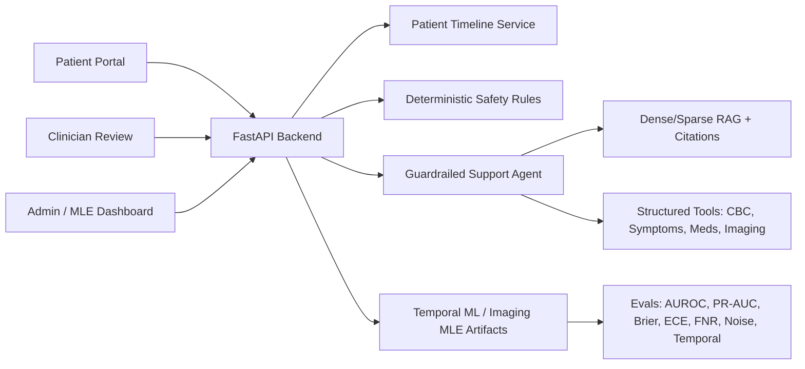

# MedicalAgent Case Study

## Positioning

MedicalAgent is a safety-first breast cancer monitoring proof of concept. It is not an AI doctor, diagnostic system, or treatment recommender. The platform organizes longitudinal patient journey data into a clinician-review workflow, then uses deterministic rules, ML signals, and guardrailed RAG to surface monitoring context for review.

The central design decision is timeline-first clinical support: CBC trends, symptoms, medications, treatment cycles, imaging summaries, support-agent messages, and clinician feedback are fused into one patient record. AI outputs remain bounded by non-diagnostic language and human review.

## System Architecture

The system is organized around four layers:

- Patient and clinician workflow: patient portal, clinician review queue, admin/MLE dashboard.
- Deterministic safety layer: CBC thresholds, symptom flags, radiology wording flags, prompt-injection checks, treatment-decision refusals.
- AI and RAG layer: intent routing, casual conversation, tool selection, dense/sparse retrieval, citations, cache safety, guardrail validation.
- ML/MLE layer: synthetic longitudinal training, public-data feasibility, model artifacts, evaluation reports, readiness gates, and error analysis.

## RAG And Agentic Workflow

The support agent uses optimized routing instead of forcing every message through retrieval. Casual messages receive conversational support. Research or oncology education questions use RAG. Structured data entry invokes tools only when extractors and the LLM router have enough signal to save a symptom, CBC row, medication, or imaging report.

The RAG pipeline includes:

- safety and scope check
- LLM-assisted intent routing with deterministic fallback
- query rewriting and decomposition
- BM25 sparse retrieval
- sentence-transformer dense embeddings
- FAISS dense retrieval
- reciprocal-rank fusion
- metadata/domain boosting
- parent-child context expansion
- reranking
- context windowing/compression
- citation validation
- output guardrails
- exact and semantic caching with TTL and KB fingerprint invalidation

Agent observability is DB-backed. Each call records route, intent, safety level, cache status, retrieved/cited sources, grounding score, hallucination-risk proxy, latency, token estimate, and terminal pipeline stage.

## ML And MLE Layer

The core ML system uses a synthetic longitudinal oncology benchmark because no single public dataset covers CBC trends, symptoms, medications, treatment cycles, breast MRI response, CT/ultrasound metastatic indicators, clinician notes, and outcomes in one record.

Implemented ML/MLE artifacts include:

- temporal treatment-success classification
- continuous response-score regression
- toxicity and support-intervention signals
- BreastDCEDL/I-SPY1 direction for MRI response experiments
- feature-store materialization
- dataset hashes and lineage
- model registry metadata
- champion selection and rollback metadata
- prediction audit logs
- per-prediction error table
- SHAP/feature-importance artifacts where available
- synthetic-to-public imaging gap report

Evaluation coverage includes AUROC, PR-AUC, Brier score, ECE, sensitivity, specificity, false-negative rate, confusion matrices, subgroup checks, temporal leakage audit, temporal generalization, high-noise robustness, hybrid weight ablation, RAG regression, source-hit rate, citation coverage, attack-block rate, cache metrics, and latency.

## Imaging Data Strategy

The imaging strategy deliberately separates report-text support from image diagnosis.

Current implemented support:

- MRI report trend extraction
- CT/PET-CT and ultrasound report-text ingestion
- metastatic-indicator wording flags for ascites, peritoneal/omental disease, hepatic lesions, pleural/pericardial findings, bone/lung/brain/adrenal wording, and distant lymph nodes
- negation handling for phrases such as no ascites, no evidence of metastatic disease, and no suspicious lesion
- clinician-review routing for suspicious wording

Public imaging dataset candidates:

- TCIA I-SPY2 and Duke Breast Cancer MRI for breast MRI response direction
- BreastDCEDL for deep-learning-ready DCE-MRI response experiments
- TCIA QIN-BREAST for longitudinal PET/CT and quantitative MRI workflow exploration
- TCIA FDG-PET-CT-Lesions and NIH DeepLesion for CT/PET-CT lesion workflow experiments
- BUSI and BUS-UCLM for breast ultrasound segmentation/classification baselines

The first image-model target should be narrow: breast ultrasound segmentation/classification or CT lesion workflow readiness. The system should not claim metastatic breast cancer detection from images without task-specific labels, external validation, and clinician review.

## Safety Architecture

Safety rules run before AI reasoning. This prevents the agent from being the first decision-maker for urgent or risky cases.

Guardrails include:

- non-diagnostic system boundary
- treatment-decision refusal
- urgent symptom escalation
- deterministic CBC danger checks
- radiology metastatic-wording flags
- prompt-injection and exfiltration detection
- multilingual/encoded attack checks
- patient-scoped memory only
- safety-aware cache gating
- clinician approval/edit/reject workflow

The safety claim is intentionally bounded: this is a robust POC guardrail layer, not a certified medical-device safety case.

## Current Limitations

- Synthetic ML performance does not prove real clinical validity.
- External validation remains directional and shows domain gap.
- CT and ultrasound image models are not diagnostic readers.
- Public datasets are source-specific and incomplete.
- Authentication, hosting, and compliance are demo-tier unless separately deployed with production controls.
- The platform is not HIPAA-certified or clinically validated.

## Next Work

The highest-ROI next technical work is:

1. Download BUSI or BUS-UCLM and run the ultrasound baseline.
2. Render ultrasound confusion matrix and example predictions in the admin dashboard.
3. Download DeepLesion or FDG-PET-CT-Lesions and run the CT workflow report.
4. Add a small segmentation baseline for ultrasound masks.
5. Add Grad-CAM or saliency previews for image-model artifacts.
6. Keep the image-model claims strictly non-diagnostic and evaluation-first.

## Portfolio Framing

MedicalAgent demonstrates applied AI engineering maturity: timeline-first product design, deterministic safety before LLMs, guardrailed RAG with citations, structured tool use, auditable agent traces, temporal ML, public-data realism strategy, evaluation discipline, and clinician-in-the-loop governance.

The strongest honest claim is not that the model is clinically valid. The strongest claim is that the system is designed like a serious healthcare AI POC: clear boundaries, measurable evaluation, documented limitations, human oversight, and explicit handling of the gap between synthetic benchmarks and public real-world data.
