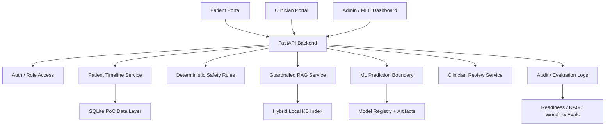

# AI Breast Cancer Treatment Monitoring System

AI-assisted proof of concept for longitudinal breast cancer treatment monitoring. The system is not a diagnostic tool. It assumes a patient already has doctor-confirmed breast cancer and helps organize treatment journey data over time.

## Flagship Positioning

This project is intentionally timeline-first, not chatbot-first.

Safe positioning:

> A safety-first AI-assisted monitoring and clinician-review platform for breast cancer treatment journeys.

The platform helps clinicians review longitudinal patient progress by combining CBC trends, symptoms, treatment cycles, imaging summaries, and AI-generated structured summaries while enforcing non-diagnostic boundaries, deterministic safety rules, citations, audit logs, and clinician approval workflows.

Do not position it as an AI doctor, diagnosis bot, cancer-progression detector, or treatment recommender. The system organizes, summarizes, flags, explains, and audits; clinicians make decisions.

## Flagship Implementation Matrix

| System area | Status | Evidence |
| --- | --- | --- |
| Patient timeline | Implemented | Patient report timeline combines labs, symptoms, treatments, imaging, interventions, reports, and chat history. |
| CBC/symptom safety rules | Implemented | Deterministic validation/risk rules run before LLM/RAG behavior. |
| RAG with citations | Implemented | Hybrid retrieval, reranking, compression, citations, output validation, cache policy. |
| Clinician approval workflow | Implemented | Approve/edit/reject summary review with notes and quality/usefulness scores. |
| Audit logs | Implemented | App events, prediction audit logs, RAG eval logs, review logs, upload logs. |
| ML response/risk model | Implemented as PoC | Synthetic longitudinal model registry plus BreastDCEDL pCR baseline signal. |
| Calibration/Brier | Implemented as MLE gate | Versioned reports and readiness gates track Brier score and expected calibration error. |
| SHAP explanations | Implemented where available | pCR prediction payloads include XAI/SHAP-style explanations. |
| CNN imaging baseline | Implemented as experiment | Temporal/deep-learning baselines exist; imaging claims remain exploratory. |
| QLoRA behavior experiment | Planned | Use later for formatting/safety behavior only; RAG remains factual grounding. |
| RAG eval suite | Implemented | `scripts/evaluate_agent_rag.py` plus `Data/agent_eval/latest_agent_regression.json`. |
| Safety eval suite | Implemented | Multilingual, encoded, privacy, treatment-boundary, and false-positive guardrail tests. |
| Model/system/data cards | Implemented | `MODEL_CARD.md`, `DATA_CARD.md`, and `SYSTEM_CARD.md`. |
| Dashboard screenshots/demo video | Planned | Capture after frontend polish/componentization. |

Current readiness posture:

- Strict MLE status: `unideal`
- Hard gates: `passed`
- PoC demo readiness: `ready_with_limitations`
- Safety regression: `strong`
- Claim boundary: supervised synthetic-data engineering demo, not production or clinical validation.

## What It Does

- Tracks CBC/lab trends across treatment cycles.
- Stores treatment schedules, medication logs, symptoms, imaging reports, and MRI file references.
- Builds patient reports with risk flags, temporal timelines, deterministic monitoring snapshots, and patient-friendly explanations.
- Uses BreastDCEDL/I-SPY1 MRI-derived tabular features for a small pCR response-classification baseline.
- Adds SHAP explanations for model behavior.
- Saves model artifacts, registry metadata, and prediction audit logs.
- Provides separate patient, clinician, and admin/MLE surfaces.
- Provides a patient support chat that can save symptoms, complete CBC values, medication mentions, and answer timeline-monitoring questions.
- Adds clinician-in-the-loop summary review with approve/edit/reject audit logging.
- Adds admin/MLE analytics for model evaluation, calibration, threshold policies, cost-sensitive error analysis, drift checks, subgroup behavior, audit counts, and clinician feedback.
- Adds product-grade failure handling: constrained inputs, invalid-data responses, insufficient-data summaries, model-unavailable states, and clinician-style fallback language.
- Adds production-thinking telemetry: structured app event logs, prediction/error monitoring, confidence distribution, model version promotion, and rollback controls.

## Product Hardening Roadmap Implemented

Week 1, "Make it Real":

- Demo user sessions expose patient, clinician, and admin role context through `/auth/demo-login` and `/auth/whoami`.
- Patient inputs now enforce CBC, symptom, treatment-cycle, chat, and imaging-report constraints before database writes.
- Invalid values return structured `invalid_data` responses instead of failing silently or saving impossible records.
- Patient reports include a `data_availability` section with missing labs, insufficient timeline depth, unavailable model signal, and clinician-style interpretation guidance.

Week 2, "Production Thinking":

- `app_event_logs` records validation errors, patient-input events, model lifecycle changes, and prediction events.
- Admin/MLE analytics show prediction count, operational failure rate, recent errors, event-type counts, and confidence distribution.
- Model registry supports champion promotion and rollback so model v1/v2 lifecycle behavior can be practiced safely.

Week 3, "Stress & Failure Testing":

- Tests now intentionally cover impossible CBC values, extreme-but-plausible lab warnings, invalid symptom severity, missing longitudinal data, monitoring counters, and rollback behavior.
- Threshold, cost-sensitive, false-negative, calibration, subgroup, and decision-impact metrics remain visible in the admin dashboard for failure-mode review.

## Patient Agent RAG Architecture

The patient support agent now follows a safety-first RAG pipeline:

```text
User query
-> safety / scope check
-> intent router with deterministic rules plus optional LLM adjudication
-> query rewrite and decomposition
-> exact cache check
-> semantic cache check for low-risk queries
-> local hybrid TF-IDF/vector index retrieval
-> parent-child / sentence-window expansion
-> reranking
-> contextual compression
-> answer generation
-> validation and citation check
-> safe cache storage
```

Implemented in:

- `backend/services/agent_rag.py`: safety routing, retrieval, reranking, compression, citation validation, and low-risk cache storage.
- `backend/services/rag_vector_index.py`: persisted local hybrid retrieval index with TF-IDF vector similarity, lexical overlap, metadata scoring, and KB fingerprint invalidation.
- `backend/services/support_chat_agent.py`: patient chat integration after symptom/CBC/medication extraction.
- `backend/services/local_llm.py`: optional JSON adjudication for security, intent routing, and cache policy. Groq is primary when configured; Ollama is the local experiment/fallback path; deterministic guardrails remain the final fallback.
- `backend/models.py`: `AgentResponseCache` for exact and semantic reuse of safe educational answers with TTL, schema versioning, KB/source fingerprint invalidation, and last-hit telemetry.
- `backend/services/app_logging.py`: admin telemetry for agent cache entries and hits.

Cache policy:

- Cacheable: low-risk educational or portal-help answers with citations and no patient-specific state.
- Not cacheable: urgent symptoms, diagnosis/outcome questions, treatment-decision wording, patient-specific timeline summaries, or messages that save labs/symptoms/medications.
- Freshness: cached answers expire after 30 days and are invalidated whenever the built-in/local RAG knowledge fingerprint changes.
- Semantic reuse: only low-risk answers with the same intent, current cache schema, current KB fingerprint, and sufficient semantic-key similarity are reused.
- Cache adjudication: deterministic policy decides first; when available, Groq can veto/confirm cache storage for borderline low-risk messages, with Ollama reserved for local fallback experiments.
- Ingested KB chunks are also cached in-process using file size/mtime signatures so local JSON retrieval does not reread unchanged chunk files on every request.

## RAG Evaluation, Guardrails, and Feedback

The RAG layer now logs lightweight production evaluation metrics for every patient-agent response:

- Proxy retrieval precision@3: heuristic top-3 relevance from query-token overlap. This is a placeholder until a labeled KB/RAGAS evaluation set exists.
- Answer grounding score: answer/context overlap proxy for whether the reply is supported by retrieved text.
- Hallucination score: inverse grounding plus citation and guardrail penalties. Lower is better.
- Input guardrails: prompt-injection, privacy-boundary, high-risk medical scope, diagnosis/outcome, urgent symptom, and treatment-decision detection.
- Output guardrails: unsafe treatment directives, diagnosis claims, missing citations, and missing escalation language for high-risk messages.
- Cost/latency telemetry: per-call latency, estimated input/output tokens, cache path, and estimated LLM cost. The deterministic RAG path has zero provider generation cost; optional Groq adjudication can add small hosted LLM cost.
- User feedback: patient-facing 1-5 rating with thumbs-up/down derivation for each assistant response.
- Offline agent regression suite: labeled education, portal-help, clinical-safety, and prompt-injection/security cases for route, citation, source-hit, grounding, hallucination, latency, and guardrail checks.
- Multilingual/adversarial guardrail cases: Tagalog, Spanish, CJK, encoded payloads, and obfuscated database/privacy attacks.

Admin dashboard visibility:

- RAG call count, cache hit rate, average proxy precision@3, grounding score, hallucination score, hallucination-risk distribution, guardrail pass/fail counts, latency, and token estimates.
- Patient agent feedback count, average rating, thumbs-up rate, rating distribution, and recent comments.
- Latest agent regression status, pass rate, intent accuracy, source-hit rate, citation coverage, attack-block rate, output-guardrail pass rate, grounding/hallucination proxies, and quality gates.

Appropriate now:

- Guardrail pass/fail, citation coverage, cache hit rate, latency, token estimates, user ratings, and heuristic grounding/hallucination checks.

Appropriate later after research-paper KB:

- RAGAS context precision/recall, faithfulness, answer relevancy, answer correctness, labeled retrieval precision@k, source-level evaluation by paper/guideline type, and clinician/SME scoring.

Project cards and eval catalog:

- `SYSTEM_CARD.md`: intended use, non-diagnostic boundary, safety architecture, privacy/security posture, and known risks.
- `MODEL_CARD.md`: model purpose, inputs, metrics, limitations, QLoRA boundary, and safe claims.
- `DATA_CARD.md`: synthetic journey data, feature groups, labels, scenario coverage, and dataset limitations.
- `evals/`: RAG, safety, summary-quality, workflow, and MLE readiness evaluation catalog.

Run the local agent regression suite:

```text
python scripts/evaluate_agent_rag.py
```

Build or refresh the local RAG retrieval index:

```text
python scripts/build_rag_index.py
```

Output:

```text
Data/agent_eval/latest_agent_regression.json
Data/rag_index/local_hybrid_rag_index.joblib
```

Hosted Groq adjudication plus optional local Ollama fallback:

```text
GROQ_API_KEY=<your-groq-key>
GROQ_MODEL=openai/gpt-oss-120b
GROQ_ADJUDICATION_TIMEOUT_SECONDS=3
LLM_ADJUDICATION_ENABLED=true
OLLAMA_BASE_URL=http://127.0.0.1:11434
OLLAMA_MODEL=<your-local-model-name>
```

If `GROQ_API_KEY` is set, Groq is used as the primary hosted adjudicator for safety, intent, and cache policy. If Groq is absent or unavailable, Ollama can be used as a local learning/fallback experiment when `OLLAMA_MODEL` is set. If neither provider is available, the system keeps using deterministic guardrails and routing.

The admin dashboard can also run the same suite from the `Agent Regression Suite` card.

## Current Architecture

- `backend/api/main.py`: FastAPI routes.
- `backend/models.py`: SQLAlchemy database schema.
- `backend/services/`: dataset handling, synthetic data, auth, uploads, model artifacts, chat agent.
- `backend/processing/`: clinical trend, risk, timeline, report, and LLM summary logic.
- `frontend/index.html`: clinician dashboard.
- `frontend/patient.html`: patient portal.

## Local MLOps, Serving, and Jobs

Account-free production-style AI/ML upgrades are implemented locally:

- `backend/services/mlops_tracking.py`: MLflow-style local run tracking with params, metrics, artifact hashes, status, DB rows, and JSON run files under `Data/mlruns_local/`.
- `backend/services/inference_service.py`: model-serving boundary for local artifact inference today and BentoML/Ray Serve/Triton-style backends later.
- `backend/services/task_queue.py`: DB-backed local task queue for heavier jobs such as RAG index builds, agent regression, MLE readiness, evaluation reports, and feature-store materialization.
- `backend/services/feature_store.py`: local offline feature-store manifest with source hashes, feature schema, entity counts, missing rates, and serving-row lookup.

Useful scripts:

```text
python scripts/run_training_pipeline.py
python scripts/materialize_feature_store.py
python scripts/build_rag_index.py
python scripts/evaluate_agent_rag.py
```

Admin API helpers:

```text
GET  /admin/mlops-runs
GET  /admin/inference-service
GET  /admin/llm-adjudication
POST /admin/tasks
POST /admin/tasks/{task_id}/run
POST /admin/tasks/run-next
```
- `frontend/admin.html`: admin/MLE operations dashboard.
- `scripts/run_training_pipeline.py`: one-command synthetic training, evaluation-report, and registry pipeline.
- `.github/workflows/ci.yml`: CI workflow for backend compilation and tests.
- `Data/`: generated manifests, model outputs, summaries, and local artifacts.
- `Datasets/`: local real datasets, ignored by git.



## Main Datasets

- QIN-BREAST-02: small breast MRI DICOM and clinical metadata dataset, useful for workflow and DICOM indexing.
- BreastDCEDL I-SPY1: DCE-MRI NIfTI volumes and masks with pCR labels, useful for MRI response-classification proof of concept.
- Synthetic temporal journeys: generated longitudinal CBC, medications, symptoms, treatments, and imaging reports for workflow simulation.
- Complete synthetic journeys: generated end-to-end treatment journeys with diagnosis, treatment sessions, per-cycle MRI, CBC timepoints, medications, symptoms, interventions, and final outcome labels.

## Real MRI Baseline Task

Binary treatment-response classification:

- Input: MRI-derived tabular tumor-region features.
- Output: pCR positive vs pCR negative.

Current best baseline:

- Logistic regression.
- 159 eligible feature rows.
- ROC AUC: 0.637.

The small CNN experiment did not beat the classical baseline, which is documented as an honest result.

This baseline is not the main longitudinal treatment-monitoring model and should not be presented as clinical MRI interpretation.

## Complete Synthetic Dataset

The complete generated dataset lives in:

```text
Data/complete_synthetic_breast_journeys/
```

It currently includes:

- 300 synthetic `COMPV4-BRCA-*` patients
- 1,800 treatment sessions
- 5,400 CBC rows
- 7,028 medication/support rows
- 3,420 symptom rows
- 2,100 synthetic MRI report rows
- 1,990 support intervention rows
- 300 final outcome rows
- 1,800 training-ready temporal ML rows

Important files:

- `temporal_ml_rows.csv`: cycle-level ML table.
- `outcomes.csv`: final synthetic response/cancer-status labels.
- `interventions.csv`: growth-factor support, transfusion, platelet support, infection management, and urgent support events.
- `data_dictionary.json`: table descriptions.

## Complete Synthetic Model Training

Training script:

```text
python train_complete_synthetic_models.py --target treatment_success_binary
```

Models trained on synthetic longitudinal rows:

- logistic regression
- random forest
- extra trees
- gradient boosting
- SVM
- MLP
- temporal 1D CNN over patient treatment-cycle sequences: Conv1D encoder over cycle-ordered feature sequences with binary cross-entropy objective
- temporal GRU over patient treatment-cycle sequences: GRU sequence encoder over cycle-ordered features with binary cross-entropy objective

Main target:

- `treatment_success_binary`

Best current result on patient-level test split:

- Gradient boosting
- ROC AUC: 0.990
- Average precision: 0.993
- Brier score: 0.062
- Sensitivity: 0.977
- Specificity: 0.875
- Accuracy: 0.933
- Balanced accuracy: 0.926

Other response models:

- Logistic regression patient-level ROC AUC: 0.983
- Temporal 1D CNN patient-level ROC AUC: 0.959
- Temporal GRU patient-level ROC AUC: 0.929

Cycle-level monitoring classifiers were also trained for `toxicity_risk_binary` and `support_intervention_needed`. These are simulator-learning tasks because the labels are generated from CBC/symptom/intervention rules.

Synthetic XAI:

- `Data/complete_synthetic_training/synthetic_xai_explanations.json`
- Explains logistic-regression contributions toward or away from `treatment_success_binary`.
- Used by the patient portal and support agent.

Training notes:

- `Data/complete_synthetic_training_notes.md`

## Evaluation and MLE Monitoring

The admin/MLE dashboard reports:

- AUROC, AUPRC, sensitivity, specificity, precision, and Brier score.
- Expected calibration error and calibration bins.
- Bootstrap confidence intervals.
- False-negative review cases.
- Decision-curve net benefit.
- Threshold operating points across multiple cutoffs.
- Cost-sensitive threshold policies for safety-first, balanced, and precision-first review workflows.
- Decision-impact simulation categories for clinician-review routing.
- Subgroup performance by stage, subtype, age band, and treatment regimen.
- Drift, data-quality, data-coverage, and clinician-loop metrics.
- Real-vs-synthetic evidence separation so simulator results are not confused with real-dataset baselines.
- MRI-derived feature inventory documenting current tabular imaging features and the planned raw-MRI boundary.

These metrics are project engineering gates only. They do not prove clinical safety or real-world effectiveness.

## MLE Readiness Gates

The project includes a model-lifecycle readiness layer for production-style MLE practice:

- Data contract checks: required temporal columns, patient/cycle uniqueness, longitudinal depth, label prevalence, missingness, and numeric range validation.
- Artifact checks: training CSV, prediction export, metrics JSON, versioned evaluation report, champion model artifact, and SHA-256 hashes.
- Model quality gates: AUROC, AUPRC, sensitivity, Brier score, expected calibration error, false-negative rate, bootstrap CI stability, subgroup checks, and drift proxy status.
- Lifecycle checks: model registry readiness, prediction audit logging, rollback metadata readiness, and safety regression status from the patient-agent suite.
- PoC demo readiness: a separate `poc_demo_readiness` field allows supervised engineering demos when hard gates pass, while still listing advisory gaps such as calibration, subgroup coverage, lifecycle maturity, or drift monitoring.

Run locally:

```text
python scripts/run_mle_checks.py
```

Output:

```text
Data/mle_monitoring/latest_mle_readiness.json
```

The admin dashboard also has an `MLE Release Gates` card that runs the same checks through `/admin/mle-readiness`.

Important boundary: `status` remains the strict MLE signal. `poc_demo_readiness.ready_with_limitations` means the workflow is demoable with synthetic/demo data and disclaimers; it does not mean production or clinical validation.

Versioned evaluation artifacts can be generated into:

```text
Data/model_evaluation_reports/
```

Each run writes `evaluation_report.json`, calibration bins, threshold operating points, cost-sensitive thresholds, false-negative cases, subgroup metrics, decision-impact categories, data coverage, and a manifest.

## Reproducible Pipeline

Run the complete synthetic training/evaluation pipeline:

```text
python scripts/run_training_pipeline.py
```

To regenerate evaluation artifacts and registry metadata from existing trained outputs:

```text
python scripts/run_training_pipeline.py --skip-training
```

The pipeline validates the synthetic temporal ML table, trains models unless skipped, registers the synthetic champion with dataset/model hashes, writes versioned evaluation reports, and keeps the synthetic-data warning explicit.

## Clinician Workflow

The clinician dashboard includes a review queue that prioritizes urgent deterministic risk flags, unreviewed summaries, missing data warnings, `needs_clinician_review` / `watch_closely` statuses, and top review flags from the patient timeline summary.

The review queue routes attention. It does not diagnose or recommend treatment changes.

## Documentation Cards

- `MODEL_CARD.md`: model purpose, input representation, training objective, evaluation, limitations, and safe positioning.
- `DATA_CARD.md`: dataset sources, labels, feature groups, counts, limitations, and safe dataset language.

## Safety Positioning

This system does not:

- diagnose cancer
- detect cancer
- confirm metastasis
- choose treatment
- replace clinicians

It is a clinical-safety-inspired engineering proof of concept for organizing and summarizing longitudinal oncology data.

## Local URLs

Use the current running FastAPI port.

- Login / role landing page: `/login`
- Patient portal: `/patient`
- Clinician dashboard: `/clinician`
- Admin/MLE dashboard: `/admin`
- API docs: `/docs`

Example:

```text
http://127.0.0.1:8017/login
http://127.0.0.1:8017/patient
http://127.0.0.1:8017/clinician
http://127.0.0.1:8017/admin
```

The root path `/` opens the login/role page. The patient portal no longer creates a default Patient 1 session automatically; it requires a patient-scoped demo session from the login page. Cross-patient lists and patient reports are scoped to clinician/admin demo sessions.

## CI/CD and Deployment Readiness

The repository now includes a GitHub Actions CI/CD workflow in:

```text
.github/workflows/ci.yml
```

The workflow runs on push, pull request, and manual dispatch:

- secret scan for API keys/tokens
- backend compilation
- unit and regression tests
- RAG guardrail/red-team tests
- frontend smoke checks
- knowledge-base ingestion smoke test
- agent RAG regression suite
- FastAPI health/API smoke test
- Docker image build

Local Docker run:

```text
docker compose up --build
```

Then open:

```text
http://127.0.0.1:8017/health
http://127.0.0.1:8017/login
http://127.0.0.1:8017/patient
http://127.0.0.1:8017/clinician
http://127.0.0.1:8017/admin
```

The app uses `DATABASE_URL` from `.env` when provided. Docker defaults to:

```text
sqlite:////app/Data/medical_agent.db
```

## Knowledge Base Ingestion

Future research papers and trusted source files can be staged in:

```text
KnowledgeBase/raw/
```

Supported starter formats:

- Markdown
- text
- PDF through `pypdf`

Download the starter open-access breast cancer paper set:

```text
python scripts/download_research_papers.py
```

This stores NCBI Open Access full-text files in:

```text
KnowledgeBase/raw/research_papers/
```

Direct PDF downloads from PubMed Central can be browser-gated, so the downloader saves clean article text for ingestion. The current starter set covers breast MRI treatment response, DCE-MRI response prediction, chemotherapy-induced neutropenia, febrile neutropenia support, and hematologic toxicity. See:

```text
KnowledgeBase/STARTER_PAPERS.md
```

Run ingestion:

```text
python scripts/ingest_knowledge_base.py
```

Output:

```text
Data/rag_knowledge_base_chunks.json
Data/rag_index/local_hybrid_rag_index.joblib
```

The patient RAG agent automatically combines the built-in safety/education snippets with ingested local KB chunks when that file exists. The generated chunk file and local retrieval index are ignored by git so licensed papers, large local documents, and binary retriever artifacts do not accidentally get committed.

The ingestion pipeline uses section-aware chunks, metadata tagging, and quality checks:

- section-aware chunking for abstract, methods, results, discussion, and conclusion style content
- metadata for topic, modality, care stage, confidence/source type, PMCID, tags, and section
- lightweight watchlists for strong unsupported claim language and possible contradiction-sensitive terms
- automatic local hybrid RAG index refresh unless `--skip-index` is passed

The patient agent applies deterministic CBC safety rules before RAG retrieval. Very low WBC, hemoglobin, or platelet values are routed to clinician-review language instead of being left to the LLM/RAG layer.

Admin RAG governance is available at:

```text
GET /admin/rag-source-registry
```

The admin dashboard uses this source registry to show source counts, chunk counts, topic/modality coverage, trust levels, citation policy, and lightweight quality watchlists.

After adding papers, rerun:

```text
python scripts/ingest_knowledge_base.py
python scripts/evaluate_agent_rag.py
```

That gives a quick check that new KB content did not weaken retrieval, citations, guardrails, or prompt-injection blocking.

## Environment

Use the root `.env` file:

```env
GROQ_API_KEY=your_key_here
GROQ_MODEL=openai/gpt-oss-120b
LLM_ADJUDICATION_ENABLED=true
```

The app also checks the legacy nested `MedicalAgent/.env` location, but the project root is the canonical location.

Use `.env.example` as the safe template. Do not commit real API keys or real patient data.

## Portfolio Description

Built an AI-assisted breast cancer treatment-monitoring platform that combines longitudinal patient records, CBC trends, medication and symptom tracking, breast imaging report NLP, planned multimodal integration using MRI-derived features, deterministic clinical rule flags, timeline intelligence, and LLM-assisted summaries. Implemented FastAPI services, SQLite persistence, patient/clinician/admin demo sessions, local upload logging, synthetic temporal oncology journeys, model artifact registration, prediction audit trails, clinician-in-the-loop summary review, RAG knowledge-base ingestion, prompt-injection/data-exfiltration guardrails, offline agent regression evaluation, CI/CD checks, Docker deployment scaffolding, and admin/MLE monitoring for calibration, confidence intervals, drift, subgroup behavior, threshold policy, cost-sensitive error analysis, decision-impact simulation, API cost/latency, grounding, hallucination proxies, and feedback analytics. The system is positioned as clinician-review support and workflow intelligence, not diagnosis or treatment recommendation.
