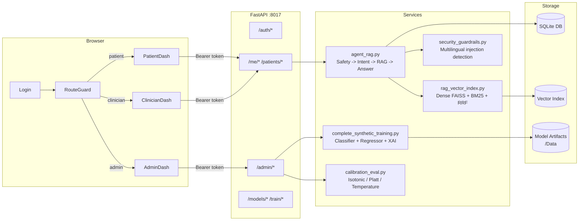
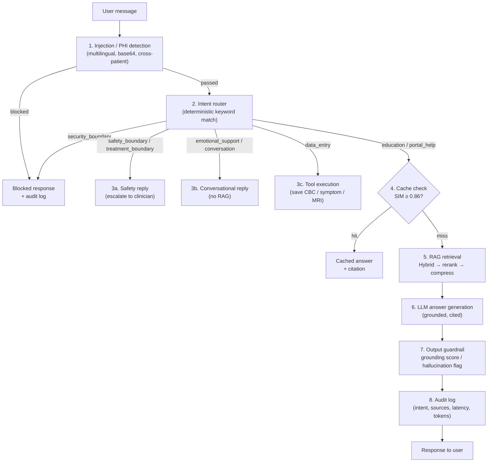

# MedicalAgent: Safety-First Breast Cancer Monitoring PoC

MedicalAgent is a safety-first clinical decision-support proof of concept for breast cancer monitoring that fuses multimodal signals, including labs, imaging summaries, symptoms, treatment cycles, and longitudinal trends, into a unified clinician view. It combines predictive modeling, RAG-grounded guidance, and human-in-the-loop review to surface potentially relevant changes for clinician review while enforcing strict non-diagnostic boundaries, auditability, and guardrails.

## What this system is
- A timeline-first monitoring and clinician review assistant for already-diagnosed breast cancer cases.
- A proof-of-concept platform that produces monitoring signals, safety flags, and summaries for clinician review.
- A deterministic-first RAG support agent for low-risk education and portal help, with citations when retrieval context is used.
- A local MLE/MLOps sandbox for training, evaluation, and model lifecycle practice using synthetic journeys.

## What this system is NOT
MedicalAgent is not an AI doctor, diagnosis bot, or treatment recommendation system.

- This system does not diagnose breast cancer.
- This system does not recommend treatment changes.
- This system does not replace clinicians.
- This system is not clinically validated.
- Synthetic data is used for POC workflow and safety testing, not clinical validation.

## Architecture overview
Flow:
Frontend / Dashboards -> Timeline and data-entry tools -> Deterministic scope/safety gate -> Intent router -> RAG / ML / tool workflow -> Validation and guardrails -> Clinician review -> Audit logs -> Evaluation and MLE dashboard

Key components:
- FastAPI backend and role-scoped portals.
- Timeline, risk, and multimodal monitoring services.
- Guardrailed RAG agent with hybrid retrieval.
- ML training, evaluation, and model registry lifecycle.
- Admin/MLE analytics and evaluation reports.

## AI / Agentic RAG layer
- Deterministic scope and safety checks, then intent routing and query rewrite/decomposition.
- Hybrid lexical + TF-IDF retrieval, parent-child expansion, reranking, and contextual compression.
- Citation-checked answer generation with refusal/escalation on unsafe requests.
- Optional LLM adjudication for routing and cache safety, with deterministic fallback.

Implementation: [backend/services/agent_rag.py](backend/services/agent_rag.py), [backend/services/rag_vector_index.py](backend/services/rag_vector_index.py), [backend/services/local_llm.py](backend/services/local_llm.py). Details: [docs/rag_pipeline.md](docs/rag_pipeline.md).

## Cache policy
- Exact and semantic caches with TTL and knowledge-base fingerprint invalidation.
- Cache allowed only for low-risk, non-patient-specific educational or portal-help answers.
- If retrieval context is used, cached answers must include citations.
- Cache blocked for patient-specific, urgent, diagnosis/outcome, treatment-decision, or privacy-sensitive content.

Policy details: [docs/cache_policy.md](docs/cache_policy.md). Implementation: [backend/services/agent_rag.py](backend/services/agent_rag.py) and [backend/models.py](backend/models.py).

## Safety and guardrails
- Deterministic prompt-injection, privacy boundary, and urgent medical safety checks before any retrieval or generation.
- Output guardrails block treatment directives, diagnosis claims, and missing citation cases.
- Designed with healthcare privacy principles in mind, but not certified or validated for clinical deployment.
- All patient-specific or urgent outputs must be reviewed by a qualified clinician.
- RAG is used for grounded knowledge support, not autonomous medical decision-making.
- ML outputs are monitoring signals and risk flags, not diagnoses.

Implementation: [backend/services/security_guardrails.py](backend/services/security_guardrails.py), [backend/services/agent_rag.py](backend/services/agent_rag.py). Details: [docs/safety_and_limitations.md](docs/safety_and_limitations.md).

## ML / MLE layer
- Synthetic longitudinal modeling for treatment success, toxicity risk, and support-intervention flags.
- Hybrid response modeling: binary classification estimates whether a synthetic journey looks favorable, while regression estimates a continuous `response_score_percent` from MRI-size change.
- The patient report exposes `hybrid_mle_signal`, currently 65% classifier probability score plus 35% normalized response-regression score, with an agreement label between classifier and regressor bands.
- Robust response-regression selection uses Huber/tree regressors plus a median ensemble and an outlier-aware score that penalizes RMSE.
- Current artifacts include temporal leakage audit, dataset lineage hashes/schema signatures, a locked synthetic holdout manifest, error taxonomy, and cost-sensitive threshold evaluation.
- Current training discipline uses development rows for training/calibration and evaluates once on a frozen locked synthetic holdout.
- Response uncertainty bands show when response-regression model families disagree.
- External validation direction is reported separately through the BreastDCEDL/I-SPY1 MRI-derived feature baseline.
- BreastDCEDL baseline response classifier using MRI-derived tabular features.
- Model artifacts, registry metadata, promotion/rollback, and local MLOps tracking.
- Versioned evaluation reports and MLE readiness gates.

Implementation: [backend/services/complete_synthetic_training.py](backend/services/complete_synthetic_training.py), [backend/services/breastdcedl_baseline.py](backend/services/breastdcedl_baseline.py), [backend/services/model_artifacts.py](backend/services/model_artifacts.py). Details: [docs/ml_lifecycle.md](docs/ml_lifecycle.md).

## Synthetic patient journey modeling
- Complete synthetic breast cancer journeys for labs, symptoms, treatments, interventions, imaging summaries, and outcomes.
- Used for workflow practice, safety testing, and MLE readiness evidence, not clinical validation.

Details: [docs/synthetic_data.md](docs/synthetic_data.md) and [DATA_CARD.md](DATA_CARD.md).

## Evaluation suite
- RAG regression, safety regression, ML metrics, and workflow feedback tracking.
- Heuristic grounding and hallucination proxies until labeled RAG data exists.
- Detailed synthetic training report exports patient-level test predictions, regression residuals, slice metrics, and hybrid review-rule routing.
- Detailed MLE report also exports error taxonomy and cost-sensitive threshold policy tables.
- Admin/MLE dashboard includes detailed training report, locked holdout evaluation, external validation direction, and model-comparison cards.
- System proof table and claim mapping are tracked in [docs/system_proof.md](docs/system_proof.md).

Details: [docs/evaluation.md](docs/evaluation.md) and [evals/README.md](evals/README.md).

## Model registry and promotion/rollback
- Registry metadata and lifecycle endpoints support promotion and rollback.
- Production semantics are simulated locally to enforce safe lifecycle practice.

Details: [docs/model_registry.md](docs/model_registry.md) and [backend/services/model_artifacts.py](backend/services/model_artifacts.py).

## Feature-store materialization
- Local feature-store manifest with schema, hashes, and missingness for training and serving consistency.

Details: [docs/feature_store.md](docs/feature_store.md) and [backend/services/feature_store.py](backend/services/feature_store.py).

## Human-in-the-loop clinician review
- Clinician review queue and summary approval/edit/reject logging are built in.

Details: [backend/services/clinician_feedback.py](backend/services/clinician_feedback.py) and [backend/api/main.py](backend/api/main.py).

## Auditability
- App event logs, prediction audit logs, and RAG evaluation logs support traceability.

Implementation: [backend/services/app_logging.py](backend/services/app_logging.py) and [backend/models.py](backend/models.py).

## Setup instructions
1. Create a virtual environment and install dependencies:
   ```
   python -m venv .venv
   .venv\Scripts\activate
   pip install -r requirements.txt
   ```
2. Initialize the local database and seed demo data:
   ```
   python seed_db.py
   ```
3. Start the API:
   ```
   uvicorn backend.api.main:app --reload
   ```

## Demo flow
See [docs/demo_flow.md](docs/demo_flow.md) for a step-by-step patient, clinician, and admin demo walkthrough.

Demo credential routing:
- Patient demo: `P001` / `patient-demo` or any valid demo patient ID / `patient-demo`.
- Clinician demo: `clinician` / `clinician-demo`.
- Admin demo: `admin` / `admin-demo`.

The login form resolves the account role from credentials and redirects to the correct portal. The portals no longer expose role-switching links in the top navigation.

## Limitations
- Synthetic data is not clinical evidence; it is for engineering practice only.
- RAG metrics are heuristic proxies until labeled KB evaluation sets exist.
- Imaging analysis is derived from report text or tabular features, not validated clinical imaging models.
- No clinical validation, regulatory approval, or production privacy/security controls are claimed.
- **Not approved for real PHI.** See [docs/PHI_PRIVACY_LIMITATIONS.md](docs/PHI_PRIVACY_LIMITATIONS.md) for the explicit boundary and what real PHI handling would require.

## Database & migrations

The default config is local SQLite (`medical_agent.db`). Demo / dev still works via `python seed_db.py`. For any non-demo deployment, use Alembic:

```
alembic upgrade head            # apply all migrations to a fresh DB
alembic stamp head              # mark an existing DB as up-to-date (one-time)
alembic revision --autogenerate -m "describe change"   # create a new migration
alembic downgrade -1            # roll back one revision
```

## Future work
- Add labeled RAG evaluation sets and formal groundedness scoring.
- Expand multimodal signals with validated imaging workflows.
- Harden production security controls and PHI handling for real deployment.
- Add clinician-reviewed gold cases for summary quality evaluation.

## Ops and governance docs
- [docs/threat_model.md](docs/threat_model.md)
- [docs/security_controls.md](docs/security_controls.md)
- [docs/incident_response.md](docs/incident_response.md)
- [docs/monitoring.md](docs/monitoring.md)
- [docs/regulatory_positioning.md](docs/regulatory_positioning.md)
- [docs/ci_cd.md](docs/ci_cd.md)

## For Recruiters and Interviewers

### What this project demonstrates

**Applied AI/ML engineering** - not a toy demo. Key capabilities:

| Area | What was built |
|------|----------------|
| RAG pipeline | Dense sentence-transformer retrieval with FAISS + BM25 sparse retrieval + RRF fusion when dependencies are available; BM25 + TF-IDF sparse fallback with honest backend labels |
| Safety-first agent | Deterministic priority gates before LLM: injection detection, multilingual attack patterns, PHI boundary, treatment/diagnosis refusal |
| ML evaluation | AUROC, PR-AUC, Brier, ECE, sensitivity/specificity/FNR, cost-sensitive threshold (FN costlier than FP), locked holdout, external validation direction |
| Agent regression suite | 45 labeled test cases: education, portal_help, clinical_safety, security, conversation, tool_use - 100% pass rate |
| Model lifecycle | Register, promote, rollback, audit; calibration comparison (isotonic / Platt / temperature scaling) |
| Agent Trace Observatory | DB-backed per-call trace log: intent, safety level, guardrail status, RAG sources, grounding, latency, tokens - live in Admin dashboard |
| RAG Ablation Study | BM25-only vs sparse BM25+TF-IDF vs dense FAISS+BM25+RRF vs full reranked pipeline on education eval cases |
| Per-Prediction Error Table | TP/FP/TN/FN per synthetic holdout prediction; MAE, sensitivity, specificity, SHAP top-features per row |
| Noise Robustness Eval | 5 EHR-realistic perturbations (missingness, jitter, unit error, batch effect, contradictory records) with AUROC/sensitivity degradation |
| Temporal Generalization | Patient-timeline split + cycle-accumulation split vs random baseline; generalization gap reporting |
| Progressive Chat UX | Pipeline-stage status labels while waiting (safety gate -> intent -> retrieval -> generation) |
| Frontend | React + TypeScript + Vite, role-based routing, chat panel with tool-call confirmations, metric interpretation bands |
| Governance | System card, model cards (3), RAG pipeline doc, MLE evaluation report, audit logs |

### Architecture (Mermaid)



### Agent Flow (Mermaid)



### What this proves / What this does not prove

**Proves:**
- Ability to design and implement a multi-layer safety architecture for healthcare AI
- Disciplined evaluation pipeline: regression suite, holdout, calibration, cost-sensitive thresholds
- RAG engineering: retrieval, reranking, caching, grounding scoring, hallucination detection
- ML lifecycle practice: training, versioning, promotion, rollback, model cards, audit logs
- Full-stack integration: React SPA + FastAPI + SQLite + vector index + local ML models

**Does not prove:**
- Clinical validity — all model training and testing uses synthetic or non-validated data
- HIPAA/regulatory compliance — no certified security controls are in place
- Production scalability — SQLite and in-process models are for local/demo use only
- Clinical decision support accuracy — the system is a monitoring and review aid, not a diagnostic tool

### How to run (30 seconds)
```bash
# 1. Install Python dependencies
pip install -r requirements.txt

# 2. Start backend
uvicorn backend.api.main:app --host 127.0.0.1 --port 8017 --reload

# 3. In a new terminal, start React frontend
cd frontend-react && npm install && npm run dev

# 4. Open http://localhost:5173
# Demo: P001 / patient-demo  |  clinician / clinician-demo  |  admin / admin-demo
```

---

## React Frontend (frontend-react/)

A modern React + TypeScript + Vite frontend for the same backend. The legacy HTML files in `frontend/` remain untouched.

### Running the stack

**1. Start the backend (port 8017)**
```bash
uvicorn backend.api.main:app --host 127.0.0.1 --port 8017 --reload
```

**2. Start the React dev server (port 5173)**
```bash
cd frontend-react
npm install
npm run dev
```
Open http://localhost:5173. The React API client calls http://127.0.0.1:8017 directly.

### Available scripts (frontend-react/)
| Command | Description |
|---------|-------------|
| `npm run dev` | Start Vite dev server on port 5173 |
| `npm run build` | Type-check and build to `dist/` |
| `npm run lint` | Run frontend lint checks |
| `npm run test:e2e` | Run Playwright smoke tests for login, patient, clinician, admin, and route guards |
| `npm run preview` | Serve the production build locally |

### Quality gate
```bash
# Fast local gate: lint, build, backend tests, MLE readiness, RAG ablation,
# and latest strong agent-regression artifact.
python scripts/run_quality_gate.py --skip-slow-agent

# Full UI smoke included. Requires: cd frontend-react && npx playwright install chromium
python scripts/run_quality_gate.py --skip-slow-agent --include-e2e
```

### Demo credentials
| Username | Password | Destination |
|----------|----------|-------------|
| `P001` | `patient-demo` | Patient dashboard |
| `P002` | `patient-demo` | Patient dashboard |
| `clinician` | `clinician-demo` | Clinician review queue |
| `admin` | `admin-demo` | Admin / MLE dashboard |

Role is inferred from credentials — no manual role selection after login.

### Pages
- `/login` — credential form with demo quick-fill pills
- `/patient` — timeline, labs, AI snapshot, model signal, chat support
- `/clinician` — review queue, patient detail, approve/edit/reject workflow, audit trail
- `/admin` — RAG metrics + ablation study, guardrails, Agent Trace Observatory, MLE gates + noise/temporal/error table, regression suite, feedback log
