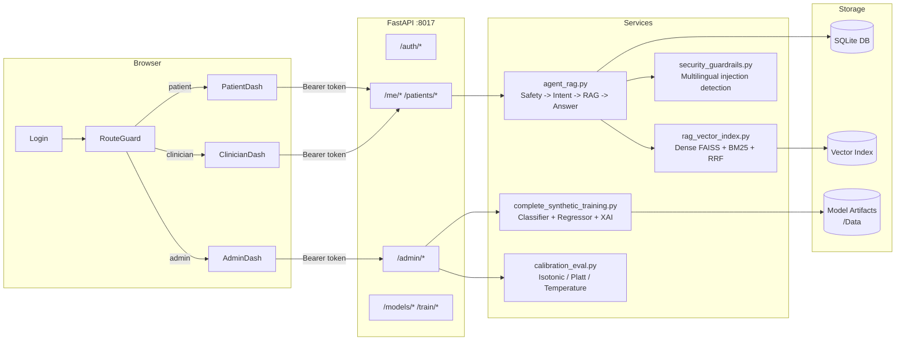
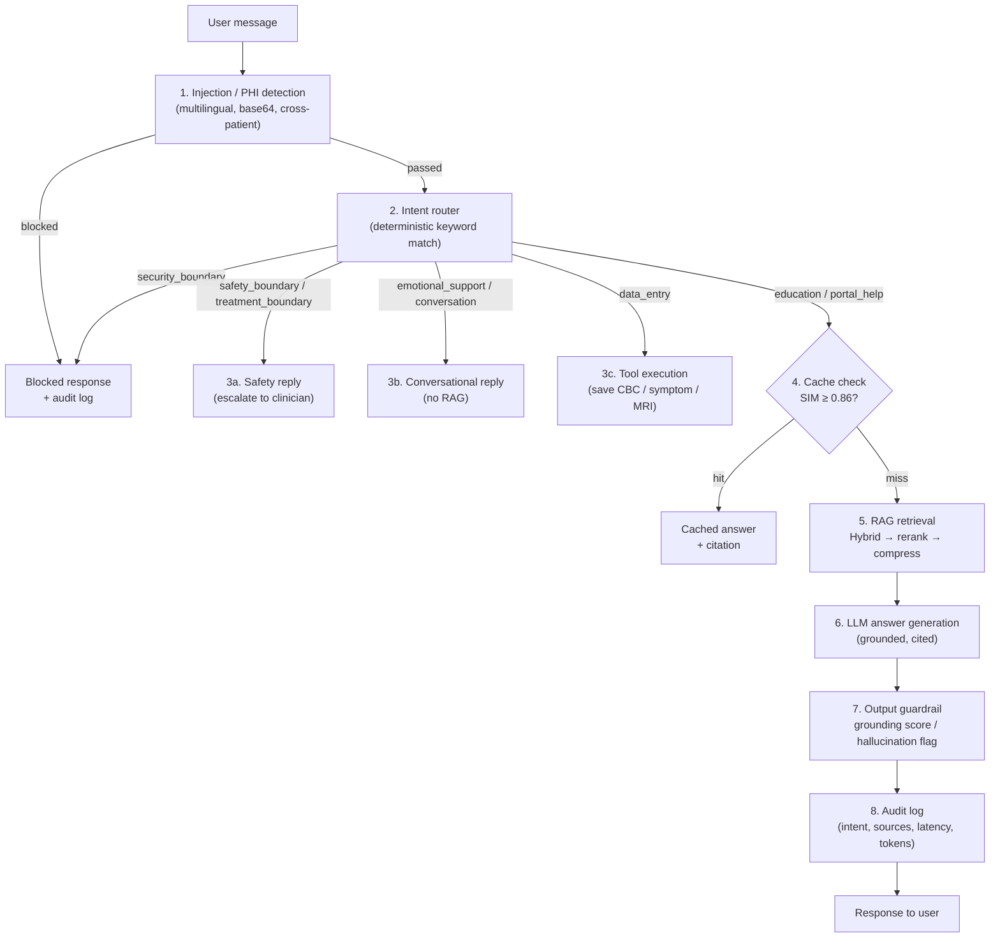

# MedicalAgent: Safety-First Breast Cancer Monitoring PoC

MedicalAgent is a safety-first clinical decision-support proof of concept for breast cancer monitoring that fuses multimodal signals, including labs, imaging summaries, symptoms, treatment cycles, and longitudinal trends, into a unified clinician view. It combines predictive modeling, RAG-grounded guidance, and human-in-the-loop review to surface potentially relevant changes for clinician review while enforcing strict non-diagnostic boundaries, auditability, and guardrails.

## What this system is
- A timeline-first monitoring and clinician review assistant for already-diagnosed breast cancer cases.
- A proof-of-concept platform that produces monitoring signals, safety flags, and summaries for clinician review.
- A deterministic-first RAG support agent for low-risk education and portal help, with citations when retrieval context is used.
- A local MLE/MLOps sandbox for training, evaluation, and model lifecycle practice using synthetic journeys.

## What this system is NOT
MedicalAgent is not an AI doctor, diagnosis bot, or treatment recommendation system.

- This system does not diagnose breast cancer.
- This system does not recommend treatment changes.
- This system does not replace clinicians.
- This system is not clinically validated.
- Synthetic data is used for POC workflow and safety testing, not clinical validation.

## Engineering maturity

Nine hardening phases sit between the trained synthetic model and the patient-facing UI. Each ships with its own test suite and a corresponding admin-dashboard card. See **[docs/demo_storyline.md](docs/demo_storyline.md)** for a reviewer-facing walkthrough that exercises every phase end-to-end.

| # | Phase | What it guards | Hard CI gate | Live numbers |
|---|---|---|---|---|
| 1 | **Leakage audit** ([service](backend/services/leakage_audit.py)) | No label proxy enters the feature contract; patient IDs never overlap train/test; no feature is byte-identical to a label. | `tests/test_leakage_audit.py` — fails the build on regression. | 23/23 checks pass on production CSV across 4 seeds × multiple targets. |
| 2 | **Evidence-aware abstention layer** ([service](backend/services/evidence_sufficiency.py), [wrapper](backend/services/predict_with_abstention.py)) | Model returns `insufficient_evidence` when the input row lacks the modalities required for the question. Partial evidence shrinks the probability toward the prior. | `tests/test_evidence_abstention.py` — 18 rule + integration tests; 8-scenario sweep at `Data/evals/models/latest_evidence_abstention_eval.json`. | Full-evidence: 100% coverage, 92.4% accuracy. Demographics-only: 100% abstention. |
| 3 | **Prediction traceability** ([service](backend/services/prediction_trace.py)) | Every live prediction lands in `PredictionTrace` with model + feature-set + threshold + calibration + safety-trigger + validator-decision + RAG-source + abstention-state provenance. | `tests/test_prediction_trace.py` — 8 schema-completeness + filter tests. | 21-column table, populated by `predict_and_trace` on every patient-report fetch. |
| 4 | **Modality-dropout retraining** ([service](backend/services/modality_dropout_training.py), [comparison](backend/services/modality_robustness_comparison.py)) | Champion classifier retrained on augmented rows where random modality groups are masked. Head-to-head against the original model. | `tests/test_modality_robustness.py` — 9 tests including a production-data comparison gate. | +8.3pp accuracy and −7.3 Brier on `no_imaging` scenario vs. champion; no regression on `full_data`. |
| 5 | **Live evidence-aware inference** ([service](backend/services/live_evidence_prediction.py)) | Every `/me/report` fetch resolves the patient's most-recent cycle row, runs the abstention-aware classifier, persists a trace, and embeds the envelope in the response. | `tests/test_live_evidence_prediction.py` — 5 cohort + trace-persistence contract tests. | Patient dashboard shows decision, modalities used, confidence, claim boundary. |
| 6 | **Provenance + failure-mode registry** ([generator card](backend/services/synthetic_generator_card.py), [failure registry](backend/services/failure_mode_registry.py)) | Synthetic generator card pins schema, fingerprints rows, documents causal assumptions / known shortcuts / unsupported claims. Failure-mode registry consolidates engineering risks + failure case gallery + safety red-team failures + drift findings into one auditable table. | `tests/test_provenance_artifacts.py` — 9 structure + aggregation tests. | Generator card: passed, schema in sync. Registry: 17 entries, 6 high-severity, status reflects honest unresolved gaps. |
| 7 | **Clinician dashboard parity** ([trace endpoint](backend/api/routers/clinician_review.py), [PredictionTracesPanel](frontend-react/src/pages/clinician/PredictionTracesPanel.tsx)) | Clinician sees the same evidence-aware envelope the patient sees, plus an auditable trace log per patient (filter by abstention, summary chips). | `tests/test_clinician_prediction_traces.py` — 9 access-control + contract tests. | Endpoint gated to clinician + admin roles, patients blocked. |
| 8 | **Form catalogs + RAG governance + post-gen validator** ([catalogs](frontend-react/src/lib/clinical-constants.ts), [governance](backend/services/kb_source_governance.py), [validator](backend/services/post_generation_validator.py)) | Curated symptom/medication dropdowns with "Other" fallback. KB sources mapped to T1–T5 tiers with `allowed_use`. Post-gen validator blocks 6 banned-claim categories (diagnosis, treatment, prognosis, dosage, genetic-risk, tumor-marker) even when the LLM tries to make them. | `SelectWithCustom.test.tsx` (9) + `tests/test_rag_governance.py` (20). | 28 symptoms + 22 medications. 24 KB sources mapped (T1=2, T2=10, T3=11, T4=1, 0 issues). 6 rules in validator catalog. |
| 9 | **Hybrid completion** ([hybrid_prediction.py](backend/services/hybrid_prediction.py)) | Classification + regression + toxicity heads, each through its own abstention sufficiency rules, bundled per patient view. Three trace rows per fresh report build (one per head, grouped by snapshot hash). | `tests/test_hybrid_prediction.py` — 9 per-head + bundle + live-integration tests. | Toxicity head scores when imaging is missing while response heads abstain — independent per-head sufficiency working. |

Run them all locally:

```
python scripts/run_leakage_audit.py
python scripts/run_evidence_abstention_eval.py
python scripts/run_modality_dropout_training.py
python scripts/run_modality_robustness_comparison.py
python scripts/run_synthetic_generator_card.py
python scripts/run_failure_mode_registry.py
python scripts/run_kb_source_governance.py
pytest tests/test_leakage_audit.py tests/test_evidence_abstention.py \
       tests/test_prediction_trace.py tests/test_modality_robustness.py \
       tests/test_live_evidence_prediction.py tests/test_provenance_artifacts.py \
       tests/test_hybrid_prediction.py tests/test_clinician_prediction_traces.py \
       tests/test_rag_governance.py
```

What this is *not*: any of these passing is engineering evidence, not clinical validation. The synthetic-to-real gap is itself the first entry in the failure-mode registry.

## Architecture overview
Flow:
Frontend / Dashboards -> Timeline and data-entry tools -> Deterministic scope/safety gate -> Intent router -> RAG / ML / tool workflow -> Validation and guardrails -> Clinician review -> Audit logs -> Evaluation and MLE dashboard

Key components:
- FastAPI backend and role-scoped portals.
- Timeline, risk, and multimodal monitoring services.
- Guardrailed RAG agent with hybrid retrieval.
- ML training, evaluation, and model registry lifecycle.
- Admin/MLE analytics and evaluation reports.

## AI / Agentic RAG layer
- Deterministic scope and safety checks, then intent routing and query rewrite/decomposition.
- Dense/sparse retrieval when local dependencies are available: sentence-transformer embeddings with FAISS, BM25 sparse retrieval, reciprocal-rank fusion, parent-child expansion, reranking, and contextual compression/windowing. A BM25 + TF-IDF sparse fallback is labeled honestly when dense dependencies are unavailable.
- Citation-checked answer generation with refusal/escalation on unsafe requests.
- Optional LLM adjudication for routing and cache safety, with deterministic fallback.

Implementation: [backend/services/agent_rag.py](backend/services/agent_rag.py), [backend/services/rag_vector_index.py](backend/services/rag_vector_index.py), [backend/services/local_llm.py](backend/services/local_llm.py). Details: [docs/rag_pipeline.md](docs/rag_pipeline.md).

## Cache policy
- Exact and semantic caches with TTL and knowledge-base fingerprint invalidation.
- Cache allowed only for low-risk, non-patient-specific educational or portal-help answers.
- If retrieval context is used, cached answers must include citations.
- Cache blocked for patient-specific, urgent, diagnosis/outcome, treatment-decision, or privacy-sensitive content.

Policy details: [docs/cache_policy.md](docs/cache_policy.md). Implementation: [backend/services/agent_rag.py](backend/services/agent_rag.py) and [backend/models.py](backend/models.py).

## Safety and guardrails
- Deterministic prompt-injection, privacy boundary, and urgent medical safety checks before any retrieval or generation.
- Output guardrails block treatment directives, diagnosis claims, and missing citation cases.
- Designed with healthcare privacy principles in mind, but not certified or validated for clinical deployment.
- All patient-specific or urgent outputs must be reviewed by a qualified clinician.
- RAG is used for grounded knowledge support, not autonomous medical decision-making.
- ML outputs are monitoring signals and risk flags, not diagnoses.

Implementation: [backend/services/security_guardrails.py](backend/services/security_guardrails.py), [backend/services/agent_rag.py](backend/services/agent_rag.py). Details: [docs/safety_and_limitations.md](docs/safety_and_limitations.md).

## Genetic Counseling Readiness
This project includes a non-diagnostic hereditary-risk support module. It organizes family cancer history, genetic-test records, biomarker/pathology results, and tumor-marker trends for clinician or genetic-counselor review. It does not diagnose inherited risk, interpret genetic variants as medical advice, predict whether a patient or relative will develop cancer, or recommend treatment changes.

Supported records:
- Family cancer history with relationship, maternal/paternal side, cancer type, age at diagnosis, male breast cancer flag, known familial mutation status, and privacy reminder.
- Genetic test records with germline/somatic/tumor sequencing type, blood/saliva/tissue sample type, gene, variant text, classification, report date, lab/provider, and genetic-counselor review status.
- Biomarker/pathology records for ER, PR, HER2, Ki-67, grade/stage text when present, report text, and clinician-review flag.
- Tumor-marker records for CA 15-3, CA 27.29, CEA, value, unit, reference range, date, and trend direction.

The RAG KB includes source-backed education for genetic counseling, hereditary breast/ovarian cancer, BRCA1/BRCA2 and related genes, germline vs somatic testing, VUS, multigene panels, ER/PR/HER2/Ki-67, and tumor-marker limitations. Safety checks refuse genetic overclaims, VUS-as-positive language, tumor-marker diagnosis claims, treatment-change requests, and uploads of identifiable relative records without consent.

Implementation: [backend/services/genetic_counseling.py](backend/services/genetic_counseling.py), [backend/services/genetic_counseling_eval.py](backend/services/genetic_counseling_eval.py), [frontend-react/src/pages/patient/GeneticCounselingPanel.tsx](frontend-react/src/pages/patient/GeneticCounselingPanel.tsx), [frontend-react/src/pages/clinician/GeneticReadinessCard.tsx](frontend-react/src/pages/clinician/GeneticReadinessCard.tsx).

## ML / MLE layer
- Synthetic longitudinal modeling for treatment success, toxicity risk, and support-intervention flags.
- Hybrid response modeling: binary classification estimates whether a synthetic journey looks favorable, while regression estimates a continuous `response_score_percent` from MRI-size change.
- The patient report exposes `hybrid_mle_signal`, currently 65% classifier probability score plus 35% normalized response-regression score, with an agreement label between classifier and regressor bands.
- Robust response-regression selection uses Huber/tree regressors plus a median ensemble and an outlier-aware score that penalizes RMSE.
- Current artifacts include temporal leakage audit, dataset lineage hashes/schema signatures, a locked synthetic holdout manifest, error taxonomy, and cost-sensitive threshold evaluation.
- Current training discipline uses development rows for training/calibration and evaluates once on a frozen locked synthetic holdout.
- Response uncertainty bands show when response-regression model families disagree.
- External validation direction is reported separately through the BreastDCEDL/I-SPY1 MRI-derived feature baseline.
- BreastDCEDL baseline response classifier using MRI-derived tabular features.
- Biomarker/tumor-marker retraining readiness is tracked as a separate feature-ablation benchmark. It compares monitoring-only features, the current default subtype-aware feature set, and an enhanced candidate with structured ER/PR/HER2/Ki-67, synthetic germline-risk flag, and CA 15-3/CA 27.29/CEA tumor-marker trend features.
- The biomarker feature benchmark reports feature lineage, missingness, leakage caveats, classification deltas, response-regression deltas, and a promotion recommendation. Current status is `monitor_only`: enhanced synthetic features are roughly comparable to the current default and should not be promoted without temporal and external/public-data validation.
- Model artifacts, registry metadata, promotion/rollback, and local MLOps tracking.
- Versioned evaluation reports and MLE readiness gates.

Implementation: [backend/services/complete_synthetic_training.py](backend/services/complete_synthetic_training.py), [backend/services/breastdcedl_baseline.py](backend/services/breastdcedl_baseline.py), [backend/services/model_artifacts.py](backend/services/model_artifacts.py). Details: [docs/ml_lifecycle.md](docs/ml_lifecycle.md).

## Synthetic patient journey modeling
- Complete synthetic breast cancer journeys for labs, symptoms, treatments, interventions, imaging summaries, and outcomes.
- Used for workflow practice, safety testing, and MLE readiness evidence, not clinical validation.

Details: [docs/synthetic_data.md](docs/synthetic_data.md) and [DATA_CARD.md](DATA_CARD.md).

## Evaluation suite
- RAG regression, safety regression, ML metrics, and workflow feedback tracking.
- Genetic Counseling Readiness benchmark covers overclaim rate, VUS handling, germline/somatic correctness, referral correctness, treatment-advice leakage, family privacy boundaries, biomarker safety, tumor-marker overclaim rate, citation coverage, and clinician-review routing.
- Heuristic grounding and hallucination proxies until labeled RAG data exists.
- Detailed synthetic training report exports patient-level test predictions, regression residuals, slice metrics, and hybrid review-rule routing.
- Detailed MLE report also exports error taxonomy and cost-sensitive threshold policy tables.
- Admin/MLE dashboard includes detailed training report, locked holdout evaluation, external validation direction, and model-comparison cards.
- System proof table and claim mapping are tracked in [docs/system_proof.md](docs/system_proof.md).

Details: [docs/evaluation.md](docs/evaluation.md) and [evals/README.md](evals/README.md).

Benchmark ladder artifacts live under `benchmarks/` with a consolidated report generated by `python scripts/generate_benchmark_report.py`.

## Model registry and promotion/rollback
- Registry metadata and lifecycle endpoints support promotion and rollback.
- Production semantics are simulated locally to enforce safe lifecycle practice.

Details: [docs/model_registry.md](docs/model_registry.md) and [backend/services/model_artifacts.py](backend/services/model_artifacts.py).

## Feature-store materialization
- Local feature-store manifest with schema, hashes, and missingness for training and serving consistency.

Details: [docs/feature_store.md](docs/feature_store.md) and [backend/services/feature_store.py](backend/services/feature_store.py).

## Human-in-the-loop clinician review
- Clinician review queue and summary approval/edit/reject logging are built in.

Details: [backend/services/clinician_feedback.py](backend/services/clinician_feedback.py) and [backend/api/main.py](backend/api/main.py).

## Auditability
- App event logs, prediction audit logs, and RAG evaluation logs support traceability.

Implementation: [backend/services/app_logging.py](backend/services/app_logging.py) and [backend/models.py](backend/models.py).

## Setup instructions
1. Create a virtual environment and install dependencies:
   ```
   python -m venv .venv
   .venv\Scripts\activate
   pip install -r requirements.txt
   ```
2. Initialize the local database and seed demo data:
   ```
   python seed_db.py
   ```
3. Start the API:
   ```
   uvicorn backend.api.main:app --reload
   ```

## Demo flow
See [docs/demo_flow.md](docs/demo_flow.md) for a step-by-step patient, clinician, and admin demo walkthrough.

Demo credential routing:
- Patient demo: `P001` / `patient-demo` or any valid demo patient ID / `patient-demo`.
- Clinician demo: `clinician` / `clinician-demo`.
- Admin demo: `admin` / `admin-demo`.

The login form resolves the account role from credentials and redirects to the correct portal. The portals no longer expose role-switching links in the top navigation.

## Limitations
- Synthetic data is not clinical evidence; it is for engineering practice only. The synthetic-to-real gap is the first entry in the [failure-mode registry](backend/services/failure_mode_registry.py); see the generator card for the causal assumptions baked into the dataset and the shortcuts the model could exploit.
- The evidence-aware abstention rules are *defaults*, not learned — they need clinical-advisor sign-off before relaxation. The over-cautious failure mode is benchmarked as `false_abstention_rate` per scenario.
- The modality-dropout retraining establishes that the model handles synthetic missingness; clinical missingness in real patient records may follow different patterns.
- RAG metrics are heuristic proxies until labeled KB evaluation sets exist.
- Imaging analysis is derived from report text or tabular features, not validated clinical imaging models.
- No clinical validation, regulatory approval, or production privacy/security controls are claimed.
- **Not approved for real PHI.** See [docs/PHI_PRIVACY_LIMITATIONS.md](docs/PHI_PRIVACY_LIMITATIONS.md) for the explicit boundary and what real PHI handling would require.

## Database & migrations

The default config is local SQLite (`medical_agent.db`). Demo / dev still works via `python seed_db.py`. For any non-demo deployment, use Alembic:

```
alembic upgrade head            # apply all migrations to a fresh DB
alembic stamp head              # mark an existing DB as up-to-date (one-time)
alembic revision --autogenerate -m "describe change"   # create a new migration
alembic downgrade -1            # roll back one revision
```

## Future work
- Add labeled RAG evaluation sets and formal groundedness scoring.
- Expand multimodal signals with validated imaging workflows.
- Harden production security controls and PHI handling for real deployment.
- Add clinician-reviewed gold cases for summary quality evaluation.
- Replace rule-based abstention with a learned evidence-sufficiency head; current rules are explicit defaults a clinical advisor can review and override.
- Wire `predict_and_trace` into the clinician review surface so traces correlate with reviewer decisions in `ClinicalSummaryReview`.
- Bring the clinician dashboard up to the patient-portal's SectionCard + structured-form standard.

## Ops and governance docs
- [docs/threat_model.md](docs/threat_model.md)
- [docs/security_controls.md](docs/security_controls.md)
- [docs/incident_response.md](docs/incident_response.md)
- [docs/monitoring.md](docs/monitoring.md)
- [docs/regulatory_positioning.md](docs/regulatory_positioning.md)
- [docs/ci_cd.md](docs/ci_cd.md)

## For Recruiters and Interviewers

### What this project demonstrates

**Applied AI/ML engineering** - not a toy demo. Key capabilities:

| Area | What was built |
|------|----------------|
| RAG pipeline | Dense sentence-transformer retrieval with FAISS + BM25 sparse retrieval + RRF fusion when dependencies are available; BM25 + TF-IDF sparse fallback with honest backend labels |
| Safety-first agent | Deterministic priority gates before LLM: injection detection, multilingual attack patterns, PHI boundary, treatment/diagnosis refusal |
| ML evaluation | AUROC, PR-AUC, Brier, ECE, sensitivity/specificity/FNR, cost-sensitive threshold (FN costlier than FP), locked holdout, external validation direction |
| Agent regression suite | 45 labeled test cases: education, portal_help, clinical_safety, security, conversation, tool_use - 100% pass rate |
| Model lifecycle | Register, promote, rollback, audit; calibration comparison (isotonic / Platt / temperature scaling) |
| Agent Trace Observatory | DB-backed per-call trace log: intent, safety level, guardrail status, RAG sources, grounding, latency, tokens - live in Admin dashboard |
| RAG Ablation Study | BM25-only vs sparse BM25+TF-IDF vs dense FAISS+BM25+RRF vs full reranked pipeline on education eval cases |
| Per-Prediction Error Table | TP/FP/TN/FN per synthetic holdout prediction; MAE, sensitivity, specificity, SHAP top-features per row |
| Noise Robustness Eval | 5 EHR-realistic perturbations (missingness, jitter, unit error, batch effect, contradictory records) with AUROC/sensitivity degradation |
| Temporal Generalization | Patient-timeline split + cycle-accumulation split vs random baseline; generalization gap reporting |
| Progressive Chat UX | Pipeline-stage status labels while waiting (safety gate -> intent -> retrieval -> generation) |
| Frontend | React + TypeScript + Vite, role-based routing, chat panel with tool-call confirmations, metric interpretation bands |
| Governance | System card, model cards (3), RAG pipeline doc, MLE evaluation report, audit logs |
| Leakage audit (CI gate) | Hard build-failure check: patient-ID split disjointness across multiple seeds, 8-entry known label-proxy denylist, feature-vs-label byte-identity detection — 23/23 production checks pass |
| Evidence-aware abstention | Rule-based sufficiency layer + abstention envelope (`decision`/`probability`/`confidence`/`evidence`/`model_version`); refuses to score 100% of demographics-only rows while keeping 100% coverage and 92.4% accuracy on full-evidence rows |
| Prediction traceability | 21-column `PredictionTrace` table — every live inference records model + feature-set + threshold + calibration + safety-trigger + validator-decision + modalities-present provenance; live in admin dashboard |
| Modality-dropout retraining | Champion classifier retrained on rows with stochastically masked modality groups; head-to-head vs. original shows +8.3pp accuracy and −7.3 Brier on `no_imaging` with no regression on `full_data` |
| Generator card + failure-mode registry | Synthetic generator card pins schema/seed/cohort/fingerprint + documents causal assumptions, known shortcuts, unsupported claims; failure-mode registry consolidates 17 entries across engineering risks, narrative cases, safety-red-team failures, and drift findings |

### Architecture (Mermaid)


```mermaid
graph LR
    subgraph Browser
        Login --> RouteGuard
        RouteGuard -->|patient| PatientDash
        RouteGuard -->|clinician| ClinicianDash
        RouteGuard -->|admin| AdminDash
    end

    subgraph FastAPI["FastAPI :8017"]
        Auth["/auth/*"]
        PatientAPI["/me/* /patients/*"]
        AdminAPI["/admin/*"]
        MLAPI["/models/* /train/*"]
    end

    subgraph Services
        AgentRAG["agent_rag.py\nSafety -> Intent -> RAG -> Answer"]
        VectorIndex["rag_vector_index.py\nDense FAISS + BM25 + RRF"]
        MLModels["complete_synthetic_training.py\nClassifier + Regressor + XAI"]
        Calibration["calibration_eval.py\nIsotonic / Platt / Temperature"]
        Guardrails["security_guardrails.py\nMultilingual injection detection"]
    end

    subgraph Storage
        SQLite[("SQLite DB")]
        VecIdx[("Vector Index")]
        Artifacts[("Model Artifacts\n/Data")]
    end

    PatientDash -->|Bearer token| PatientAPI
    ClinicianDash -->|Bearer token| PatientAPI
    AdminDash -->|Bearer token| AdminAPI

    PatientAPI --> AgentRAG
    AgentRAG --> Guardrails
    AgentRAG --> VectorIndex
    VectorIndex --> VecIdx
    AgentRAG --> SQLite

    AdminAPI --> MLModels
    AdminAPI --> Calibration
    MLModels --> Artifacts
```

### Agent Flow (Mermaid)


```mermaid
flowchart TD
    MSG["User message"] --> INJECT["1. Injection / PHI detection\n(multilingual, base64, cross-patient)"]
    INJECT -->|blocked| BLOCK["Blocked response\n+ audit log"]
    INJECT -->|passed| INTENT["2. Intent router\n(deterministic keyword match)"]
    INTENT -->|security_boundary| BLOCK
    INTENT -->|safety_boundary / treatment_boundary| SAFE["3a. Safety reply\n(escalate to clinician)"]
    INTENT -->|emotional_support / conversation| CONV["3b. Conversational reply\n(no RAG)"]
    INTENT -->|data_entry| TOOL["3c. Tool execution\n(save CBC / symptom / MRI)"]
    INTENT -->|education / portal_help| CACHE{"4. Cache check\nSIM ≥ 0.86?"}
    CACHE -->|hit| CACHED["Cached answer\n+ citation"]
    CACHE -->|miss| RAG["5. RAG retrieval\nHybrid → rerank → compress"]
    RAG --> GEN["6. LLM answer generation\n(grounded, cited)"]
    GEN --> OUTGUARD["7. Output guardrail\ngrounding score / hallucination flag"]
    OUTGUARD --> AUDIT["8. Audit log\n(intent, sources, latency, tokens)"]
    AUDIT --> RESP["Response to user"]
```

### What this proves / What this does not prove

**Proves:**
- Ability to design and implement a multi-layer safety architecture for healthcare AI
- Disciplined evaluation pipeline: regression suite, holdout, calibration, cost-sensitive thresholds
- RAG engineering: retrieval, reranking, caching, grounding scoring, hallucination detection
- ML lifecycle practice: training, versioning, promotion, rollback, model cards, audit logs
- Full-stack integration: React SPA + FastAPI + SQLite + vector index + local ML models
- Data-hygiene discipline: leakage audit as a hard CI gate, every prediction emitted with explicit modality provenance, abstention as a first-class output state
- Honest provenance: synthetic generator card with documented causal assumptions / known shortcuts / unsupported claims; consolidated failure-mode registry instead of hand-waving over known gaps

**Does not prove:**
- Clinical validity — all model training and testing uses synthetic or non-validated data
- HIPAA/regulatory compliance — no certified security controls are in place
- Production scalability — SQLite and in-process models are for local/demo use only
- Clinical decision support accuracy — the system is a monitoring and review aid, not a diagnostic tool

### How to run (30 seconds)
```bash
# 1. Install Python dependencies
pip install -r requirements.txt

# 2. Start backend
uvicorn backend.api.main:app --host 127.0.0.1 --port 8017 --reload

# 3. In a new terminal, start React frontend
cd frontend-react && npm install && npm run dev

# 4. Open http://localhost:5173
# Demo: P001 / patient-demo  |  clinician / clinician-demo  |  admin / admin-demo
```

---

## React Frontend (frontend-react/)

A modern React + TypeScript + Vite frontend for the same backend. The legacy HTML files in `frontend/` remain untouched.

### Running the stack

**1. Start the backend (port 8017)**
```bash
uvicorn backend.api.main:app --host 127.0.0.1 --port 8017 --reload
```

**2. Start the React dev server (port 5173)**
```bash
cd frontend-react
npm install
npm run dev
```
Open http://localhost:5173. The React API client calls http://127.0.0.1:8017 directly.

### Available scripts (frontend-react/)
| Command | Description |
|---------|-------------|
| `npm run dev` | Start Vite dev server on port 5173 |
| `npm run build` | Type-check and build to `dist/` |
| `npm run lint` | Run frontend lint checks |
| `npm run test:e2e` | Run Playwright smoke tests for login, patient, clinician, admin, and route guards |
| `npm run preview` | Serve the production build locally |

### Quality gate
```bash
# Fast local gate: lint, build, backend tests, MLE readiness, RAG ablation,
# and latest strong agent-regression artifact.
python scripts/run_quality_gate.py --skip-slow-agent

# Full UI smoke included. Requires: cd frontend-react && npx playwright install chromium
python scripts/run_quality_gate.py --skip-slow-agent --include-e2e
```

### Demo credentials
| Username | Password | Destination |
|----------|----------|-------------|
| `P001` | `patient-demo` | Patient dashboard |
| `P002` | `patient-demo` | Patient dashboard |
| `clinician` | `clinician-demo` | Clinician review queue |
| `admin` | `admin-demo` | Admin / MLE dashboard |

Role is inferred from credentials — no manual role selection after login.

### Pages
- `/login` — credential form with demo quick-fill pills
- `/patient` — timeline, labs, AI snapshot, model signal, chat support
- `/clinician` — review queue, patient detail, approve/edit/reject workflow, audit trail
- `/admin` — RAG metrics + ablation study, guardrails, Agent Trace Observatory, MLE gates + noise/temporal/error table, regression suite, feedback log
