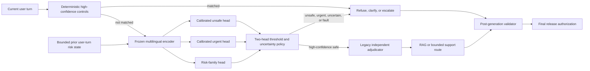

# Multilingual Semantic Safety Architecture

## Boundary

This component classifies routing risk. It does not diagnose, assess symptom
severity clinically, recommend treatment, or establish real-world safety.

## Decision flow

## Artifact contract

Runtime loading verifies:

- model, calibration, and threshold SHA-256 hashes;
- matching model and dataset versions;
- configured encoder and embedding dimension;
- artifact age;
- local availability of the frozen encoder.

Any failure returns `fail_closed`, disables caching, and prevents continuation
to ordinary retrieval or generation. Model/provider failure cannot relax a
deterministic safety decision, and retrieved text never enters the classifier
control plane as trusted policy.

## Multi-turn contract

The last four user turns are classified independently. The state stores only
probabilities, risk family, age/offset, and model version. Recent risk decays by
`0.92^age`; risk is never reset merely because a later turn is short or polite.
Malformed or oversized turns fail closed.

The urgency score must agree with an urgent semantic family. Unsafe routing is
triggered by either the calibrated unsafe head or an unsafe family prediction
at the frozen confidence floor. This reduces single-head failures while keeping
the deterministic urgent and medical-boundary controls ahead of the model.

## Evaluation contract

Internal development and validation banks may be used to choose architecture
and thresholds. The sealed old final bank is prohibited for tuning and is not
rerun. DEP-001 can only be reassessed on a newly authored external-human
no-read holdout created after the implementation freeze.
