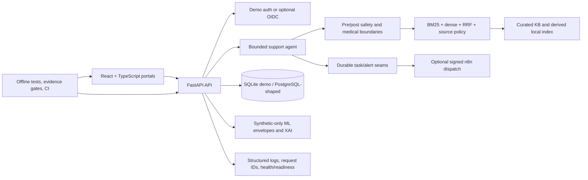

# Technical overview

## Runtime surfaces

- **Frontend:** role-separated patient, clinician, and admin/reviewer portals.
- **Backend:** FastAPI routers with authorization dependencies, request
  correlation, input boundaries, and sanitized exception handling.
- **Identity:** database-backed demo sessions for synthetic use; optional OIDC
  validation and browser PKCE readiness seams. Demo auth fails closed in
  staging/production unless explicitly enabled.
- **Database:** SQLAlchemy models and 12 Alembic revisions. SQLite is the local
  demo profile; PostgreSQL/Redis form the production-shaped synthetic profile.
- **RAG:** sparse BM25 and optional dense FAISS retrieval, reciprocal-rank fusion,
  rewrite/expansion/reranking seams, allowed-use/source-tier filtering,
  citations, evidence envelopes, and fail-closed high-risk behavior.
- **Agent:** bounded routes for answer, retrieve, clarify, structured record
  proposal, refusal, escalation, and review routing. RAG cannot override policy.
- **ML/MLE/XAI:** synthetic response/regression/review-hint heads, calibration,
  temporal/leakage/shortcut checks, abstention, prediction envelopes, lineage,
  model registry/promotion contracts, and explanation artifacts.
- **Automation:** durable tasks, leases/retries, alert outbox, signed/redacted n8n
  dispatch, and disabled-by-default execution controls.
- **Evidence:** registered JSON/CSV artifacts distinguish internal, frozen,
  external-prepared, historical, synthetic, live-agent, and informational proof.
- **Observability:** structured redacted logs, request IDs, process-local metrics,
  liveness/readiness, and a vendor-neutral error reporter. Durable metrics and a
  production error-reporting adapter are not included.

## Provider seams

Core structural verification and the synthetic demo run without cloud accounts.
Groq/Ollama, Pinecone/Azure AI Search, n8n, MLflow, Redis, and OIDC are optional
or deployment-specific. A buyer must provision and validate every external
provider, region, credential, cost control, and agreement.

## Technical boundaries

The platform demonstrates engineering controls; it does not establish clinical
correctness. Current source-governed RAG has governance advantages but has not
proven raw Recall@10 superiority over BM25. Synthetic ML metrics do not establish
real-world generalization. DEP-001 negative held-out safety evidence remains a
release blocker.
