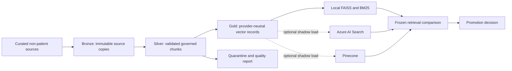

# Cloud, Data, and Vector Architecture

## Status and boundary

This is an engineering reference architecture for synthetic and non-patient
assets. It has not been deployed to Azure or Pinecone, has not processed real
patient data, and does not establish clinical validation, HIPAA compliance,
FHIR interoperability, hospital readiness, or production healthcare readiness.

## Target architecture



The local retrieval path remains canonical. A managed vector backend is a
shadow candidate until a frozen parity evaluation proves acceptable retrieval,
governance, latency, cost, and failure behavior. No managed backend is promoted
by configuration alone.

## Data engineering implementation

`backend/services/data_platform_pipeline.py` implements an incremental local
medallion-shaped pipeline for the curated knowledge base:

- **Bronze:** content-addressed source copies plus a SHA-256 source manifest.
- **Silver:** validated chunks enriched with source tier, allowed use,
  staleness, patient-facing suitability, and `clinical_validation: false`.
- **Gold:** provider-neutral records with a namespace, embedding input, KB
  fingerprint, and filterable governance metadata.
- **Quarantine:** malformed or duplicate records with explicit issue codes.
- **Lineage:** source-to-bronze-to-silver-to-gold nodes, transformations,
  record counts, and fingerprints.

The second unchanged run reuses existing silver/gold materializations instead
of rewriting them. Data contracts live in `config/data_contracts.json`.
The pipeline excludes patient records, raw chat, prompts, and responses.
Its remote-safe check verifies metadata shape and banned identity keys; it is
not a compliance certification or a general-purpose PHI detector.

Run:

```powershell
python scripts/ingest_knowledge_base.py --skip-index
python scripts/run_data_platform_pipeline.py
```

The explicit ingestion step is part of `scripts/ship.py` because the chunk
materialization is generated and intentionally not committed. This keeps a
clean clone reproducible from the source assets actually present in that
environment.

## Vector-store contract

`backend/services/managed_vector_store.py` defines a provider-neutral adapter
for:

- `local_faiss`: current canonical retrieval path.
- `azure_ai_search`: hybrid text/vector request construction with governance
  filters applied before vector ranking.
- `pinecone`: namespace-isolated upsert/query construction with equivalent
  metadata filters.

Remote network access is disabled by default. Only approved demo knowledge
namespaces are accepted, and records containing banned patient identity or raw
conversation metadata are rejected. The adapters do not make the local and
managed ranking algorithms equivalent; parity must be measured.

Run the offline contract evaluation:

```powershell
python scripts/run_vector_store_contract_eval.py
```

The artifact `Data/evals/rag/latest_vector_store_contract_eval.json` checks
filter construction, namespace isolation, network-default-off behavior, and
gold-record compatibility. It is a contract test, not evidence that Azure AI
Search or Pinecone improves retrieval.

## Azure reference foundation

`infra/azure/main.bicep` describes an intentionally incomplete, cost-gated
foundation:

- Log Analytics and a Container Apps environment.
- ADLS Gen2 containers for bronze, silver, gold, and quarantine.
- Key Vault for future secret references.
- Optional Azure AI Search.
- Optional Service Bus queue with duplicate detection and dead-letter support.
- Optional PostgreSQL Flexible Server.

Cost-bearing managed services are disabled by default. Public network access is
disabled for optional data services. The template does not deploy the NLCare
application, private endpoints, DNS zones, a container registry, workload
identity bindings, or production alerts. Those omissions are deployment
blockers, not future-proofing claims.

Run the static readiness check:

```powershell
python scripts/run_cloud_infrastructure_readiness.py
```

Before any Azure test deployment:

1. Install Azure CLI and Bicep, then compile and run `what-if`.
2. Use a separate low-cost development subscription and synthetic/non-patient
   data only.
3. Add private endpoints, private DNS, managed identities, least-privilege
   roles, retention policies, budgets, and alerting.
4. Deploy one non-patient shadow backend, never two managed vector systems at
   once without a measured reason.
5. Run frozen local-versus-managed retrieval parity, load, cost, recovery, and
   filter-leakage tests.
6. Keep the managed backend disabled if the comparison does not justify it.

## Provider decision

For an Azure-first deployment, Azure AI Search is the first managed shadow
candidate because it can combine lexical and vector retrieval with metadata
filters in one service. Pinecone remains a portable alternative for vector
operations. At the current corpus size, neither is automatically better than
local FAISS/BM25, and operating both would add cost and failure surfaces.

`pgvector` is a future simplification candidate if Postgres is already required
and the corpus remains modest. It should be evaluated against the same adapter
contract and frozen comparison before adoption.

## Evidence and artifacts

- `Data/evals/data/latest_data_platform_pipeline.json`
- `Data/evals/rag/latest_vector_store_contract_eval.json`
- `Data/evals/ops/latest_cloud_infrastructure_readiness.json`
- `Data/lakehouse/manifests/latest_source_manifest.json`
- `Data/lakehouse/lineage/latest_lineage.json`
- `Data/lakehouse/silver/knowledge_chunks.jsonl`
- `Data/lakehouse/gold/vector_records.jsonl`

## What this still cannot claim

- No Azure or Pinecone deployment has been completed.
- No live managed-vector parity benchmark has been completed.
- No real patient data has been processed.
- No clinical validation, clinician approval, IRB approval, or patient benefit.
- No HIPAA, FHIR, hospital, or production healthcare readiness.
