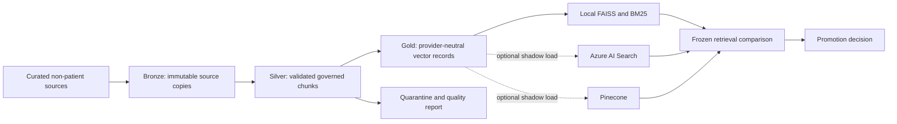

# Cloud, Data, and Vector Architecture

## Status and boundary

This is an engineering reference architecture for synthetic and non-patient
assets. It has not been deployed to Azure or Pinecone, has not processed real
patient data, and does not establish clinical validation, HIPAA compliance,
FHIR interoperability, hospital readiness, or production healthcare readiness.

## Target architecture



The local retrieval path remains canonical. A managed vector backend is a
shadow candidate until a frozen parity evaluation proves acceptable retrieval,
governance, latency, cost, and failure behavior. No managed backend is promoted
by configuration alone.

## Data engineering implementation

`backend/services/data_platform_pipeline.py` implements an incremental local
medallion-shaped pipeline for the curated knowledge base:

- **Bronze:** content-addressed source copies plus a SHA-256 source manifest.
- **Silver:** validated chunks enriched with source tier, allowed use,
  staleness, patient-facing suitability, and `clinical_validation: false`.
- **Gold:** provider-neutral records with a namespace, embedding input, KB
  fingerprint, and filterable governance metadata.
- **Quarantine:** malformed or duplicate records with explicit issue codes.
- **Lineage:** source-to-bronze-to-silver-to-gold nodes, transformations,
  record counts, and fingerprints.

The second unchanged run reuses existing silver/gold materializations instead
of rewriting them. Data contracts live in `config/data_contracts.json`.
The pipeline excludes patient records, raw chat, prompts, and responses.
Its remote-safe check verifies metadata shape and banned identity keys; it is
not a compliance certification or a general-purpose PHI detector.

Run:

```powershell
python scripts/ingest_knowledge_base.py --skip-index
python scripts/run_data_platform_pipeline.py
```

The explicit ingestion step is part of `scripts/ship.py` because the chunk
materialization is generated and intentionally not committed. This keeps a
clean clone reproducible from the source assets actually present in that
environment.

## Vector-store contract

`backend/services/managed_vector_store.py` defines a provider-neutral adapter
for:

- `local_faiss`: current canonical retrieval path.
- `azure_ai_search`: hybrid text/vector request construction with governance
  filters applied before vector ranking.
- `pinecone`: namespace-isolated upsert/query construction with equivalent
  metadata filters.

Remote network access is disabled by default. Only approved demo knowledge
namespaces are accepted, and records containing banned patient identity or raw
conversation metadata are rejected. The adapters do not make the local and
managed ranking algorithms equivalent; parity must be measured.

Run the offline contract evaluation:

```powershell
python scripts/run_vector_store_contract_eval.py
python scripts/run_azure_search_index_readiness.py
python scripts/run_managed_vector_shadow_sync.py
python scripts/run_managed_vector_shadow_comparison.py
```

The artifact `Data/evals/rag/latest_vector_store_contract_eval.json` checks
filter construction, namespace isolation, network-default-off behavior, and
gold-record compatibility. It is a contract test, not evidence that Azure AI
Search or Pinecone improves retrieval.

The Azure index schema is versioned at
`config/vector_indexes/azure_ai_search_nlcare_kb.json`. It defines a 384
dimensional HNSW vector field and filterable source-tier, allowed-use,
staleness, audience, data-scope, and claim-boundary metadata. The readiness
runner validates it locally. `--apply` uses an idempotent REST `PUT` only when
all managed-vector network gates and credentials are explicitly enabled.

The shadow sync runner validates every gold record against the remote-safe
metadata contract and creates deterministic batches without computing
embeddings or contacting Azure by default. Its `--apply` path uses the same
local MiniLM encoder as the comparison, checks dimensions, performs
`mergeOrUpload`, and verifies each per-document receipt. A successful sync is
ingestion evidence only, not retrieval-improvement evidence.

The managed shadow comparison stays `ready_for_managed_shadow_run` when no
endpoint exists. A live run must use the unchanged frozen retrieval goldset
and report Recall@5/10, MRR, NDCG@10, citation precision, claim support,
unsupported context, refusal/source-tier correctness, and p50/p95 latency.
Promotion remains `HOLD` until measured cost, ingestion freshness, deletion,
and outage fallback evidence also exists.

## Azure reference foundation

`infra/azure/main.bicep` describes a compile-checked, cost-gated foundation:

- Log Analytics and an optional private Container Apps environment.
- ADLS Gen2 containers for bronze, silver, gold, and quarantine.
- Key Vault with purge protection and RBAC-oriented access.
- A user-assigned workload identity with scoped storage, vault, search, and
  messaging data roles.
- Optional VNet, delegated subnets, private DNS, and private endpoints for
  Storage blob/DFS, Key Vault, Search, Service Bus, and PostgreSQL.
- Optional Entra/RBAC-only Azure AI Search.
- Optional Service Bus queue with duplicate detection and dead-letter support.
- Optional private PostgreSQL Flexible Server with 14-day default backup
  retention, storage autogrow, and opt-in geo-redundant backup.
- Optional engineering action group, failed-operation alert, and monthly cost
  budget.

Compute, private networking, managed search, messaging, PostgreSQL, alerts, and
budgets are all disabled by default. Public network access is disabled by
default. The template still does not deploy the NLCare application, a
container registry, or any patient data. Private resources have not been
exercised from a workload, and backup restoration has not been proven.

Run the local compile/readiness checks:

```powershell
.\tools\bin\bicep.exe build infra\azure\main.bicep --stdout > $null
python scripts/run_cloud_infrastructure_readiness.py
```

The current machine has standalone Bicep available, but Azure CLI installation
was blocked at the Windows installer boundary and no subscription credentials
are configured. Consequently `what-if` and deployment remain incomplete.

Before any Azure test deployment:

1. Install/authenticate Azure CLI and run a resource-group `what-if`.
2. Use a separate low-cost development subscription and synthetic/non-patient
   data only.
3. Review names, region availability, RBAC scope, budget amount, alert
   recipient, and private DNS before deployment.
4. Deploy one non-patient Azure AI Search shadow backend, never two managed vector systems at
   once without a measured reason.
5. Run frozen local-versus-managed retrieval parity, load, cost, recovery, and
   filter-leakage tests.
6. Keep the managed backend disabled if the comparison does not justify it.

The exact procedure and teardown contract are in
`docs/runbooks/azure_non_patient_shadow.md`.

## Reliability drills

`python scripts/run_data_platform_reliability_eval.py` exercises six local,
non-patient failure modes:

- idempotent replay;
- partial-row quarantine isolation;
- explicit v0-to-v1 schema migration defaults;
- deterministic backfill batching;
- local tombstone propagation;
- managed-adapter failure with local fallback.

These drills do not claim Azure object deletion, Azure AI Search delete
propagation, PostgreSQL point-in-time restore, or regional disaster recovery.
Those remain explicit false fields in the artifact.

## Provider decision

For an Azure-first deployment, Azure AI Search is the first managed shadow
candidate because it can combine lexical and vector retrieval with metadata
filters in one service. Pinecone remains a portable alternative for vector
operations. At the current corpus size, neither is automatically better than
local FAISS/BM25, and operating both would add cost and failure surfaces.

`pgvector` is a future simplification candidate if Postgres is already required
and the corpus remains modest. It should be evaluated against the same adapter
contract and frozen comparison before adoption.

## Evidence and artifacts

- `Data/lakehouse/manifests/latest_pipeline_run.json`
- `Data/evals/rag/latest_vector_store_contract_eval.json`
- `Data/evals/rag/latest_azure_search_index_readiness.json`
- `Data/evals/rag/latest_managed_vector_shadow_sync.json`
- `Data/evals/rag/latest_managed_vector_shadow_comparison.json`
- `Data/evals/rag/latest_managed_vector_shadow_failures.json`
- `Data/evals/ops/latest_cloud_infrastructure_readiness.json`
- `Data/evals/ops/latest_data_platform_reliability_eval.json`
- `Data/lakehouse/manifests/latest_source_manifest.json`
- `Data/lakehouse/lineage/latest_lineage.json`
- `Data/lakehouse/silver/knowledge_chunks.jsonl`
- `Data/lakehouse/gold/vector_records.jsonl`

## What this still cannot claim

- The Azure template compiles locally, but no Azure or Pinecone deployment has
  been completed.
- No live managed-vector parity benchmark has been completed.
- No managed delete, backup-restore, cloud load, or measured cost drill has
  been completed.
- No real patient data has been processed.
- No clinical validation, clinician approval, IRB approval, or patient benefit.
- No HIPAA, FHIR, hospital, or production healthcare readiness.
