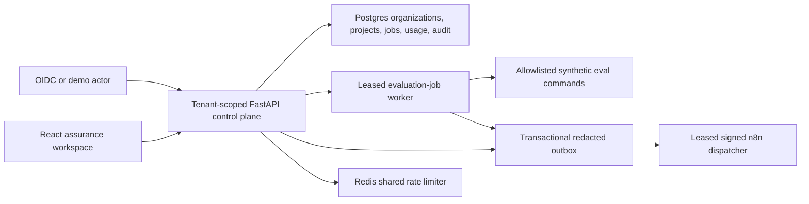

# NLCare SaaS Product Boundary and Roadmap

## Product direction

The credible SaaS direction is a **synthetic healthcare-AI assurance workspace**:
teams organize projects, run RAG/agent/safety evaluations, inspect evidence,
track redacted usage and latency, and export review packets. The patient and
clinician portals remain portfolio demonstrations of the system being evaluated.

This boundary avoids turning synthetic ML outputs or internally authored safety
tests into clinical authority.

## Implemented foundation

- Organizations, membership roles, projects, and synthetic environments.
- Idempotent job submission and non-billing usage accounting.
- Entitlement ceilings for projects, evaluation runs/cases, provider tokens,
  automation runs, storage, and vectors.
- Leased jobs with bounded retries, crash recovery, and dead letters.
- Transactional outbox delivery through signed, redacted n8n events.
- Shared Redis rate limiting for multi-process profiles; strict profiles fail
  closed when shared protection is requested but unavailable.
- An admin-only workspace for projects, jobs, usage, and claim boundaries.

## API surface

- `GET /platform/session`
- `POST /platform/organizations`
- `GET /platform/organizations/{organization_id}/overview`
- `GET|POST /platform/organizations/{organization_id}/projects`
- `GET /platform/organizations/{organization_id}/usage`
- `GET /platform/organizations/{organization_id}/jobs`
- `POST /platform/organizations/{organization_id}/projects/{project_id}/jobs`
- `DELETE /platform/organizations/{organization_id}/jobs/{job_id}`

Mutating job requests require an `Idempotency-Key`. Tenant access is checked in
the service layer, not inferred from frontend state.

## Data boundary

The SaaS tables are control-plane metadata only. Job payloads reject patient,
message, prompt, email, phone, address, and date-of-birth style fields, including
nested values. Outbox payloads pass through the existing blocked-field scanner.
Usage events are explicitly `billable = false` and are not invoice truth.

## What remains before a restricted external alpha

1. Connect a real OIDC provider and test organization provisioning, role changes,
   revocation, session expiry, and account recovery.
2. Apply the migration to disposable Postgres, then run concurrent worker,
   backup/restore, dead-letter replay, and tenant-isolation drills.
3. Deploy behind TLS and a gateway/WAF with managed secrets, log retention,
   alert ownership, vulnerability scanning, and incident runbooks.
4. Add browser-level tests for organization switching, quota errors, idempotent
   resubmission, worker completion, cancellation, and inaccessible tenant URLs.
5. Complete an external-author evaluation and independent security review.

## Explicit non-capabilities

This foundation is not clinically validated, does not accept real patient data,
does not prove healthcare production readiness, has no verified live identity
provider, does not provide audited billing, and has not been exercised in a
managed cloud environment. A passing release gate is engineering evidence only.
