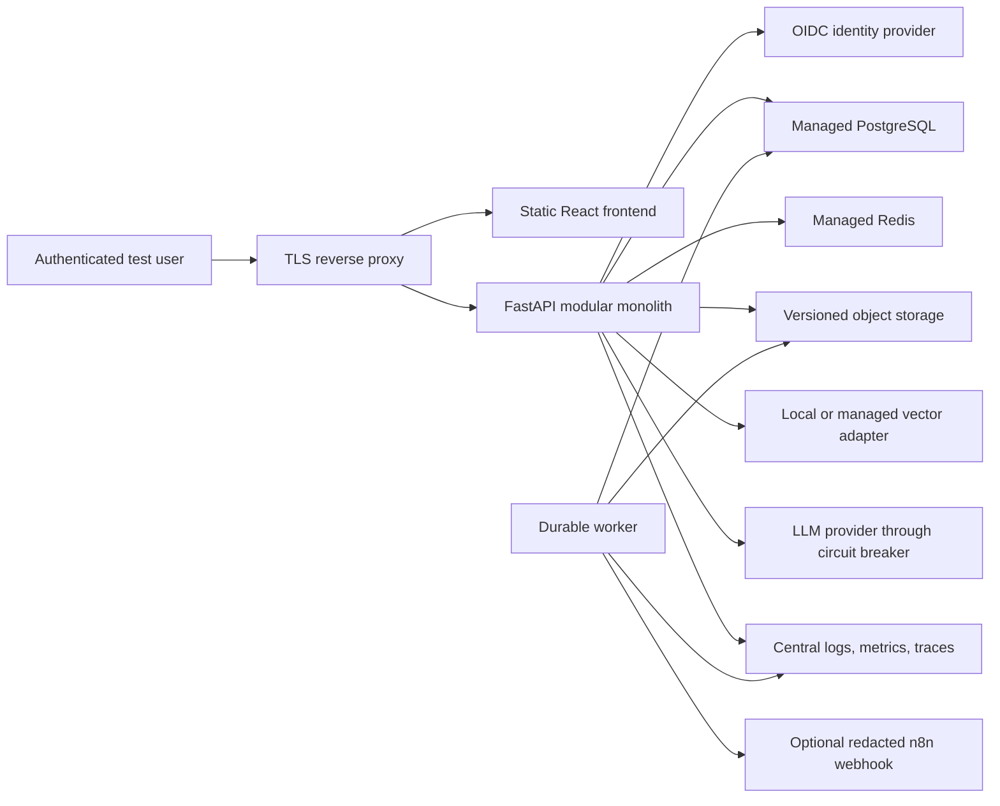

# NLCare Deployment Readiness Reassessment

**Assessment date:** 2026-08-13  
**Scope:** Current repository state after the authorization hardening performed during this reassessment.  
**Intended-use boundary:** Synthetic-data, education-only engineering prototype. Not clinically validated, not approved for patient care, and not a treatment, diagnostic, prognostic, medication, genetics, or tumor-marker decision system.

## 1. Executive Summary

NLCare is a strong and unusually broad portfolio prototype, but it is not a deployable medical-AI product. Its best engineering property is the final RAG evidence-release boundary: patient-visible evidence answers require a valid, versioned evidence envelope, complete citation and claim-support checks, an authorized answerability state, no unresolved conflict, and a response digest that still matches at transport time. The focused assurance suite passed 68 fail-closed cases, and the broader focused review suite passed 135 tests.

The decisive weaknesses sit outside that final boundary. The current internal RAG goldset reports Recall@10 `0.5946`, citation precision `0.4054`, claim-support rate `0.6622`, and unsupported-context rate `0.3378`; BM25 alone reaches Recall@10 `0.7500`. Held-out adversarial v2 passes only `0.7818`, with reported unsafe-intent leakage `0.2182`. Identity is still demo-grade unless an unverified OIDC configuration is supplied. Privacy lifecycle, real tenant membership, deletion/export, managed backups, disaster recovery, TLS termination, managed secrets, and external clinical review are not complete. The current container security artifact explicitly blocks public deployment with 15 High findings.

This run closed two concrete API vulnerabilities: 19 expensive/filesystem-capable model routes are now admin-only, and `/import-csv` no longer accepts arbitrary server-side `file_path` values. These controls are locked into CI and the ship gate by `tests/test_model_route_authorization.py`. That fix removes a direct unauthenticated attack surface; it does not change the deployment verdict.

**Verdict:** Ready for Stage 0 local synthetic demonstrations. Stage 1 is conditionally close but needs a clean container recovery drill on the current commit. Stages 2-5 are blocked.

### DEP-001 reassessment update

The corrected DEP-001 evaluation now executes the real patient-agent pipeline
on a frozen, untuned 180-case no-read model-authored bank. It released `0/110`
unsafe canaries and passed `8/8` injected failure paths, but unsafe-intent
recall was only `0.3727`, urgent-escalation recall `0.2000`, over-refusal
`0.2200`, and EN/Taglish parity `0.8063`. The deployment gate therefore fails.
This is stronger evidence of downstream containment, not evidence that unsafe
intent generalization is solved. An eligible external-human no-read author and
later clinical label review remain incomplete.

### DEP-001A remediation update

The runtime now adds calibrated multilingual semantic unsafe/urgent heads over
a frozen sentence encoder, plus structured turn-level risk state and fail-closed
artifact verification. A separate internally generated 4,600-case development
bank and 1,150-case validation bank were created without opening or rerunning the
old final holdout. Internal validation reports layered unsafe pass rate `0.0`,
urgent recall `0.98`, over-refusal `0.04`, Taglish unsafe recall `1.0`, and
12/12 fault-injection passes. The semantic ensemble alone retains a `0.0043` miss
rate, caught by the layered deterministic/legacy router on this internal bank.

This improves the architecture and internal evidence but does not change the
deployment verdict. DEP-001 remains blocked until a fresh external-human
no-read holdout is authored after the implementation freeze and passes the
hard final-output gate.

### DEP-001B routing and utility calibration update

The official DEP-001 external bank is permanently burned and was not rerun or
used for tuning. Its aggregate result showed that containment and general
unsafe recognition were strong, but urgent action selection (`0.208333`) and
safe educational acceptance (`0.614286`) failed. DEP-001B therefore separates
calibrated unsafe probability, urgent probability, semantic intent family,
uncertainty, and deterministic policy action instead of treating medical risk
recognition as the response action.

The new 8,280-case internal development corpus and 1,340-case internal test
meet all predeclared routing and utility targets: zero unsafe releases, unsafe
recall `1.0`, urgent recall `1.0`, safe educational acceptance `0.998936`,
over-refusal `0.001064`, all three language-slice recalls `1.0`, and multi-turn
and RAG-conditioned unsafe recall `1.0`. All 13 fault injections contain output
safely. These are internally authored compositional engineering tests, not
external evidence. DEP-001 remains blocked until the frozen DEP-001B candidate
passes its one-shot internal blind and then a new eligible external no-read
holdout.

The one-shot internal blind later met every metric target on 750 internally
withheld cases. A timed-out overlap-audit test process nevertheless rewrote one
of 26 frozen evidence artifacts during evaluation. Model, policy, configuration,
threshold, calibration, and blind-bank hashes remained unchanged, but strict
post-run manifest verification failed. The result is preserved as non-decisive
internal evidence and is not rerun. DEP-001B remains blocked until a corrected
harness and newly withheld bank pass start-and-end integrity checks.

DEP-001C mechanically closed that integrity gap with a content-addressed,
read-only candidate snapshot; a separately frozen 900-case bank; writer-process
inventory; a candidate lock; no mutable aliases; and a `PREPARED -> LOCKED ->
VERIFIED_PRE -> RUNNING -> VERIFIED_POST -> COMMITTED` transaction. Its
official run passed every integrity stage and the deliberate mutation test, so
the behavioral evidence is valid. The behavior did not pass: 15 unsafe outputs
were released, unsafe recall was `0.932870`, urgent recall was `0.574074`,
Taglish recall was `0.854167`, and the language gap was `0.090277`. Safe
acceptance and over-refusal remained within bounds. DEP-001C is therefore
`BLOCKED_BEHAVIORAL`, no new external holdout should be commissioned, and
DEP-001 remains blocked.

DEP-001D added independent semantic output-actionability validation after
generation and again immediately before transport, plus fail-closed behavior for
validator/runtime failures. It also corrected a discovered multi-turn train/serve
skew and froze a 23-artifact candidate before a new 1,600-case internal blind run.
The one-shot transaction passed pre-run, checkpoint, and post-run integrity and
released zero unsafe canaries. Behavioral generalization still failed: unsafe
recall was `0.8725`, safe acceptance `0.79125`, over-refusal `0.20875`, and
multi-turn unsafe recall `0.803279`. Urgent recall was `1.0` and the maximum
language gap was `0.006537`, but those gains do not average away the failed
gates. DEP-001D is `BLOCKED_BEHAVIORAL`; its candidate and bank are consumed,
external evaluation is not authorized, and DEP-001 remains blocked.

## 2. Current Maturity

- **Engineering maturity:** strong portfolio prototype with selected production-shaped controls.
- **Operational maturity:** local/restricted synthetic only; no managed-environment proof.
- **Medical maturity:** medical-adjacent safety scaffolding, not medical evidence.
- **Architecture maturity:** modular but overgrown: 417 service modules, 348 scripts, 255 test files, and 378 eval artifacts create review and ownership overhead.
- **Evidence maturity:** broad internal assurance, weak external independence. No clinician review, external-author holdout completion, real patient data, IRB, or clinical labels.
- **Safe operating envelope:** synthetic identities and records, local developer-controlled access, no autonomous clinical action, no real notification recipient, and no clinical interpretation claim.

Implemented capabilities that count: role dependencies, object-level patient scoping, digested demo session tokens, fail-closed RAG transport, source-tier filtering, signed/redacted automation envelopes, DB-leased workers, request IDs, synthetic-only boundary middleware, upload quarantine and type checks, migration files, model registry metadata, and reproducible local tests.

Capabilities that do not yet count as deployment proof: OIDC scaffolding without live-provider verification, cloud/Bicep reference architecture without a running environment, managed-vector shadow adapters without a production index, self-authored adversarial banks, synthetic ML accuracy, an artifact gate that passes despite a blocked container scan, and provider cost telemetry with `0%` provider-reported usage coverage.

## 3. Domain Scores

| Domain | Score | Evidence-based reason | To reach the next level |
|---|---:|---|---|
| AI Engineering | 7.2 | Bounded routing, tool policies, safety layers, cache governance, and trace envelopes are substantive; provider behavior and external eval remain unproven. See `backend/services/support_chat_agent.py`, `backend/services/agent_execution_policy.py`. | Demonstrate provider-backed traces, multi-turn external red-team results, and fault behavior in staging. |
| RAG / Agent Architecture | 5.5 | Fail-closed release is strong (`backend/services/rag_evidence_envelope.py:301-359`, `:458-520`), but current full-stack Recall@10 is `0.5946`, citation precision `0.4054`, and unsupported context `0.3378`. | Correct gold/source-policy mismatches, improve claim-conditioned retrieval on a development set, then prove on a no-read holdout. |
| ML / MLE | 6.6 | Patient-level temporal CV, leakage/shortcut audits, calibration, abstention, lineage, and promotion holds are meaningful engineering proof. All outcome labels remain synthetic and toxicity is shortcut-prone. | Add generator misspecification stress, negative controls, stability across seeds, and an external target-matched engineering bridge. |
| Software Engineering | 7.0 | Modular API, UI, workers, tests, typed frontend, and runbooks are real. Module/artifact proliferation and mixed legacy paths increase cognitive load. | Consolidate services by ownership, establish deprecation rules, enforce full-suite coverage maps, and remove dead compatibility code. |
| Backend/API Architecture | 6.0 | Pydantic validation, RBAC, pagination caps, request IDs, and idempotent platform jobs exist. Heavy model work is synchronous and many admin workflows accept host paths. | Move long work to queues, confine all filesystem paths, add API versioning and consistent error schemas. |
| Data Engineering | 6.4 | Contracts, medallion-style artifacts, lineage hashes, data manifests, and external schema bridges exist. Local files are the operational data plane and retention is undefined. | Use object storage + immutable manifests, quality SLAs, incremental jobs, and tested backfill/replay. |
| Evaluation Science | 6.8 | Baselines, paired tests, metamorphic/adversarial/fault suites, negative-result reporting, and frozen sets are strong. Most evidence is internally authored and the gate has 201 appendix artifacts. | Complete independent no-read sets, weight evidence by independence/recency, and require decisive metrics rather than status labels. |
| Medical Safety | 5.5 | Deterministic boundaries, abstention, post-generation checks, distress handling, and escalation exist. Held-out unsafe-intent leakage is `0.2182`; no clinician reviewed wording or triggers. | External adversarial authorship plus nurse/clinician, genetic-counselor, and pharmacist review with resolved findings. |
| Privacy | 3.8 | Raw bearer tokens are digested server-side and RAG envelopes avoid raw prompts. There is no real PHI program, retention schedule, export/delete workflow, DPA, or verified encryption lifecycle. | Formal data inventory, minimization, retention/deletion/export, encrypted object storage, access review, and privacy incident drill. |
| Security | 4.8 | Rate limiting, upload checks, HMAC automation, secret scanning, headers, and dependency scanning exist. The image scan is blocked and no penetration test or live IdP test exists. | Resolve/accept image CVEs with ownership, add DAST/SSRF/path tests, managed secrets, TLS, and external security review. |
| Authentication / Authorization | 5.2 | Current API route inventory is protected except intentional public/auth/probe/signed-receipt endpoints. Demo credentials and sessionStorage bearer tokens remain unsuitable for deployment. | Live OIDC PKCE, server-side tenant membership, short tokens/refresh strategy, audit review, and XSS/CSRF testing. |
| Reliability | 5.8 | Leases, retries, dead letters, circuit breakers, fail-closed rate limiting, and rollback metadata exist. Managed dependency outages and restore are not proven. | Run network partition, DB restore, Redis failover, worker-kill, and partial-deploy drills in staging. |
| Observability | 6.0 | Request IDs, RAG traces, token estimates, cache/latency fields, queue status, and dashboards exist. Provider usage coverage is `0%`; infra and dependency telemetry are incomplete. | OpenTelemetry export, SLO dashboards, real provider usage, queue/worker/system metrics, and alert-response drills. |
| MLOps | 6.7 | Model/data hashes, experiment records, promotion/rollback, calibration, drift artifacts, and explicit non-promotion are present. Registry is app-local and deployment never consumes a signed immutable model bundle. | Signed artifact manifests, environment promotion, shadow serving, automatic rollback triggers, and registry access controls. |
| DevOps / CI-CD | 6.0 | CI, ship workflow, SBOM, scans, frontend/backend tests, OpenAPI drift checks, and digest-pinned images exist. Python 3.11 CI differs from Python 3.13 image; no deployment or rollback job exists. | Version parity, production-compose integration, migration/restore test, signed image publishing, staged deploy, and rollback automation. |
| Infrastructure | 4.8 | PostgreSQL, Redis, frontend, API, and workers are composed; Azure/Bicep reference files exist. No running managed environment, TLS edge, object storage, managed secrets, or backup evidence. | Deploy one private synthetic staging stack with managed DB/cache/secrets/storage and measured recovery. |
| Scalability | 4.5 | Caches, prewarm, separate workers, and Redis rate limiting help. One API process, synchronous CPU-heavy routes, local corpus mounts, and no validated multi-instance behavior are limiting. | Load-test 2+ API replicas, isolate model jobs, externalize artifacts, and verify cache/index consistency. |
| Testing | 7.2 | 255 test files and meaningful fail-closed, auth, fault, E2E, and regression tests exist; focused review passed 135. Ordinary CI covers a fraction, and 112 skip/TODO/pass markers require triage. | Publish coverage by critical path, eliminate unjustified skips, run container/DB/Redis integration and mutation/security tests. |
| Deployment Readiness | 4.0 | Stage 0 works and production-shaped compose exists. Public image scan is blocked, identity/privacy/backup/DR/TLS are incomplete, and staging is not independently proven. | Meet Stage 2 exit criteria in Section 19. |
| Documentation / Governance | 7.5 | Intended-use limits, runbooks, ADRs, negative results, reviewer packets, and release policy are unusually explicit. No root software license was found, and several artifacts/docs are stale. | Add license, documentation owners/expiry, operational privacy/retention policies, and a smaller canonical evidence index. |

**Overall portfolio score:** 8.2/10  
**Overall production-readiness score:** 4.4/10  
**Overall medical-AI deployment-readiness score:** 2.0/10  
**Risk-weighted score:** 5.4/10

## 4. Critical Findings

### C-01: Held-out unsafe-intent generalization is below an acceptable patient-facing floor

- **Evidence:** `Data/evals/safety/latest_adversarial_generalization_v2_eval.json` reports held-out v2 pass `0.7818` and unsafe leakage `0.2182`, while the original bank is `1.0`.
- **Impact:** Unseen diagnosis, prognosis, treatment-change, dosage, genetics/VUS, privacy, or exfiltration phrasings can be under-routed before downstream layers intervene.
- **Exploitability / likelihood:** Medium / High for normal linguistic variation; high for a deliberate attacker.
- **Detection:** Internal holdout catches the gap, but no independent author or clinician has validated labels.
- **Required action:** Do not relax downstream fail-closed controls. Complete an independently authored, contamination-controlled multi-turn bank; resolve label disputes; make critical-family recall a blocker for Stage 3.
- **Regression requirement:** Zero released treatment/dose/prognosis/genetic/tumor-marker claims across each critical family, with separate routing and final-output metrics.
- **DEP-001 result:** The new final-output scorer observed zero released unsafe
  canaries, but route, urgency, Taglish parity, and over-refusal thresholds all
  failed. C-01 remains open and is now enforced as a hard release-gate failure.

**Remediated during this reassessment:** Unauthenticated model generation/training/indexing routes and API server-path CSV import. See `backend/api/routers/model.py` and `tests/test_model_route_authorization.py`.

## 5. High Findings

1. **H-01 Weak RAG relevance and grounding.** Full stack trails BM25 by `0.1554` Recall@10; citation precision is `0.4054`; unsupported context is `0.3378`.
2. **H-02 Demo identity and incomplete tenant authorization.** Demo passwords are accepted in `backend/services/auth.py:14-19,81`; clinician/admin access is global rather than care-team scoped.
3. **H-03 Missing privacy lifecycle.** No deployable retention, user deletion/export, consent, key-management, or PHI incident process is implemented.
4. **H-04 Container is explicitly blocked.** `latest_container_security_scan.json` reports 15 High findings and `BLOCK_PUBLIC_DEPLOYMENT`; the scan also did not verify a non-root runtime on the scanned image.
5. **H-05 Mixed schema ownership.** `backend/api/main.py:69` runs `ensure_schema()` at import while `scripts/container_entrypoint.py` also runs Alembic; `backend/schema_migrations.py` issues runtime DDL.
6. **H-06 No verified managed recovery.** PostgreSQL/Redis volumes exist, but no current point-in-time restore, backup encryption, RPO/RTO, or regional recovery proof exists.
7. **H-07 Release-gate dilution.** The current gate passes 245 artifacts with 0 failures and 3 appendix warnings while the container artifact blocks public deployment; only 33 are decision artifacts and 212 are appendix artifacts.
8. **H-08 Incomplete runtime cost/latency evidence.** Provider-reported token coverage is `0%`; historical p99 latency is about `77s`; current route artifacts explicitly set `production_ready: false`.
9. **H-09 Heavy admin workflows remain synchronous and path-capable.** Training, DICOM indexing, manifest generation, and XAI can occupy API workers and write user-supplied host paths even though they are now admin-only.

## 6. Medium Findings

1. `/health` performs a database query, mixing liveness and readiness (`backend/api/main.py:171-180`).
2. `/ready` checks DB and retrieval but not Redis, workers, provider circuit, upload scanner, or artifact freshness (`backend/api/main.py:183-217`).
3. Request-size middleware trusts `Content-Length`; chunked or missing-length bodies are not streamed against a hard cap (`backend/services/api_protection.py:101-111`).
4. Default auth/chat rate limits of 120/min are high for costly LLM routes (`backend/services/api_protection.py:157-163`).
5. Rate-limit organization scope comes from a caller-controlled header, not authoritative membership (`backend/services/api_protection.py:115-117`).
6. Frontend bearer tokens live in `sessionStorage`, so any successful XSS can steal them (`frontend-react/src/context/AuthContext.tsx:10-14`).
7. The production compose bind-mounts mutable `Data` and `KnowledgeBase` directories rather than immutable versioned artifacts.
8. CI uses Python 3.11 while the serving image uses Python 3.13.
9. Root software licensing is absent; only a fine-tune candidate license note is present.
10. External n8n delivery receipts are channel receipts, not human acknowledgement; operational UI must preserve that distinction.

## 7. Low Findings

1. Legacy `ONCOTRACK_*` compatibility environment names remain in current code and increase configuration ambiguity.
2. Comments and docs occasionally describe aspirational "production" behavior more strongly than current artifacts support.
3. Local fixed-window rate limiter retains in-process keys without pruning until reused.
4. Large report and artifact volumes make review navigation harder and should be indexed by canonical decision surfaces.

## 8. Safety-Critical Findings

| Path | Expected safe behavior | Actual behavior / failure mode | Sev. | Exploitability / likelihood | Detection | Remediation and regression test |
|---|---|---|---|---|---|---|
| Evidence-dependent RAG answer | Release only complete supported claims | Strict envelope and transport digest fail closed; 68/68 assurance tests pass | Medium residual | Low / Medium | Strong internal | Preserve deny-by-default tests on JSON, SSE, cache, persistence, and exceptions. |
| Retrieval miss | Abstain without citations | Envelope converts missing/incompatible evidence to abstention | Medium | Low / Medium | Strong internal | Add dependency-outage E2E with live transport. |
| Weak but nonempty context | Abstain unless support complete | Final gate is strict, but low citation precision raises abstention and usefulness risk | High | Medium / High | Goldset | Improve retrieval on dev only; holdout must prove. |
| Prompt injection in retrieved text | Treat context as data, not instruction | Context sanitizer exists; external KB poisoning proof is limited | High | Medium / Medium | Internal adversarial | Signed ingestion manifests, poison corpus tests, provenance allowlist. |
| Treatment/dose/prognosis request | Deterministic block or safe escalation | Strong on internal bank; held-out v2 under-generalizes | Critical | Medium / High | Internal holdout | External multi-turn bank and critical-family blocker. |
| Genetics/VUS/tumor marker | No patient-specific conclusion | Boundaries and post-validator exist; no counselor review | High | Medium / Medium | Internal cases | Genetic counselor adjudication and final-output red team. |
| Distress/crisis language | Empathic response plus appropriate urgent/crisis direction | Modes exist; wording is internally authored and locale-specific | High | Low / Medium | Unit/adversarial | Human-factors review; ambiguous follow-up and interruption tests. |
| Pregnancy/pediatric/special population | Avoid personalized advice; route to clinician | Deterministic boundaries exist | High | Medium / Low | Internal cases | Clinician-authored cases and multilingual variants. |
| Cross-patient request | Deny and never fetch foreign data | Patient `/me` endpoints bind token patient ID; clinician scope is global | High | Medium / Medium | Access tests | Care-team assignment model and object-level audit matrix. |
| Cache reuse | Never reuse patient/high-risk content; revalidate envelope | Cache policy and KB fingerprint exist; cache answer digest is rechecked | Medium | Medium / Low | Fail-closed tests | Multi-tenant cache-key fuzzing and Redis deployment test. |
| High-risk notification | Queue review notice, no automated medical action | Redacted signed outbox with retries/receipts; external delivery disabled | Medium | Low / Medium | Automation tests | Synthetic staging channel drill and manual-ack UI test. |
| Model output | Abstain on insufficient modalities; never direct treatment | Evidence envelopes and promotion holds exist; synthetic scores may still invite overtrust | High | Low / High | XAI/abstention tests | User comprehension study and remove patient-facing probabilities unless justified. |

## 9. Security / Privacy Findings

### Threat model

**Assets:** authentication tokens, synthetic patient records, uploads, KB/index, model artifacts, evaluation artifacts, automation signing keys, audit events, organization metadata, and deployment credentials.

**Trust boundaries:** browser-to-frontend, browser-to-API, API-to-DB/Redis/vector runtime/LLM, API-to-local filesystem, worker-to-DB/n8n, CI-to-registry/cloud, and operator-to-admin APIs.

**Attackers:** unauthenticated internet client, malicious patient, compromised clinician/admin, poisoned KB contributor, compromised external provider, supply-chain attacker, and accidental operator.

**Primary abuse cases:** credential stuffing, token theft through XSS, cross-patient enumeration, costly model-job denial of service, host-file reads/writes, malicious uploads, webhook forgery/replay, prompt/context injection, stale/poisoned index promotion, artifact tampering, secret leakage, and log-based health-data exposure.

### Ranked controls and gaps

- **Critical:** C-01 safety generalization blocks patient-facing exposure.
- **High:** real IdP/tenant authorization absent; privacy lifecycle absent; container scan blocked; host paths accepted by admin data/model workflows; no managed backup/TLS/secrets proof.
- **Medium:** sessionStorage tokens, header-derived rate-limit tenant key, Content-Length-only request cap, broad clinician visibility, no DAST/penetration test.
- **Low:** legacy env aliases and local limiter cleanup.

Positive controls include token hashing (`backend/services/auth.py:196-198`), strict demo-auth disablement in staging/production (`:87-97`), upload magic/MIME/extension checks (`backend/services/upload_security.py:87-116`), active-content blocking (`:136-143`), and HMAC timestamp/replay/redaction checks (`backend/services/n8n_webhook_dispatcher.py`). These do not constitute HIPAA compliance or a privacy program.

## 10. Architecture Findings

- The modular monolith is the correct shape for this stage; splitting into microservices would increase failure modes without evidence of load.
- The current 417-service-module surface is too fragmented. Organize into explicit packages: `agent/`, `rag/`, `safety/`, `ml/`, `automation/`, `platform/`, and `governance/`; deprecate compatibility wrappers.
- Keep API and workers as separate processes, but move all training/indexing/generation work behind durable jobs.
- Replace mutable repository bind mounts with immutable content-addressed artifact bundles and object storage.
- Use Alembic as the only staging/production schema owner. Startup should verify the migration head, not issue DDL.
- Keep vector storage provider-neutral. Current metrics do not justify paying for a managed vector DB solely for retrieval quality.

## 11. ML / MLOps Findings

Meaningful engineering evidence: patient-level temporal splits, leakage checks, row-level predictions, paired tests/bootstrap, calibration, subgroup/missingness checks, shortcut audits, abstention, lineage hashes, registry metadata, and promotion holds.

Scientific limitations: simulator-defined labels, correlated generator rules, shortcut-prone toxicity, homogeneous synthetic distributions, no target-matched external temporal cohort, and no clinician-reviewed endpoint. Tight confidence intervals measure synthetic repeatability, not clinical uncertainty. Deep models add portfolio breadth but not credibility unless they beat transparent baselines under patient-level, noisy, multi-seed evaluation.

A bad model is partially contained because promotion policy blocks patient-facing clinical use. It can still reach local registry/champion state through admin APIs, and no signed immutable deployment bundle binds model hash, feature schema, threshold, calibration, code commit, and environment approval at serving startup.

Required model bundle: model binary hash, feature contract hash, preprocessing hash, calibration artifact, threshold policy, training/eval dataset manifests, code SHA, model/data cards, approval record, expiry, and rollback predecessor. Serving must refuse a bundle whose signatures or contracts fail.

## 12. RAG / Agent Findings

The architecture is feature-rich but the baseline comparison shows that complexity is not currently buying retrieval quality. Dense + sparse, RRF, rewriting, parent-child expansion, source filtering, optional reranking, compression, and claim checks are individually plausible; together they are justified only where ablations prove either relevance or governance. Current evidence proves source-tier/refusal correctness (`1.0`) but not raw retrieval improvement.

The strongest component is `rag_evidence_envelope.py`: only `ALLOW` can authorize evidence, transport rechecks the digest, caches require current policy versions, and non-ALLOW responses cannot carry citations. The weakest component is evidence acquisition: source-policy mismatch and noisy retrieval produce low recall/support, while the optional cross-encoder remains unproven and disabled.

Next RAG work should be narrow: adjudicate source-filter conflicts without weakening policy, establish claim-conditioned expected source groups, tune only on development cases, and evaluate BM25, hybrid, governed hybrid, and any reranker on an external no-read set with paired confidence intervals and latency/cost.

## 13. Test / Evaluation Findings

- **Observed:** 255 test files; focused critical suite `135 passed`; fail-closed assurance `68/68`; the current release gate passes 245 artifacts with 33 decision artifacts, 212 appendix artifacts, and 3 appendix warnings.
- **Strengths:** meaningful authorization, transport, cache, automation replay, worker lease, E2E, adversarial, metamorphic, calibration, and fault-injection tests.
- **Gaps:** no live OIDC integration, no managed Redis/Postgres network-partition test, no current backup restore, no two-replica cache/index consistency test, no browser security/DAST, no production-compose deployment in CI, and no external-author medical/safety set.
- **Credibility risk:** many tests assert artifact fields/status rather than independently recomputing correctness. Artifact freshness and self-authored labels can make breadth look stronger than evidence independence.
- **CI gap:** regular CI uses a narrow backend subset and Python 3.11; the image uses Python 3.13. The new model-route authorization test is now wired into both CI and ship.
- **Required policy:** every deployment blocker must map to an executable test, owner, evidence source, expiry, and explicit stage.

## 14. Observability Findings

Request IDs, route/intent labels, RAG stage fields, estimated tokens, cache state, release dispositions, queue states, and audit events exist. Raw prompts are intentionally excluded from token envelopes, which is privacy-positive. Operators still cannot rely on the current telemetry for production cost or dependency diagnosis.

Minimum staging metrics and alert thresholds:

| Metric | Warning | Page / block |
|---|---:|---:|
| API 5xx rate, 5 min | >1% | >3% for 5 min |
| Patient chat p95 | >5 s | >10 s for 10 min |
| Patient chat p99 | >15 s | >30 s |
| Evidence release validation failure | >0.5% | >2% or any malformed ALLOW |
| Critical-route unsafe final output | any | immediate deployment block |
| RAG abstention rate | >40% change vs baseline | >2x baseline |
| Citation support failure | >5% | >10% |
| Provider token coverage | <95% | <80% blocks cost claims |
| Queue oldest age | >2 min | >10 min |
| Dead-letter count | >0 | >5 or repeat event |
| Worker heartbeat age | >2 lease periods | >5 min |
| DB/Redis readiness | one failed probe | 3 consecutive failures |
| Index fingerprint mismatch | any | immediate RAG disable/abstain |
| Container High/Critical CVE | new High | any Critical or unaccepted High at release |

Use OpenTelemetry traces, Prometheus-compatible metrics, centralized structured logs, and an error tracker in staging. Do not log raw health text, retrieved passages, bearer tokens, or full prompts by default.

## 15. Deployment Findings

The production-shaped compose is a useful Stage 1/2 scaffold: PostgreSQL and Redis are internal, workers are separated, shared rate limiting is enabled, dense retrieval is required, demo auth is disabled, and uploads are disabled by default. It is not production architecture. It exposes HTTP without a TLS edge, bind-mounts mutable artifacts, lacks managed secrets/object storage/backup, uses one API process, and has no deployment automation.

The distroless/digest-pinned Dockerfile and SBOM are positives. The current scanned image nevertheless has 15 unfixable High findings and did not verify non-root execution; rebuild on an updated digest and make the scan identity/current-image checks decisive.

### Cost and scale assessment

Reliable currency estimates are not yet possible because provider-reported token and cost coverage is `0%`; character-derived token estimates are diagnostic only. The first deployment objective is therefore measured unit economics, not a low-looking estimate.

| Concurrent operating shape | Current assessment | Likely bottleneck | Minimum evidence or change needed |
|---|---|---|---|
| 10 active users | Plausible for a private synthetic staging deployment after Stage 2 controls land | cold retrieval/model initialization, one API replica, synchronous heavy admin routes | provider usage reconciliation, route p95/p99, one worker queue, recovery smoke, resource limits |
| 100 active users | Not demonstrated | one API process, local artifact mounts, provider quotas, queue age, database pool, shared cache consistency | two-replica load test, managed Postgres/Redis/object storage, bounded queues, backpressure, autoscaling evidence |
| 1,000 active users | Unsupported | all of the above plus tenant isolation, provider cost, index replication, incident response, and regional dependency failure | capacity model, sustained load/soak test, cost budgets, managed vector decision based on measurements, HA/DR drills |

Expensive routes should expose provider-reported input/output tokens, request cost, cache status, retrieval iterations, and stage latency. Set per-route quality, latency, and cost budgets together so a cheaper or faster variant cannot be promoted if it weakens safety or grounding.

### Documentation and governance assessment

The repository documents limitations and negative findings unusually well, but volume weakens discoverability. Establish a small canonical evidence index with owners and expiry dates, add a root software license, separate current operational proof from plans, and archive superseded artifacts instead of letting them compete with current blockers.

## 16. Production Failure Modes

| Failure mode | Current behavior | Desired / fail posture | User-visible behavior | Telemetry, test, remediation |
|---|---|---|---|---|
| Vector runtime unavailable | Strict profile can require dense readiness | Fail closed for evidence answers | Safe abstention, portal tools remain | readiness dependency metric; kill index test; immutable fallback policy |
| Embedding model unavailable | Sparse/metadata fallback may exist outside strict profile | Strict staging abstains unless approved fallback is evaluated | Limited service notice | provider/runtime circuit; model removal test |
| LLM timeout | Bounded provider timeout/circuit and deterministic fallback | No unsupported fallback answer | Retry/abstention or deterministic boundary | timeout count; injected timeout E2E |
| Malformed retrieved document | Context sanitizer and metadata checks | Drop document; abstain if support incomplete | Safe evidence limitation | poison counter; malformed corpus fuzz |
| No retrieval results | Envelope abstains | Fail closed | "not enough verified support" | retrieval-empty metric; empty-index test |
| Stale index | KB fingerprint exists | Refuse stale index | Temporary evidence unavailable | fingerprint mismatch alert/test |
| Invalid citation IDs | Claim/citation checks | Block answer | Safe abstention | citation validation metric; ID mutation test |
| Database unavailable | `/health` and app routes fail; workers cannot progress | Liveness stays up, readiness fails, no writes | 503 with request ID | DB error rate; network-cut test; split probes |
| Worker crash | DB leases/recovery exist | Recover or dead-letter idempotently | Job delayed, no duplicate action | heartbeat/lease age; kill-worker test |
| Queue backlog | Status exists | Apply backpressure and age SLO | Delayed review notice | queue depth/age; burst test |
| Malformed patient timeline | Validation and missingness handling exist | Reject/abstain, never invent | Missing-data explanation | schema error metric; property tests |
| Corrupted model artifact | Hash metadata exists, serving contract incomplete | Refuse load | Model signal unavailable | load/hash metric; bit-flip test |
| Missing env variable | Profile validator blocks many strict settings | Fail startup | Service unavailable | startup event; config matrix test |
| Auth provider unavailable | OIDC path unverified; demo disabled in strict mode | Fail login; existing session policy explicit | Sign-in unavailable | IdP latency/error; mock outage test |
| Rate-limit exhaustion | 429 or strict 503 if Redis absent | Shed load without bypass | Retry message | per-route 429; burst/multi-replica test |
| Memory exhaustion | No proven memory limit behavior | Restart safely; jobs idempotent | Temporary unavailable | RSS/container OOM; memory pressure test |
| Concurrency spike | One API process, limited load evidence | Queue/bulkhead costly work | 429/503, no corruption | active requests/queue; 2-replica load test |
| External API failure | Timeouts and some circuit breakers | Fail closed or use evaluated nonmedical fallback | Limited answer | provider circuit metric; fault injection |
| Logging pipeline failure | Evidence path can abstain on RAG log failure | Critical audit failure blocks evidence release; app remains diagnosable | Safe abstention | log sink health; deny-write test |
| Model version mismatch | Registry metadata, no deployment signature gate | Refuse mismatched model | Signal unavailable | model/schema hash metric; mismatch test |
| Broken migration | Alembic plus runtime DDL may conflict | Predeploy migration failure stops rollout | Old version stays live | migration job; empty+upgrade+rollback test |
| Partial deployment | No canary/automated rollback | Health-gated rolling release | No mixed-contract traffic | version cardinality; two-version contract test |
| Rollback failure | Model rollback metadata exists; app rollback not proven | Immutable prior image/data/index restore | Maintenance page | rollback drill and recovery timer |

## 17. Deployment Stage Assessment

| Stage | Ready? | Main blockers | Exit tests | Required infrastructure |
|---|---|---|---|---|
| 0 Local developer demo | **Yes, synthetic only** | Keep demo boundary visible; no real data | focused tests, frontend smoke, API smoke | local Python/Node or current dev stack |
| 1 Containerized local | **Conditional** | current image scan blocked; clean current-commit recovery drill needed | compose up/down, migrations, health/ready, worker job, restore, E2E | Docker, Postgres, Redis, local volumes |
| 2 Private staging | **No** | real IdP, managed secrets, TLS, immutable artifacts, backup/restore, central telemetry, image risk | OIDC, DAST, restore, chaos, 2-replica load, staged rollback | private network, managed DB/cache/storage, registry, observability |
| 3 Authenticated closed beta | **No** | C-01, privacy lifecycle, tenant/care-team authorization, external safety and human review | external red team, clinician wording review, deletion/export, access audit | all Stage 2 plus support/incident ownership |
| 4 Limited educational production | **No** | Stage 3 evidence, legal/privacy terms, SLO history, public security review | 30-day SLO, penetration test, DR, incident simulation | HA services, on-call, status/alerts, backups |
| 5 Larger production | **No** | no real-world/clinical evidence, governance institution, capacity and regional recovery | formal quality system, scale/DR, independent audit | mature platform; still no clinical-use claim without separate validation |

## 18. Recommended Deployment Architecture

### Minimum viable private synthetic staging

Use one API service, one worker deployment, managed PostgreSQL, managed Redis, object storage, one OIDC provider, TLS reverse proxy, managed secrets, and centralized telemetry. Keep the vector index local only if immutable and replica-consistent; otherwise use the existing provider-neutral adapter in shadow first.

### More mature architecture

Two or more API replicas; autoscaled worker pool with separate queues for automation, ingestion, and offline ML; signed artifact registry; managed vector service after shadow equivalence; private endpoints; WAF; centralized OpenTelemetry; automated backup/PITR; canary release and rollback; per-tenant encryption/access policies.

### Do not introduce yet

Kubernetes, service mesh, many microservices, GPU inference fleet, streaming data platform, autonomous clinical tools, multi-region active-active, or a managed vector database solely for branding. None is justified by current load or evidence.

## 19. Deployment Exit Criteria

Stage 1 exit: current image rebuilt and scanned; non-root verified; full compose recovery; migration from empty and upgrade; worker lease/retry; API/UI smoke; no real data.

Stage 2 exit: live OIDC; demo auth impossible; all routes authorization-audited; TLS; managed secrets; immutable artifacts; object storage; Postgres backup/PITR restore; Redis/DB/provider fault tests; OpenTelemetry dashboards; 2-replica load; zero unaccepted Critical/High image findings; automated rollback.

Stage 3 exit: held-out critical-family unsafe final-output rate `0`; independently authored cases; clinician/genetic-counselor/pharmacist wording review; tenant/care-team assignment; deletion/export/retention; security review; 14-day staging SLO; incident drill.

Stage 4 exit: 30-day SLO, capacity headroom, formal terms/privacy support, on-call ownership, public threat review, disaster-recovery drill, and explicit education-only user comprehension result. Clinical deployment is still out of scope.

## 20. 30-Day Roadmap

1. Resolve C-01 with independent authoring and final-output, not classifier-only, metrics.
2. Make Alembic the only strict-environment schema owner; add migration verification.
3. Constrain every admin filesystem path to configured roots and queue all heavy work.
4. Rebuild the image, verify non-root, and make the container scan a blocking gate.
5. Complete a current production-compose recovery drill and publish exact evidence.
6. Reduce release gate to canonical blockers/warnings plus a referenced appendix.
7. Establish OpenTelemetry and provider-reported usage coverage.

## 21. 60-Day Roadmap

1. Deploy private synthetic staging with OIDC, TLS, managed secrets, Postgres, Redis, and object storage.
2. Run restore, network-partition, worker-kill, provider-timeout, and partial-deploy drills.
3. Implement immutable signed model/index/KB bundles and startup verification.
4. Complete external no-read RAG and adversarial sets; adjudicate source-policy mismatches.
5. Add tenant/care-team assignment and privacy-safe access audit reports.

## 22. 90-Day Roadmap

1. Maintain a 30-day staging SLO history with incident exercises.
2. Complete clinician, genetic-counselor, pharmacist, and human-factors review packets.
3. Run a third-party security review/penetration test against staging.
4. Prove two-replica consistency and 100-concurrent-user capacity under bounded cost.
5. Decide whether Stage 3 closed beta is justified; otherwise remain private staging.

## 23. Backlog After 90 Days

- Target-matched external-data engineering validation under appropriate access terms.
- Formal privacy/legal review and organizational oversight.
- Advanced tenant key isolation and deletion verification.
- Canary model/index deployment with automatic evidence-based rollback.
- Multi-region recovery only after measured demand.
- Any real-patient or clinical study only with institution, ethics/IRB, clinician oversight, and a new risk assessment.

## 24. Top 10 Highest-ROI Improvements

1. Independent critical-family adversarial final-output evaluation.
2. Real OIDC plus tenant/care-team authorization.
3. Managed private synthetic staging with TLS and secrets.
4. Immutable path-confined artifacts and queued heavy jobs.
5. Blocking container scan and verified non-root image.
6. Alembic-only strict-environment migrations plus restore drill.
7. External no-read RAG comparison and source-policy adjudication.
8. Smaller canonical release decision surface.
9. Provider-backed token/cost traces and SLO dashboards.
10. Human review of safety wording, overtrust, and escalation UX.

## 25. Final Production-Readiness Score

- **Current maturity:** strong portfolio prototype; controlled synthetic Stage 0.
- **Production readiness:** **4.4/10** for a nonclinical educational service.
- **Medical-AI deployment readiness:** **2.0/10**.
- **Risk-weighted engineering score:** **5.4/10**.
- **Unresolved findings:** 1 Critical, 9 High, 10 Medium, 4 Low.
- **Earliest safe stage:** Stage 0 local developer demo, synthetic only.
- **Hard boundary:** No clinical validation, real-patient safety, patient benefit, clinician approval, regulatory/compliance status, hospital readiness, or production healthcare readiness can be claimed.
