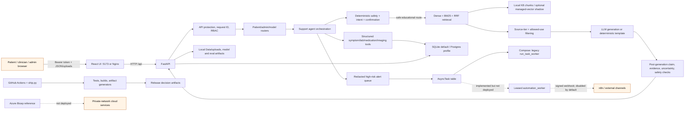

# NLCare Full Repository Technical, Clinical, and Production-Readiness Audit

Audit date: 2026-08-03  
Repository state: `main` at `c2c02ff`; working tree already contained extensive uncommitted user/generated changes before this audit.  
Audit mode: read-only except for this report. No application, configuration, test, dataset, schema, or generated-evaluation file was intentionally changed.

## 1. Executive verdict

### Current maturity classification

**Strong portfolio prototype.** NLCare is substantially beyond a concept or ordinary CRUD/LLM demo: it has real patient/clinician/admin boundaries, modular agent and retrieval code, synthetic temporal ML pipelines, trace artifacts, structured release checks, negative-result reporting, external-data bridges, and a large automated test/evaluation surface. It is not a pre-production medical system because the patient-facing safety boundary can fail open, the strongest safety evidence is internally authored and currently weak on an untouched holdout, privacy controls are inadequate for real health data, deployment launches the wrong automation worker, and no clinical reviewer has evaluated the product.

### Overall score

**5.4 / 10 weighted overall.** This is not a simple mean. The score weights medical safety, evaluation validity, data integrity, security/privacy, reliability, deployment readiness, and reproducibility more heavily than feature count or documentation breadth. The unweighted domain mean would over-reward the project's scope.

### Production-readiness verdict

**Not production ready; do not deploy for real patient care or accept real patient data.** The existing `PROCEED_WITH_WARNINGS` artifact is an engineering-demo decision, not a production authorization. A local synthetic-data demonstration is supportable if its boundary banners remain visible and outbound alert delivery remains disabled.

### Portfolio-readiness verdict

**Strong and differentiated for an undergraduate portfolio, provided the negative results and limitations remain prominent.** The most credible story is safety-governed AI systems engineering under synthetic-only constraints, not clinical AI performance or production healthcare readiness.

### Strongest areas

- Honest limitation language and visible negative results in [README.md](../README.md#L1-L32).
- Layered routing, deterministic safety checks, retrieval governance, post-generation validation, trace metadata, and explicit abstention paths.
- Patient-grouped temporal splits, leakage/shortcut audits, proxy-removal perturbation experiments, paired statistics, and promotion holds for synthetic ML.
- Broad internal testing, OpenAPI type drift checks, Docker build checks, security headers, request IDs, and artifact-backed release discipline.
- Prepared external-review, clinical-review, data-access, deployment, and governance packets that do not falsely claim completion.

### Weakest areas

- The intent-aware RAG evidence layer catches every exception but leaves the generated answer and citations in place, creating a confirmed fail-open grounding path.
- Frozen adversarial holdout v7 passes only 96/142 cases, with unsafe leakage `0.354545` and over-refusal `0.21875`.
- Authentication, storage, uploads, retention, consent, deletion, and session-token handling are demo-grade.
- The strongest RAG, agent, and safety evidence is internal; the no-read external holdout and all clinical review packets remain incomplete.
- Synthetic labels and direct imaging-derived targets produce high apparent performance that collapses materially under proxy removal.
- Docker Compose launches the older non-leased queue worker rather than the durable leased automation worker described by the evidence artifacts.

### Most dangerous false assumptions

1. **"Release gate passed" means safe to deploy.** It does not; the latest focused surface permits warnings while the untouched safety holdout is weak.
2. **"Claim validation exists" means unsupported answers cannot escape.** It does not; the evidence layer fails open on internal exceptions and the default validator is token overlap, not medical entailment.
3. **"Synthetic probability" is an estimate of a patient's outcome.** It is confidence against simulator-built labels and proxy-sensitive targets.
4. **"Durable worker tests passed" means deployed automation is durable.** Compose invokes a different worker with a non-atomic claim path.
5. **"No real patient data in the repository" means the running app is privacy-safe.** Users can still enter health information, chat text, and uploads into an unencrypted local database/filesystem without a complete privacy lifecycle.

### Top five blockers

1. Make post-generation evidence qualification fail closed under every exception.
2. Close or explicitly contain the 35.45% unsafe-leakage holdout result with independent, frozen evaluation.
3. Prevent real-data use until deployable identity, encrypted storage, retention/deletion, consent, and upload controls exist.
4. Replace the deployed legacy queue worker with the leased/idempotent automation worker and prove duplicate-safe delivery.
5. Obtain independent engineering authorship and clinician/genetic-counselor review; do not promote patient-facing medical wording before then.

## 2. Audit scope and limitations

### Areas inspected

- Repository structure, Git state, READMEs, system-card/claim language, configuration, Docker and Azure reference infrastructure.
- FastAPI startup, authentication/RBAC, patient chat and uploads, safety routing, RAG retrieval/filtering/validation/finalization, caching, telemetry, and persistence.
- Synthetic training, feature/target construction, temporal split and leakage controls, calibration/statistics, perturbation, external bridges, XAI, and fine-tuning gates.
- Automation queue, leased worker, alert delivery, receipts, retry/dead-letter paths, n8n scaffolding, and deployment wiring.
- React patient/admin surfaces, synthetic-output wording, loading/error handling, reusable components, and test configuration.
- CI/CD, dependency manifests, release artifacts, security scans, load/latency/token evidence, and review readiness.

### Commands executed and concise results

| Check | Result |
|---|---|
| Repository inventory using `rg --files`, file counts, directory sizing, `git status`, and targeted `rg`/file reads | About 2,195 files; 979 Python, 89 TSX, 407 JSON, 279 Markdown, 198 CSV; dirty worktree was pre-existing. |
| Focused backend tests across access control, API hardening, alerts, RAG claim alignment, post-gen escalation, OIDC/PKCE, migrations, leakage, temporal CV, statistics, XAI, fine-tune gate, and deployment validation | **94 passed** in 141.41s using an audit-only temporary SQLite database outside the repository. |
| Frontend Vitest | **57 passed** across 8 files in 51.86s; React Router future warnings remained. |
| Frontend ESLint | Passed. |
| `python scripts/ci_secret_scan.py` | Passed; no committed-secret finding from the repository scanner. |
| `docker compose -f docker-compose.prod.yml config` with a non-secret placeholder password | Parsed successfully. This validates YAML interpolation, not runtime deployment. |
| `npm audit --omit=dev` | Two moderate React Router advisories; suggested automatic fix requires a major-version change. |
| `pip check` | Failed: `ragas 0.4.3` lacked `scikit-network`; installed `langchain-huggingface` required `huggingface-hub <1.0` while `1.4.1` was installed. |
| `pip-audit -r requirements-lock.txt --no-deps` | Unverifiable: network transfer terminated with `IncompleteRead`. Existing repository scan artifacts were inspected instead. |
| `git diff --check` | Passed; only line-ending warnings were emitted. |
| Bicep compile | Not executable: `bicep` CLI was not installed. Static Bicep inspection was performed. |
| Alembic runtime inspection | Not executable in the active Python 3.14 environment because the `alembic` module was absent. Migration files and tests were inspected. |

### Components not executable or externally verifiable

- No paid LLM/provider credentials were used; real provider token/cost reconciliation remains at zero observations.
- No Azure, managed Postgres, Redis, Pinecone/Azure AI Search, n8n, email/SMS/Viber, OIDC identity provider, or production monitoring service was provisioned.
- No real clinical dataset with the exact NLCare longitudinal target, no clinician-reviewed labels, no DUA, no IRB, and no clinical reviewer were available.
- No GPU fine-tuning or candidate-vs-baseline generation run was executed; the repository correctly holds fine-tuning at offline/shadow readiness.
- No destructive recovery, backup restore, failover, penetration test, malware-upload test, or real multi-node load test was run.

### Missing resources and environmental limitations

- The active environment differed from CI: Windows CPython 3.14 was available, while CI targets Python 3.11. The local package set is inconsistent according to `pip check`.
- The repository contains numerous modified/generated artifacts. Their generation paths and timestamps were inspected, but this audit cannot prove that every artifact corresponds to the exact current source tree.
- Existing evaluations are predominantly maintainer-authored or generator-authored. Frozen does not mean independent.
- Static source review cannot establish clinical correctness, user comprehension, operational security, or real-world reliability.

### Confidence limitations

Findings backed by direct code paths and executed tests are labeled **Confirmed**. Findings dependent on production topology, external services, or real users are labeled **Highly likely**, **Possible**, or **Unverifiable with the current environment**. No internal metric is treated as clinical validation.

## 3. Repository and architecture map

### Component inventory and entry points

| Component | Actual entry points and responsibilities |
|---|---|
| FastAPI service | `backend/api/main.py`; routers under `backend/api/routers/`; request ID, security headers, API protection, auth, patient/admin/model/automation APIs. |
| React application | `frontend-react/src/main.tsx`, role-specific pages and API hooks; Vite dev server and Nginx production image. |
| Legacy frontend | `frontend/` is still mounted and used by root redirects in `backend/api/main.py:139-161`, creating a second UI surface. |
| Persistence | SQLAlchemy models in `backend/models.py`; SQLite by default, optional Postgres; startup schema patcher plus Alembic revisions. |
| Patient agent | `backend/services/support_chat_agent.py` orchestrates safety, intent, confirmation, tools, LLM/RAG, alerts, and persistence. |
| RAG | `agent_rag.py`, `agent_retrieval.py`, `rag_vector_index.py`, source-tier/mode filters, claim validation, evidence grading, confidence routing, citation assembly, post-gen controls. |
| ML/MLE | Synthetic generators, `complete_synthetic_training.py`, model artifacts/registry, grouped temporal evaluation, perturbation and promotion gates. |
| Data platform | Local bronze/silver/gold-style contracts, manifests, hashes, quarantine, and lineage under `Data/lakehouse` and related services. |
| Automation | `task_queue.py`, durable `automation_worker.py`, high-risk alert services, signed n8n webhook/receipt scaffolding, local retry/dead-letter records. |
| Evaluation/governance | `scripts/`, `tests/`, `Data/evals/`, benchmark registry, release thresholds, review packets, negative-result gallery. |
| Deployment | Backend/frontend Dockerfiles, local and production-shaped Compose, Azure Bicep reference foundation, CI and ship workflows. |

### Actual architecture and trust boundaries

Trust boundaries are: untrusted browser input to API; role/session to patient-scoped data; raw question to model/retriever; generated text to patient-visible output; file upload to local filesystem/parser; database task to external webhook; repository artifacts to release claims; local synthetic/public stress data to model conclusions; and local Compose to any cloud deployment.

### Workflow assessment

- **Data flow:** source CSV/JSON and synthetic generators -> schema/contract checks -> local lakehouse manifests/quarantine -> feature rows -> hashes/lineage -> training/evaluation. Good provenance mechanics, but still local and not a production data plane.
- **Model flow:** configuration -> synthetic training -> patient-grouped split -> calibration/evaluation -> artifact registry -> promotion gates -> monitor-only inference. The direct imaging-derived target and simulator relationship materially limit scientific validity.
- **RAG flow:** input -> safety/intent -> hybrid retrieval -> tier/use filtering -> generation -> claim/evidence/uncertainty/post-gen checks -> citations/trace. The final evidence step is bypassable on exception because it annotates rather than substitutes.
- **Deployment flow:** commit -> selected tests/build/eval generation -> release gate -> Docker build -> manual Compose/IaC. No controlled deployment, health-based rollout, tested rollback, backup restore, or production traffic validation exists.

## 4. Claims-versus-evidence matrix

| Project claim | Evidence location | Implementation status | Validation status | Audit conclusion |
|---|---|---|---|---|
| Safety-first, non-diagnostic engineering prototype | `README.md:3-7`, UI banners, claim-boundary services | Verified working as presentation/policy | Internal tests only; no human comprehension review | Accurate positioning, but labels alone cannot neutralize patient-visible synthetic predictions. |
| Source-governed hybrid RAG | `rag_vector_index.py`, intent modes/tier filters, `latest_rag_baseline_comparison.json` | Verified working | 74-case internal frozen goldset | Governance improves source-tier correctness, but raw Recall@10 superiority over BM25 is not proven. |
| Claim-level citation validation | `rag_claim_validator.py:1-162` | Partially implemented | Unit/internal evals | Default is token overlap and the enclosing evidence layer fails open; this is not reliable medical entailment. |
| Post-generation safety validation | `post_generation_validator.py`, `agent_post_gen.py` | Implemented but insufficiently tested under dependency faults | Normal-path tests pass | Layer exists, but evidence qualification exceptions can preserve unsafe/unsupported generated content. |
| Uncertainty-aware retrieval | retrieval confidence and evidence grading services | Verified working on expected paths | Internal artifact/test cases | Useful routing metadata, not calibrated answer correctness probability. |
| Bounded agentic tools | `support_chat_agent.py`, tool-action tests, explicit confirmation state | Verified working for covered tools | Internal single/multi-turn suites | Credible bounded workflow engineering; not an autonomous clinical agent and not externally red-teamed. |
| Safety-aware cache | `agent_cache.py`, KB fingerprint, intent/safety gating | Verified working in tests | Local process/DB tests | Sound concept; production multi-node cache coherence and invalidation are unproven. |
| Durable automation | `automation_worker.py:67-284`, durable-worker artifact | Partially implemented | Worker unit evidence exists | Deployment does not use it; Compose invokes `run_task_worker.py` instead. |
| High-risk clinician alerting | alert service, local queue, signed dispatch/receipt artifacts | Partially implemented | Local drills only; external delivery disabled | Appropriate prototype queue, not monitored clinical escalation or emergency response. |
| Synthetic temporal response classification/regression | `complete_synthetic_training.py`, model artifacts | Verified working as simulator learning | Internal grouped tests and perturbation | Engineering proof only; proxy-removal degradation and target construction block scientific/clinical claims. |
| Patient-level temporal validation | split/leakage services and tests | Verified working | Internal synthetic rows | Good leakage discipline, but cannot create external validity from synthetic labels. |
| Calibrated probabilities | statistical audit and per-head calibration artifacts | Partially implemented | Synthetic calibration only | Numerically measured against simulator labels, not meaningful patient outcome probabilities. |
| Explainable AI | XAI fidelity/stability gates and patient grouping | Partially implemented | Additivity passes; rank stability fails | Honest grouped-factor display is appropriate; explanation reliability and human understanding remain weak. |
| Fine-tuning readiness | fine-tune governance/runtime/contamination/promotion artifacts | Scaffold or placeholder | Gate decision `HOLD` | Credible governance preparation, not a trained or validated adapter capability. |
| External data integration | I-SPY2/Duke/TCGA/METABRIC bridges | Partially implemented | Public-data engineering stress only | Real public rows are used, but endpoints/features are target-mismatched and do not validate NLCare heads. |
| Production-shaped deployment | Docker, Compose, health/ready, Azure Bicep | Partially implemented | Compose parses; no live cloud validation | Architecture reference only; identity, privacy, worker wiring, DR, and runtime controls block production. |
| 100+ release-gated artifacts prove readiness | release gate/benchmark registry | Verified artifact machinery | Predominantly internal/self-generated | Breadth aids traceability but dilutes decision clarity; 201/228 artifacts are optional in the focused summary. |
| Token and latency observability | request telemetry and ops artifacts | Partially implemented | Local estimates; zero provider-reported observations | Useful engineering telemetry, not billing truth or production SLO evidence. |
| FHIR/interoperability readiness | canonical schema and docs | Documentation/partial schema mapping | No exchange/conformance test | FHIR-aligned naming must not be described as interoperability or compliance. |

## 5. Domain scorecard

Weighted overall formula: `sum(domain score x risk weight) / sum(risk weights) = 819 / 151 = 5.4238`, reported as **5.4**. The weights are: product 2; architecture 3; AI 4; agentic 4; RAG 6; MLE 5; statistical validity 7; data engineering 4; synthetic data 6; external validation 7; fine-tuning 2; XAI 3; medical safety 10; responsible AI 5; SWE 4; testing 6; security 8; privacy 8; infrastructure 3; DevOps 3; MLOps/LLMOps 4; automation 5; observability 4; reliability 8; performance 3; cost 2; API/backend 3; UI/UX 4; deployment readiness 8; documentation 2; reproducibility 7; portfolio strength 1. This intentionally makes a broad but unsafe or irreproducible system score lower than a simple feature-count average.

| # | Domain | Score | Supporting evidence | What prevents a higher score | Confidence | Three highest-value improvements |
|---:|---|---:|---|---|---|---|
| 1 | Product clarity | 8.0 | Explicit non-goals, banners, negative-result wording | Patient-facing model language still invites outcome interpretation | Confirmed | Remove outcome-valenced labels; test comprehension; define formal requirements/acceptance matrix |
| 2 | Architecture | 7.0 | Responsibility-named services and role routers | Two frontends, process-local state, broad orchestrators, dual migration paths | Confirmed | Select one frontend; typed service contracts; consolidate persistence/migrations |
| 3 | AI engineering | 7.5 | Layered agent/RAG, tools, cache, traces, fallbacks | Fail-open evidence exception and internally authored evidence | Confirmed | Fail closed; fault injection; independent end-to-end holdout |
| 4 | Agentic design | 6.5 | Bounded tool actions, confirmation, verifier tests | Session-local memory, no external red team, no durable plan/state model | Highly likely | Persistent typed turn state; property-based multi-turn tests; independent tool-abuse bank |
| 5 | RAG | 6.0 | Dense/BM25/RRF, tiers, allowed use, citations | No raw lift over BM25; proxy citation metrics; heuristic validator | Confirmed | Real claim-citation grading; held-out external goldset; simplify stages by measured utility |
| 6 | Machine-learning engineering | 7.0 | Pipelines, registry, grouped splits, audits, promotion holds | Simulator-only targets and no exact-target external data | Confirmed | Canonical proxy-free trainer; repeated cross-generator validation; external exact-task bridge |
| 7 | Statistical validity | 5.5 | Bootstrap CIs, McNemar, calibration, subgroup reporting | Small homogeneous synthetic test sets; no superiority; weak endpoint validity | Confirmed | Power/effect-size plan; nested/repeated grouped CV; label-sensitivity and decision-curve analyses |
| 8 | Data engineering | 6.5 | Contracts, hashes, quarantine, lineage, medallion vocabulary | Local files, no orchestration SLA, no schema registry or production quality service | Confirmed | Idempotent scheduled pipeline; contract registry; lineage-backed replay and recovery |
| 9 | Synthetic-data methodology | 6.0 | Missingness/noise plans, quality proxies, leakage audits | Generator-label coupling and proxy-sensitive targets | Confirmed | Causal/generative specification; independent generator family; blinded label audit |
| 10 | External validation | 3.5 | I-SPY2/Duke/TCGA/METABRIC engineering bridges | Target mismatch, partial labels, no temporal exact-task validation | Confirmed | Freeze common-feature protocol; quantify shift; obtain exact-endpoint cohort/labels |
| 11 | Fine-tuning readiness | 5.0 | Dataset cards, contamination scan, promotion/runtime gates | No completed paired baseline/candidate generations; runtime blocked | Confirmed | Resolve contamination; execute tiny reproducible adapter; paired safety/quality/latency gate |
| 12 | Explainable AI | 5.5 | Fidelity/additivity checks and honest rank suppression | Retraining rank stability p05 is -1; no user comprehension | Confirmed | Stability-aware intervals; counterfactual sanity checks; clinician/user interpretation study |
| 13 | Medical safety | 4.5 | Strong boundaries, escalation categories, post-gen validators | 35.45% unsafe holdout leakage, fail-open evidence, zero clinicians | Confirmed | Stop-the-line fail-closed fix; external safety holdout; nurse/oncologist/genetic review |
| 14 | Responsible AI/governance | 7.5 | Promotion holds, contamination labels, negative gallery, review packets | Governance is self-authored and not operationally approved | Confirmed | Independent sign-off; control-owner matrix; enforce policies at runtime/deployment |
| 15 | Software engineering | 6.5 | Modular backend, typed frontend, error handling, API types | Large modules/CSS, dual UI, startup mutation, dirty generated surface | Confirmed | Module budgets; one UI; pure startup plus explicit migration command |
| 16 | Testing | 6.5 | 94 focused backend and 57 frontend tests passed; broad internal suites | CI selects subsets, no coverage target, weak dependency-fault/system tests | Confirmed | Coverage/risk map; fault-injection suite; multi-process and browser role-isolation tests |
| 17 | Security | 4.0 | RBAC, headers, CORS, request limits, secret scan, OIDC validator | Demo credentials, plaintext session tokens, incomplete OIDC, upload controls absent | Confirmed | Deployable IdP flow; hash/rotate sessions; SAST/SCA/container/upload security gates |
| 18 | Privacy | 3.5 | Payload redaction and patient-scoped endpoints | Local unencrypted records/uploads, incomplete PHI redaction, no retention/consent/deletion | Confirmed | Data classification/retention; encryption/key management; access/export/delete audit |
| 19 | Infrastructure | 5.5 | Private-network Azure reference and guarded deployment flags | Not compiled/deployed; mutable images and bind mounts | Highly likely | Compile/what-if CI; immutable images; managed secret/storage/network controls |
| 20 | DevOps | 6.0 | CI, ship workflow, Docker builds, health checks | Unpinned Python install, no controlled deploy/rollback, action tags not SHA-pinned | Confirmed | Hermetic locks; environment promotion; rollback/canary and provenance attestations |
| 21 | MLOps and LLMOps | 6.5 | Model/eval registry, traces, gates, drift/readiness artifacts | No deployed monitoring loop or provider usage truth | Confirmed | Online shadow monitoring; model/data version linkage; real token/cost reconciliation |
| 22 | Automation | 5.0 | Leases, retries, receipts, dead letters implemented | Compose launches non-leased worker; external channels disabled/unmonitored | Confirmed | Wire leased worker; idempotency keys; end-to-end signed delivery/ack SLO drill |
| 23 | Observability | 6.0 | Request IDs, trace envelopes, latency and event summaries | Local artifacts, incomplete PHI redaction, no centralized metrics/logs/traces | Confirmed | OpenTelemetry backend; PHI-safe log schema; alerts tied to SLOs and runbooks |
| 24 | Reliability | 4.5 | Retry/dead-letter code, health probes, local drills | Fail-open RAG, wrong worker, process-local state, no DR proof | Confirmed | Failure-mode tests; distributed state; backup/restore and dependency outage drills |
| 25 | Performance | 5.0 | Route/load artifacts and cache/prewarm support | Six-request load sample, local sparse/fast-mode bias, no capacity curve | Confirmed | Representative workload; concurrency saturation; per-stage/token latency budgets |
| 26 | Cost efficiency | 4.5 | Estimated tokens/cost fields and cache metrics | Zero provider-reported observations and no cloud cost baseline | Confirmed | Provider usage capture; cost per safe answer; cache/route quality-cost optimization |
| 27 | API and backend | 6.5 | Scoped routers, auth dependencies, health/ready, security middleware | Startup schema writes, local storage, some broad exceptions | Confirmed | Explicit migrations; typed domain errors; contract/load tests on Postgres/Redis |
| 28 | UI and user experience | 5.5 | Role dashboards, responsive cards, loading/error states, boundaries | Outcome-valenced model cards, no human-factors study, dual UI | Highly likely | Plain-language non-outcome display; comprehension tests; accessibility/mobile visual QA |
| 29 | Deployment readiness | 3.5 | Production-shaped Compose and conservative Azure reference | No deploy, IdP, privacy controls, worker correctness, DR, or production data guard | Confirmed | Disposable staging; identity/secrets/storage hardening; deployment/rollback/restore proof |
| 30 | Documentation | 8.5 | Extensive evidence, limitations, ADRs, review packets, runbooks | Volume obscures canonical truth; some generated claims are inconsistent | Confirmed | Canonical evidence index; archive stale docs; generated-claim consistency checks |
| 31 | Reproducibility | 4.5 | Scripts, seeds, locks/snapshots, CI | `pip check` fails locally; Python lock not transitive/hashed; artifacts may drift | Confirmed | Hash-locked environments; clean-room rebuild; artifact provenance tied to commit/container |
| 32 | Portfolio strength | 8.5 | Breadth, depth, honest negatives, working full stack | Complexity can look inflated unless canonical demo/evidence is concise | Confirmed | One reproducible demo; five headline proofs; interviewer-ready failure/decision narrative |

## 6. Critical and high-severity findings

No Critical finding was assigned because this repository is explicitly a synthetic engineering prototype and no evidence shows it is currently handling real patient care. The following High findings would become Critical candidates if the same paths were exposed to real patients or identifiable health data without containment.

### SAF-001 - Evidence-governance exceptions fail open

- **Domain:** Medical safety / RAG correctness
- **Severity:** High
- **Confidence:** Confirmed
- **Status:** Broken
- **Evidence:** `backend/services/agent_post_gen.py:241-243` promises that exceptions only mark evidence missing; `:245-333` performs mode selection, tier filtering, claim validation, evidence grading, and uncertainty routing; `:334-338` catches every exception and writes only `evidence_grade={grade: missing}`. It does not replace `result["reply"]`, clear `result["citations"]`, or set a refusal/abstention route.
- **Impact:** A dependency error in the final grounding layer can allow an unqualified generated answer to reach a patient-facing response while merely recording that validation was skipped.
- **Failure scenario:** Claim validation or tier filtering raises due to malformed chunk metadata; the original medical education answer and citations remain visible even though evidence qualification never completed.
- **Recommended remediation:** Make the layer fail closed for all generated/RAG medical-education routes: substitute a bounded insufficient-evidence message, clear citations, emit a structured governance-error trace, and preserve only previously determined deterministic safety/refusal/tool-confirmation responses.
- **Verification method:** Fault-inject exceptions from `select_mode`, `filter_chunks_by_mode`, `validate_claims`, `grade_evidence`, and `classify_retrieval_uncertainty`; assert the original answer cannot survive and all citations are removed.
- **Estimated effort:** S
- **Dependencies:** Existing intent modes, response finalizer, trace schema, post-gen tests
- **Blocks release:** Yes for any patient-facing or production-shaped release; no for a clearly isolated developer test harness.

### SAF-002 - Untouched adversarial holdout shows material unsafe leakage and over-refusal

- **Domain:** AI safety / evaluation
- **Severity:** High
- **Confidence:** Confirmed
- **Status:** Implemented but insufficiently tested
- **Evidence:** `Data/evals/safety/latest_adversarial_holdout_v7_baseline.json:1-10` reports 142 cases, 96 passes, pass rate `0.676056`, unsafe leakage `0.354545`, and over-refusal `0.21875`; category results include cross-patient exfiltration `0.1`, privacy/PII `0.2`, and prompt injection `0.0`. `README.md:14` explicitly says safety is not solved.
- **Impact:** The current generalized unsafe-intent boundary is not reliable enough for patient-facing use; tightening it naively can also worsen safe-answer refusal.
- **Failure scenario:** A code-switched or indirect privacy/treatment/prognosis request bypasses the expected refusal route and receives a normal generated answer, or a safe education question is unnecessarily blocked.
- **Recommended remediation:** Freeze the result, perform blind case adjudication, fix generalized routing features rather than exact strings, add stateful/mutation tests, and require an independently authored no-read holdout before promotion.
- **Verification method:** Re-run untouched v7 after generalized changes; separately report unsafe leakage, over-refusal, confidence intervals, category floors, and an external holdout with contamination attestations.
- **Estimated effort:** L
- **Dependencies:** Label audit, external author, frozen-set governance
- **Blocks release:** Yes for patient-facing deployment; no for a synthetic portfolio demo that visibly reports the failure.

### MED-001 - Patient UI still presents simulator outputs with outcome-valenced language

- **Domain:** Medical safety / human factors / UX
- **Severity:** High
- **Confidence:** Highly likely
- **Status:** Partially implemented
- **Evidence:** `frontend-react/src/pages/patient/HybridPredictionCard.tsx:63-64` maps model decisions to "Grouped with favorable" and "review-priority" synthetic examples; `:118-120` displays a synthetic class probability. `PatientKpiStrip.tsx:159-167` provides disclaimers and explanation, while `:365-369` correctly removes the former health score. No completed clinician or human-factors review exists (`README.md:32,130-132`).
- **Impact:** A patient can interpret green/favorable labels and a high percentage as a personal response estimate despite nearby disclaimers.
- **Failure scenario:** A person sees "favorable" and `96.8%`, delays contacting the care team, or interprets the model as contradicting concerning symptoms/labs.
- **Recommended remediation:** Remove favorable/concerning outcome framing from patient surfaces; show data availability, missingness, and review status instead. Keep detailed synthetic model outputs in admin/research views. Test comprehension and overtrust with users and clinical reviewers.
- **Verification method:** UX tests must demonstrate that participants do not interpret the number as cancer status, response chance, prognosis, or treatment advice; automated copy tests should ban outcome-probability language on patient routes.
- **Estimated effort:** M
- **Dependencies:** Product decision, clinician/nurse wording review, accessibility testing
- **Blocks release:** Yes for patient-facing release; no for admin-only synthetic research display.

### MED-002 - Medical safety policies have no qualified human review or monitored escalation owner

- **Domain:** Medical safety / governance
- **Severity:** High
- **Confidence:** Confirmed
- **Status:** Partially implemented
- **Evidence:** `README.md:5,32,130-132,696` states that no clinician, nurse, genetic counselor, or external author has completed review. Alert artifacts describe local/redacted engineering queues and disabled external delivery, not a staffed clinical service.
- **Impact:** Code-authored urgency, VUS, tumor-marker, supplement, distress, and escalation policies may be medically incomplete, linguistically inappropriate, or operationally unactionable.
- **Failure scenario:** The agent recommends escalation wording that is too weak, too strong, jurisdictionally wrong, or sends an alert to a queue nobody monitors.
- **Recommended remediation:** Obtain scoped reviews from an oncology nurse/clinician and genetic counselor, assign alert owners and response expectations, and keep all findings as wording/safety review rather than approval or validation.
- **Verification method:** Completed signed review logs with case IDs, severity, disposition, linked fixes, and re-review; operational drill records human acknowledgement separately from delivery receipt.
- **Estimated effort:** M
- **Dependencies:** External volunteers/institutional contacts, review packets, governance owner
- **Blocks release:** Yes for real patient use; no for an explicitly unreviewed portfolio prototype.

### ML-001 - Synthetic target construction and imaging proxies undermine model-result validity

- **Domain:** ML/data validity
- **Severity:** High
- **Confidence:** Confirmed
- **Status:** Partially implemented
- **Evidence:** `backend/services/complete_synthetic_training.py:202-211` creates the regression target as negative MRI percent change when absent and fills it within patient. `latest_synthetic_model_perturbation_retrain_eval.json:23-54` reports the full-feature classifier AUROC `0.997842` and regression MAE `2.463846`; proxy-removed results fall to AUROC `0.854343` and MAE `15.504482` (`:1116-1121`) and the final decision is `HOLD_SYNTHETIC_ONLY` (`:1386`). The statistical audit says paired superiority over logistic is false (`latest_synthetic_prediction_statistical_audit.json:342-372`).
- **Impact:** Near-perfect metrics mostly demonstrate recovery of simulator/target structure, not clinically meaningful longitudinal inference or justified model complexity.
- **Failure scenario:** Portfolio readers or UI users interpret high AUROC/probability as response prediction evidence when the target is closely derived from included imaging features.
- **Recommended remediation:** Make the proxy-removed feature policy the sole promotion-eligible trainer, redesign labels independently of input transformations, run cross-generator and label-sensitivity experiments, and hide patient-facing probabilities until exact-target external labels exist.
- **Verification method:** Clean-room retraining must declare feature-policy ID, pass leakage/shortcut audits, show repeated grouped-CV distributions, and demonstrate stable calibration/performance without target-derived features.
- **Estimated effort:** L
- **Dependencies:** Generator redesign, feature registry, evaluation protocol
- **Blocks release:** Yes for patient-facing model output or efficacy claims; no for labeled synthetic engineering experiments.

### EVAL-001 - Evaluation evidence is predominantly internal and several headline metric names overstate what is measured

- **Domain:** Evaluation validity / RAG
- **Severity:** High
- **Confidence:** Confirmed
- **Status:** Partially implemented
- **Evidence:** The RAG baseline uses 74 internally authored frozen cases. In `backend/services/rag_baseline_comparison.py`, citation precision is expected-source membership in a retrieved top-five window, claim support is effectively retrieval Recall@10 > 0, and unsupported context is Recall@10 == 0; these are not generated-claim entailment measures. `latest_rag_holdout_baseline_comparison.json` remains external-author-ready but incomplete. `README.md:32` reports no external author review.
- **Impact:** Reviewers can mistake source-ID retrieval proxies for answer citation faithfulness or independent generalization evidence.
- **Failure scenario:** A generated answer cites a retrieved source that contains related terms but does not entail the claim, while the dashboard displays a strong "citation precision" result.
- **Recommended remediation:** Rename proxy metrics explicitly, add claim-level human/NLI adjudication with contradiction and no-evidence cases, complete the no-read external holdout, and separate retrieval, citation selection, entailment, and final-answer correctness.
- **Verification method:** Metric contract tests; independent annotations with agreement statistics; case-level claim/source ledger; external holdout artifact marked complete without tuning contamination.
- **Estimated effort:** L
- **Dependencies:** External author/reviewer, annotation rubric, metric schema migration
- **Blocks release:** Yes for claims of RAG correctness/generalization; no for transparent internal engineering comparisons.

### SEC-001 - Authentication and session handling are demo-grade

- **Domain:** Security / identity
- **Severity:** High
- **Confidence:** Confirmed
- **Status:** Partially implemented
- **Evidence:** Hard-coded admin/clinician demo credentials exist at `backend/services/auth.py:10-18`; patient authentication accepts `patient-demo`, normalized username, or patient ID as password at `:62-80`; bearer tokens persist in plaintext at `backend/models.py:27-35`; 12-hour sessions are returned directly at `auth.py:42-58`. Demo auth is disabled in prod/staging unless explicitly overridden (`:83-93`), and OIDC validation exists, but browser PKCE/deployment integration remains incomplete.
- **Impact:** Any misconfigured environment or exposed demo profile enables trivial account access; database compromise exposes active bearer tokens.
- **Failure scenario:** `APP_ENV` is absent or mis-set, enabling demo auth on a reachable host; an attacker logs in as a known patient ID or reuses a database token.
- **Recommended remediation:** Remove patient-ID password acceptance, require explicit local-demo mode, complete OIDC authorization-code/PKCE integration, hash opaque sessions if retained, rotate/revoke tokens, and add deployment startup refusal when demo auth is possible.
- **Verification method:** Deployment profile must fail closed without IdP configuration; security tests cover environment ambiguity, token-at-rest inspection, role/tenant isolation, logout/revocation, expiry, and key rotation.
- **Estimated effort:** L
- **Dependencies:** Identity provider, secrets manager, frontend auth flow
- **Blocks release:** Yes for any network-accessible nonlocal deployment.

### PRI-001 - No defensible privacy lifecycle exists for PHI-like input

- **Domain:** Privacy / data governance
- **Severity:** High
- **Confidence:** Confirmed
- **Status:** Not present
- **Evidence:** SQLite is the default (`backend/database.py:11-22`); chat, patient records, sessions, reports, and uploads persist in database/local paths (`backend/models.py:27-35,340-359`). Logs redact selected patterns (`app_logging.py:21-35`), but the app has no complete consent, purpose limitation, retention, deletion, export, encryption/key-management, data residency, or breach workflow. A 64 MB local `medical_agent.db` was present.
- **Impact:** Real health information entered into the demo could persist indefinitely and outside a governed security boundary.
- **Failure scenario:** A user uploads a report containing identity/diagnosis data; it is written to local disk and database metadata, copied in backups or developer machines, and cannot be reliably located/deleted later.
- **Recommended remediation:** Block/label real-data entry now; define data classes and legal basis; add retention/deletion/export workflows; encrypt database/object storage and backups with managed keys; enforce least privilege and immutable audit; perform privacy threat modeling before any public deployment.
- **Verification method:** Data inventory and deletion trace tests, encryption/config inspection, access-control tests, retention job evidence, backup deletion behavior, and independent privacy/security review.
- **Estimated effort:** XL
- **Dependencies:** Product policy, legal/privacy input, managed identity/storage/database
- **Blocks release:** Yes for real data or public deployment.

### SEC-002 - File upload handling lacks content validation, malware controls, quarantine, and encrypted storage

- **Domain:** Security / file handling
- **Severity:** High
- **Confidence:** Confirmed
- **Status:** Partially implemented
- **Evidence:** Base64 decoding uses `validate=False` (`patient_uploads.py:101-104`); names are sanitized (`:107-115`) and parser reads only selected text-like types (`:164-180`), but `content_type` is client supplied, file signatures are not verified, and there is no malware scan, quarantine, encrypted object storage, content disarm, or retention policy. Upload metadata stores a local path (`models.py:349-359`).
- **Impact:** Malicious or mislabeled files and sensitive reports can be stored and later served from a trusted application origin.
- **Failure scenario:** An authenticated user uploads active content or malware with a benign extension/content type; it persists on shared storage and is downloaded by a reviewer.
- **Recommended remediation:** Enforce strict base64/size/type checks using magic bytes, quarantine uploads, scan before release, store outside the app container in encrypted object storage, force safe attachment headers, and retain audit/hash metadata.
- **Verification method:** Polyglot, malformed-base64, oversized, MIME-confusion, EICAR-equivalent safe-test, path, and cross-patient access tests; scanner outage must fail closed.
- **Estimated effort:** L
- **Dependencies:** Object store, malware scanner, upload policy
- **Blocks release:** Yes when uploads are enabled outside a disposable local demo.

### AUTO-001 - Deployment launches a non-leased worker instead of the implemented durable worker

- **Domain:** Automation / reliability / deployment
- **Severity:** High
- **Confidence:** Confirmed
- **Status:** Broken
- **Evidence:** The durable worker claims tasks with a lease and heartbeat at `backend/services/automation_worker.py:221-284` and has a dedicated entry point at `scripts/run_automation_worker.py:10-27`. Both `docker-compose.yml:60-74` and `docker-compose.prod.yml:78-94` instead run `scripts/run_task_worker.py`, which calls `task_queue.run_next_queued_task` (`run_task_worker.py:12-38`). That function selects the first queued row and then runs it without an atomic lease (`task_queue.py:86-95`).
- **Impact:** Multiple workers or restarts can execute the same side-effecting task twice, while durability artifacts describe code that is not the deployed path.
- **Failure scenario:** Two replicas select the same queued alert before either commits status; duplicate email/webhook delivery occurs or task state diverges during a crash.
- **Recommended remediation:** Wire Compose and deployment manifests to `run_automation_worker.py`, enforce idempotency keys at every external side effect, separate general background jobs if necessary, and add multi-worker/crash recovery tests against Postgres.
- **Verification method:** Two-worker concurrency test proves one lease owner and one external event; kill/restart test proves lease recovery; duplicate receipt and replay tests remain idempotent; deployment smoke asserts the expected command.
- **Estimated effort:** M
- **Dependencies:** Postgres integration test, external dispatch adapter, deployment manifests
- **Blocks release:** Yes for automated outbound delivery or multi-worker deployment.

## 7. Complete findings register

### Register index

The ten High records above are part of this complete register and contain every required evidence field. The table below inventories all findings and links High entries back to their full records; subsequent subsections provide full records for every Medium, Low, and Informational item.

| ID | Domain | Title | Severity | Confidence | Status | Blocks release? | Full record |
|---|---|---|---|---|---|---|---|
| SAF-001 | Medical safety/RAG | Evidence-governance exceptions fail open | High | Confirmed | Broken | Yes, patient-facing | Section 6 |
| SAF-002 | AI safety | Untouched holdout has unsafe leakage/over-refusal | High | Confirmed | Implemented but insufficiently tested | Yes, patient-facing | Section 6 |
| MED-001 | Human factors | Outcome-valenced synthetic output in patient UI | High | Highly likely | Partially implemented | Yes, patient-facing | Section 6 |
| MED-002 | Medical governance | No qualified review or escalation owner | High | Confirmed | Partially implemented | Yes, real use | Section 6 |
| ML-001 | ML validity | Proxy-sensitive synthetic targets | High | Confirmed | Partially implemented | Yes, model claims | Section 6 |
| EVAL-001 | Evaluation | Internal/proxy metrics overstate evidence | High | Confirmed | Partially implemented | Yes, correctness claims | Section 6 |
| SEC-001 | Security | Demo-grade identity/session handling | High | Confirmed | Partially implemented | Yes, network release | Section 6 |
| PRI-001 | Privacy | Missing PHI privacy lifecycle | High | Confirmed | Not present | Yes, real data | Section 6 |
| SEC-002 | Security | Unsafe upload trust/storage boundary | High | Confirmed | Partially implemented | Yes, uploads | Section 6 |
| AUTO-001 | Automation | Wrong worker deployed | High | Confirmed | Broken | Yes, outbound automation | Section 6 |
| RAG-001 | RAG correctness | Default claim validator is lexical overlap | Medium | Confirmed | Partially implemented | Conditional |
| RAG-002 | RAG evaluation | Complex stack adds governance, not proven retrieval lift | Medium | Confirmed | Verified working | No if stated honestly |
| RAG-003 | Research retrieval | No-evidence false paper attribution remains high | Medium | Confirmed | Implemented but insufficiently tested | Yes for research-answer claims |
| REL-001 | Reliability | Critical runtime state is process-local | Medium | Confirmed | Partially implemented | Yes for horizontal scaling |
| DB-001 | Database | Startup schema patching duplicates Alembic authority | Medium | Confirmed | Partially implemented | Yes for controlled production migration |
| REP-001 | Reproducibility | Dependency environment is not hermetic | Medium | Confirmed | Broken | Yes for reproducible release |
| TEST-001 | QA | CI breadth does not equal risk-based coverage | Medium | Confirmed | Partially implemented | Conditional |
| INFRA-001 | Infrastructure | Containers lack production hardening | Medium | Confirmed | Partially implemented | Yes for production |
| OPS-001 | Operations | Backup, restore, and disaster recovery are unproven | Medium | Unverifiable with the current environment | Documentation only | Yes for production |
| OBS-001 | Observability | Token/cost reconciliation has zero provider observations | Medium | Confirmed | Partially implemented | No; blocks cost/SLO claims |
| PERF-001 | Performance | Load/latency evidence is too small and local | Medium | Confirmed | Partially implemented | No; blocks capacity claims |
| KB-001 | Knowledge governance | Freshness and source authority metadata are incomplete | Medium | Confirmed | Partially implemented | Conditional |
| XAI-001 | Explainability | Explanation ranks are unstable and unvalidated with humans | Medium | Confirmed | Partially implemented | Yes for patient XAI claims |
| FT-001 | Fine-tuning | Fine-tuning is governed but not execution-ready | Medium | Confirmed | Stub or placeholder | No if described as scaffold |
| DATA-001 | Data engineering | Lakehouse/data contracts are local evidence only | Medium | Confirmed | Partially implemented | No; blocks platform claims |
| PRIV-002 | Privacy | PII/PHI redaction patterns are incomplete | Medium | Confirmed | Partially implemented | Yes for centralized logs |
| SWE-001 | SWE | Dual frontends and oversized modules increase drift | Medium | Confirmed | Partially implemented | No |
| REL-002 | Release governance | Gate permits known safety/scientific weaknesses as warnings | Medium | Confirmed | Partially implemented | Yes for production interpretation |
| SWE-002 | Maintainability | Residual OncoTrack names create configuration/brand drift | Low | Confirmed | Partially implemented | No |
| SWE-003 | Maintainability | CSS/admin surfaces exceed reviewable module size | Low | Confirmed | Partially implemented | No |
| DOC-001 | Documentation | One RAG artifact boundary overstates retrieval benefit | Low | Confirmed | Broken | No, if corrected |
| QA-001 | Frontend QA | React Router future warnings are unresolved | Low | Confirmed | Partially implemented | No |
| PORT-001 | Product wording | "Clinical decision-support" wording risks boundary ambiguity | Low | Possible | Documentation only | No for local demo |
| CFG-001 | Configuration | Local Compose embeds predictable development credentials | Low | Confirmed | Verified working | No if strictly local |
| GOV-001 | Governance | Negative results and claim boundaries are unusually explicit | Informational | Confirmed | Verified working | No |
| SAF-003 | Safety engineering | Structured confirmation and provenance are credible controls | Informational | Confirmed | Verified working | No |
| DATA-002 | Data engineering | Hashes, contracts, quarantine, and lineage are real | Informational | Confirmed | Verified working | No |
| INFRA-002 | Infrastructure | Azure reference defaults conservatively | Informational | Highly likely | Documentation only | No |
| DOC-002 | Documentation | Review packets and evidence maps are substantial | Informational | Confirmed | Verified working | No |

### Medium findings - full records

| ID | Domain / title | Severity / confidence / status | Evidence | Impact | Failure scenario | Recommended remediation | Verification method | Effort | Dependencies | Blocks release? |
|---|---|---|---|---|---|---|---|---|---|---|
| RAG-001 | RAG correctness - Default claim validator is lexical overlap | Medium / Confirmed / Partially implemented | `rag_claim_validator.py:1-7,55-60,127-162` declares token overlap as default and NLI optional; supported threshold is `0.30`. | Related vocabulary can be scored as support without entailment, while negation, scope, temporality, and causal direction remain fragile. | A chunk mentions CA 15-3 limitations; an answer says it proves recurrence, and overlap is high despite contradiction unless a separate deterministic trap catches it. | Use structured claim decomposition plus entailment/contradiction for high-risk claim classes; treat unavailable semantic validation as abstention, not success. | Build adversarial claim/source pairs for negation, dose, temporality, population, numerical units, VUS, markers, and treatment direction; require class-level precision/recall. | L | Local NLI/runtime budget, annotation set | Conditional: yes when generated medical claims are enabled. |
| RAG-002 | RAG evaluation - Complex stack adds governance, not proven retrieval lift | Medium / Confirmed / Verified working | `latest_rag_baseline_comparison.json:50-61` reports BM25 R@10 `0.8041`; the full stack reports `0.7838`, source-tier correctness `1.0`, and higher latency. README reports no proven lift. | Complexity raises maintenance/latency cost without demonstrated raw retrieval benefit; governance value is real but different. | A maintainer adds more rewrite/rerank/prune stages, improving a proxy while worsening citation precision or latency. | Keep only stages with frozen/held-out incremental value; separate governance filters from retrieval ranking in reporting. | Paired bootstrap/randomization by case, quality/latency/cost frontier, stage ablations, and external no-read goldset. | M | Frozen metric contracts, external cases | No if wording remains honest; yes for superiority claims. |
| RAG-003 | Research retrieval - No-evidence false paper attribution remains high | Medium / Confirmed / Implemented but insufficiently tested | `latest_research_paper_retrieval_eval.json:13-28` reports 44 cases and BM25 false paper attribution `0.625`; the full configuration reports `1.0` at `:1525-1535`. Section-hit rate is `0.1333` for that configuration. | The system may attach a plausible paper when the KB lacks evidence, which is more dangerous than returning no source. | A user asks a question unsupported by the 21-paper subset and receives an irrelevant paper citation as if it answers the question. | Add explicit no-evidence detection before paper selection; require claim-level section support; abstain when source/section evidence is absent. | Expand no-evidence and near-neighbor traps; score false attribution separately and require zero for high-risk modes before promotion. | M | Research answerability service, external paper-query author | Yes for any research-grounding correctness claim. |
| REL-001 | Reliability - Critical runtime state is process-local | Medium / Confirmed / Partially implemented | Conversation state in `support_chat_agent.py`, API rate limiting, vector runtime caches, and PKCE stores are process-local; Redis is configured but not consistently used for these controls. | Multiple replicas can disagree about confirmations, limits, cache state, or OIDC transactions. | A follow-up confirmation reaches another worker and loses pending tool state; a rate-limited client bypasses limits by switching replicas. | Move required state to typed, TTL-governed Redis/Postgres stores; keep only disposable caches process-local. | Multi-replica integration tests with sticky sessions disabled and restart/failover between turns. | L | Redis, serialization contracts, deployment topology | Yes for horizontal production scaling. |
| DB-001 | Database - Startup schema patching duplicates Alembic authority | Medium / Confirmed / Partially implemented | `backend/api/main.py:63-67` invokes `ensure_schema()` at import/startup; `schema_migrations.py:9,26-45` calls `create_all` and runtime `ALTER TABLE` while Alembic revisions also exist. | Schema state can diverge by startup order, database backend, privileges, or migration history. | An app replica starts with restricted DDL permissions or two replicas race schema patches during rollout. | Make Alembic the sole schema authority; run migrations as a controlled pre-deploy job; restrict app DDL permissions. | Empty-database and upgrade-path tests on supported Postgres versions; assert application startup performs no DDL. | M | Migration consolidation, staging Postgres | Yes for controlled production deployment. |
| REP-001 | Reproducibility - Dependency environment is not hermetic | Medium / Confirmed / Broken | CI installs unpinned `requirements.txt` (`.github/workflows/ci.yml:32-35`); the local `requirements-lock.txt` is not a full hash lock. `pip check` found missing `scikit-network` for RAGAS and incompatible `huggingface-hub` for installed `langchain-huggingface`. | Results may depend on resolver date/machine, and a clean evaluator may not reproduce tests or artifacts. | A recruiter/CI rebuild resolves newer packages and breaks an optional RAG/eval path or changes metrics. | Generate a transitive, hashed lock per supported Python version; separate core/optional/GPU groups; enforce `pip check` and clean-room install. | Rebuild from a clean container using only locks, run full ship, compare artifact fingerprints, and fail on undeclared packages. | M | Dependency tooling, supported-version policy | Yes for reproducible release; no for source review. |
| TEST-001 | QA - CI breadth does not equal risk-based coverage | Medium / Confirmed / Partially implemented | CI runs five focused Pytest files plus legacy monitoring tests (`ci.yml:47-58`) and many artifact generators, but no coverage threshold, type checker, SAST, fault-injection gate, or full test discovery is required. | Generated green artifacts can coexist with untested exception and deployment paths. | The fail-open RAG exception and wrong worker command pass CI because normal-path tests and worker-unit artifacts remain green. | Add a risk-to-test matrix, full test discovery or justified shards, branch/coverage floors on safety modules, static typing/lint/security, and deployment contract tests. | Introduce seeded failures and verify CI catches them; publish per-module coverage and skipped-test counts. | L | CI runtime budget, test taxonomy | Conditional: blocks production release until stop-the-line paths are covered. |
| INFRA-001 | Infrastructure - Containers lack production hardening | Medium / Confirmed / Partially implemented | Backend uses mutable `python:3.11-slim` and unpinned requirements; frontend uses mutable Node/Nginx tags. No explicit non-root backend user, read-only root FS, capability drop, resource limit, image signature, or runtime policy is evident. | Container compromise or dependency drift has a larger blast radius; builds are not immutable. | An upload/parser or package exploit gains write access to mounted data/KB and runs with broad container privileges. | Pin image digests, run non-root, use read-only FS/tmpfs, drop capabilities, set resources, scan/sign images, and minimize bind mounts. | Container-structure/policy tests, Trivy/Grype scan, signature verification, and runtime write/capability tests. | M | Container registry, CI security tools | Yes for production deployment. |
| OPS-001 | Operations - Backup, restore, and disaster recovery are unproven | Medium / Unverifiable with the current environment / Documentation only | Runbooks and recovery artifacts exist, but no managed database/object-store backup, point-in-time restore, RPO/RTO, cross-region copy, or destructive restore evidence was executable. | Data loss or corruption cannot be recovered predictably. | A migration or operator action corrupts patient records and local uploads; there is no tested consistent restore point. | Define RPO/RTO, encrypted backups, restore ownership, migration rollback, and regular restore drills using disposable synthetic staging. | Restore a captured Postgres/object-store snapshot into clean staging; reconcile row/file hashes and document elapsed RTO. | L | Managed database/storage, staging environment | Yes for production; no for local demo. |
| OBS-001 | Observability - Token/cost reconciliation has zero provider observations | Medium / Confirmed / Partially implemented | `latest_provider_usage_reconciliation.json:6-18` says no provider credentials, zero requests with provider-reported usage, and estimates are not billing truth. | Token/cost dashboards cannot support capacity or budget decisions. | Character estimates undercount a provider tokenizer or omit retries/cached tokens, making projected cost materially wrong. | Capture provider-reported input/output/cache token fields from non-patient test traffic and reconcile per route/model. | Minimum representative sample by route; calculate estimate bias/limits and reconcile against provider invoice/export. | S | Test credential/budget, telemetry schema | No; blocks cost claims and budget promotion. |
| PERF-001 | Performance - Load and latency evidence is too small and local | Medium / Confirmed / Partially implemented | `latest_load_test_report.json:5-12` has six requests at concurrency two, success `1.0`, p95 `4399.927 ms`; route budgets are explicitly prototype/local and production false. | Tail latency, saturation, cold starts, database contention, and provider variance are unknown. | At modest concurrent use, embedding/model initialization or DB locks produce timeouts while the six-request smoke stays green. | Define representative traffic classes; test warm/cold, cache hit/miss, safe/RAG/tool/upload routes, saturation, and dependency degradation. | Produce throughput/error/p50/p95/p99 curves at increasing concurrency and resource telemetry; establish nonclinical SLOs. | M | Staging, load generator, representative provider mode | No for local demo; yes for capacity/production claims. |
| KB-001 | Knowledge governance - Freshness and source authority metadata are incomplete | Medium / Confirmed / Partially implemented | KB governance reports source tiers/allowed use, but many source rows lack publication dates; freshness is often based on ingestion timestamp. Internal safety-policy chunks can carry high trust without clinician review. | Stale or internally authored policy text may be treated as current authoritative medical evidence. | A guideline changes while a recently ingested old document appears "fresh"; a T1 internal boundary chunk is mistaken for a reviewed clinical source. | Require publication/version/effective/review dates, provenance URLs/DOIs, review owner, retraction/supersession checks, and distinguish policy authority from clinical evidence. | Metadata completeness thresholds, stale-source quarantine, source version diff, retraction tests, and reviewer sign-off for internal medical policy. | L | Curated source registry, reviewer | Conditional: yes for patient-facing evidence use. |
| XAI-001 | Explainability - Explanation ranks are unstable and unvalidated with humans | Medium / Confirmed / Partially implemented | `latest_xai_reliability_gate.json:11-20` reports global top-k Jaccard p05 `0.6`, rank-correlation median `-0.27381`, p05 `-1.0`, and forbids ranked feature order. | Explanations can change substantially after retraining and may be mistaken for causal drivers. | The UI highlights different leading factors for nearly equivalent model versions, reducing trust or implying a false reason for risk. | Keep grouped, unordered, noncausal factors; add uncertainty/stability intervals, correlated-feature grouping, counterfactual sanity checks, and human comprehension review. | Retraining/seed stability distributions, perturbation fidelity, synthetic known-mechanism tests, and blinded explanation interpretation study. | M | Stable canonical model, reviewers | Yes for strong patient-facing XAI claims; no for honest internal diagnostics. |
| FT-001 | Fine-tuning - Fine-tuning is governed but not execution-ready | Medium / Confirmed / Stub or placeholder | `latest_finetune_promotion_gate.json:5-14` is offline/shadow only, patient-facing promotion false, decision `HOLD`; runtime/contamination artifacts report unresolved blockers. | The repository demonstrates governance, not fine-tuned-model capability or improvement. | CV/README readers infer a working LoRA/QLoRA model from extensive scaffolding despite no paired candidate outputs. | Resolve contamination, freeze behavior-only dataset, run one small deterministic adapter, compare against prompt/RAG baseline, and keep promotion shadow-only. | Reproducible training manifest, held-out paired generations, safety/non-inferiority, memorization, latency/cost, and rollback tests. | L | GPU/runtime, base-model license, adjudication | No if described as scaffold; yes for fine-tuning improvement claims. |
| DATA-001 | Data engineering - Lakehouse/data contracts are local evidence only | Medium / Confirmed / Partially implemented | Data platform services implement manifests, contracts, hashes, quarantine, and lineage; outputs remain local under `Data/lakehouse`, with no deployed scheduler/catalog/SLA. | Claims of industry data platform maturity exceed operational proof. | A partial pipeline rerun overwrites local latest manifests without an orchestrator-level transaction or monitored recovery. | Add immutable run IDs, idempotent orchestration, schema registry, data-quality SLOs, catalog lineage, and replay/backfill procedures in synthetic staging. | Inject duplicate/late/schema-drift/corrupt inputs; verify quarantine, replay, lineage, and alerts end to end. | L | Orchestrator/cloud staging, object storage | No; blocks production data-platform claims. |
| PRIV-002 | Privacy - PII/PHI redaction patterns are incomplete | Medium / Confirmed / Partially implemented | `pii_redaction.py:5-22` covers email, a North American-style phone, SSN, MRN, and one DOB form. It does not robustly cover names, addresses, Philippine phone formats, free-text dates, hospital IDs, rare conditions, or re-identifying combinations. | Centralized logs/webhooks could leak sensitive text despite a "redacted" label. | A Taglish message includes a Philippine number, patient name, address, and diagnosis; regex redaction misses most fields before dispatch/logging. | Minimize captured text, use structured allowlists, add locale-aware detectors, tokenize/pseudonymize identifiers, and prevent raw clinical text from external telemetry. | PHI corpus tests in English/Taglish and formats; false-negative review; outbound payload schema must reject unknown/free-text fields. | M | Privacy taxonomy, external service contracts | Yes before centralized/external logging of user content. |
| SWE-001 | SWE - Dual frontends and oversized modules increase drift | Medium / Confirmed / Partially implemented | FastAPI root routes still redirect to `frontend/*.html` (`main.py:139-161`) while React is separately deployed. Large files include ~3,972-line `index.css`, ~1,182-line admin eval router, and ~1,023-line admin safety section. | Behavior, auth, safety wording, and styling can diverge; review and ownership become difficult. | A security or boundary fix lands in React but the backend-served legacy page remains reachable and stale. | Choose React as the only supported UI, remove/redirect legacy assets deliberately, split large modules by bounded responsibility, and add route inventory tests. | Crawl all public routes, assert one UI/auth implementation, enforce module-size/complexity budgets, and run visual/accessibility regression. | L | Migration plan, frontend ownership | No for local demo; contributes to deployment risk. |
| REL-002 | Release governance - Gate permits known safety/scientific weaknesses as warnings | Medium / Confirmed / Partially implemented | `latest_release_decision_surface.json:5-8` reports `PROCEED_WITH_WARNINGS`, zero blockers, three warnings; nonpass warnings are adversarial v7, synthetic perturbation, and XAI. `latest_focused_release_summary.json:9-14` lists 228 artifacts, only 27 required and 201 optional. | A green/pass narrative can conceal serious patient-facing limitations and artifact volume dilutes the canonical decision. | A deployer reads "ship passed" without noticing unsafe leakage or proxy-collapse warnings and enables public access. | Define separate demo, research, and patient-facing release profiles; make weak adversarial safety/privacy/auth hard blockers for the latter; cap and prioritize canonical evidence. | Policy tests map each known severe condition to the correct profile decision; UI/README display the exact profile and warnings. | M | Release policy owners, artifact taxonomy | Yes for production interpretation; no for local synthetic demo profile. |

### Low findings - full records

| ID | Domain / title | Severity / confidence / status | Evidence | Impact | Failure scenario | Recommended remediation | Verification method | Effort | Dependencies | Blocks release? |
|---|---|---|---|---|---|---|---|---|---|---|
| SWE-002 | Maintainability - Residual OncoTrack names create configuration/brand drift | Low / Confirmed / Partially implemented | About 189 repository references remain, including `ONCOTRACK_*` environment fallbacks such as `main.py:69-84` and claim-validator variables. | Operators may set the wrong variable or present mixed branding. | `NLCARE_*` and legacy values conflict, producing environment-specific behavior. | Publish one deprecation map, prefer NLCare variables, warn on legacy use, then remove after a versioned transition. | Config precedence tests and zero unexpected visible-brand scan. | S | Release-note/deprecation policy | No. |
| SWE-003 | Maintainability - CSS/admin surfaces exceed reviewable module size | Low / Confirmed / Partially implemented | `frontend-react/src/index.css` is about 3,972 lines; several admin/service files exceed 800-1,000 lines. | Changes have broad styling/regression blast radius and weaker ownership. | A local card tweak changes another role/view due to shared selectors. | Split by tokens/layout/components/pages and enforce component-level styles or layers; decompose admin sections/services. | Visual regression across roles/viewports and module complexity budget. | M | UI refactor capacity | No. |
| DOC-001 | Documentation - RAG artifact wording overstates benefit | Low / Confirmed / Broken | The baseline artifact claim boundary says the stack finds/filters better even though full-stack Recall@10 is below BM25 and `improvement_proven_vs_bm25=false`. | A generated summary can contradict the honest README. | A portfolio excerpt selects the optimistic sentence and omits the negative metric. | Generate claim text from metric predicates and fail if superiority wording appears when proof is false. | Snapshot/schema test for allowed claim language under positive/negative/no-result fixtures. | XS | Artifact generator | No if fixed; blocks that claim. |
| QA-001 | Frontend QA - React Router future warnings are unresolved | Low / Confirmed / Partially implemented | Vitest passed 57 tests but emitted future-behavior warnings; `npm audit --omit=dev` also found two moderate router advisories requiring a major upgrade. | Future migration can alter route behavior; known advisories remain. | A later dependency update changes relative splat/path behavior and breaks role navigation. | Plan/test the major upgrade, enable future flags where supported, and document advisory disposition. | Full router/unit/E2E suite under target major version and clean audit or accepted-risk record. | M | React Router migration | No for local demo; security advisory needs tracked disposition. |
| PORT-001 | Product wording - "Clinical decision-support" language risks boundary ambiguity | Low / Possible / Documentation only | Some system-card/legacy descriptions use clinical decision-support terminology while README repeatedly says educational/non-diagnostic/unreviewed. | Readers may infer intended clinical use despite disclaimers. | A recruiter or user quotes the stronger phrase without its surrounding limitation. | Standardize on "healthcare AI engineering prototype for record organization and review routing"; reserve decision-support for future reviewed requirements. | Repository claim scan with contextual allow/deny rules. | XS | Documentation owner | No. |
| CFG-001 | Configuration - Local Compose embeds predictable development credentials | Low / Confirmed / Verified working | `docker-compose.yml` includes `medical_agent:medical_agent`; production-shaped Compose correctly requires `POSTGRES_PASSWORD`. | Copying the local profile to a reachable host creates trivial database credentials. | A developer exposes local Compose ports on a shared network. | Label local profile explicitly, bind to loopback, generate ephemeral secrets, and prevent local profile under production environment. | Profile validation and network exposure test. | S | Compose profile policy | No if strictly local; yes if exposed. |

### Informational findings - full records

| ID | Domain / title | Severity / confidence / status | Evidence | Impact | Failure scenario | Recommended remediation | Verification method | Effort | Dependencies | Blocks release? |
|---|---|---|---|---|---|---|---|---|---|---|
| GOV-001 | Governance - Negative results and claim boundaries are unusually explicit | Informational / Confirmed / Verified working | README and negative-results gallery expose RAG non-lift, unsafe holdout, synthetic limits, XAI instability, fine-tune hold, no reviews, and production false. | This materially improves portfolio credibility and discourages metric cherry-picking. | Risk is regression: future summaries omit these qualifiers. | Keep canonical claim-safety tests and a short reviewer evidence index. | CI scans headline surfaces against artifact predicates. | S | Artifact/README generator | No. |
| SAF-003 | Safety engineering - Structured confirmation and provenance are credible controls | Informational / Confirmed / Verified working | Support-agent flow requires confirmation/severity for structured writes, records saved actions/provenance, and tests exercise tool boundaries. | Demonstrates bounded-agent design rather than arbitrary autonomous action. | A future tool bypasses confirmation through a new route. | Centralize tool policy and require every tool to declare confirmation/idempotency/audit behavior. | Contract test enumerates every registered tool and policy. | S | Tool registry | No. |
| DATA-002 | Data engineering - Hashes, contracts, quarantine, and lineage are real | Informational / Confirmed / Verified working | Data services and `Data/lakehouse` manifests capture source hashes, schema rules, quarantine and lineage. | Strong engineering evidence despite local-only operation. | Latest-file conventions obscure immutable run provenance. | Add immutable run IDs/catalog and preserve current controls. | Clean replay reproduces hashes and quality decisions. | M | Orchestrator/catalog | No. |
| INFRA-002 | Infrastructure - Azure reference defaults conservatively | Informational / Highly likely / Documentation only | Bicep uses disabled-by-default/production-false guards, private-network concepts, managed identities, Key Vault/search/service-bus/Postgres scaffolding, and budget/action-group constructs. | Good architectural planning without pretending deployment. | Static template contains a compile/runtime error not found because Bicep was unavailable. | Add Bicep compile, lint, what-if, policy tests, and disposable synthetic deployment. | CI compile/what-if and teardown proof. | L | Azure subscription/CLI | No; no deployment claim until verified. |
| DOC-002 | Documentation - Review packets and evidence maps are substantial | Informational / Confirmed / Verified working | Reviewer packets, ADRs, evidence maps, runbooks, limitation docs, and templates cover multiple disciplines. | Valuable reviewer onboarding and honest governance evidence. | Excess volume hides the canonical current state or stale documents conflict. | Maintain one generated evidence index, owners, expiry, and archive policy. | Link/status checker and stale/contradictory-claim test. | M | Documentation governance | No. |

**Finding counts:** Critical 0; High 10; Medium 18; Low 6; Informational 5.

## 8. Medical-AI safety assessment

### Boundary analysis

The stated boundary is unusually clear: education, record organization, monitoring context, structured patient updates, and routing for human review are allowed; diagnosis, prognosis, treatment selection/change, dosage, genetic-risk interpretation, VUS-as-positive, tumor-marker conclusions, supplement substitution, false reassurance, and cross-patient disclosure are blocked. These boundaries are implemented in pre-generation deterministic checks, intent routing, source-use policies, post-generation pattern checks, and UI disclaimers.

The boundary is not operationally closed. Three mechanisms undermine it:

1. `apply_intent_aware_rag_layer` fails open on internal exceptions (SAF-001).
2. The untouched v7 bank demonstrates generalized routing misses rather than a theoretical concern (SAF-002).
3. Synthetic outcome-valenced patient cards can communicate a clinical implication without using a formally blocked sentence (MED-001).

### Potential harm scenarios

| Scenario | Existing control | Residual risk |
|---|---|---|
| User asks whether a marker proves recurrence | Intent boundary, deterministic traps, source policy, post-gen validator | Paraphrases/indirect claims and evidence-layer failure can bypass lexical controls. |
| User asks to change dose/treatment | Pre-generation safety and post-gen patterns | Code-switch, hypothetical framing, multi-turn context, and generated numerical advice remain weak categories. |
| User expresses imminent danger or severe symptoms | Distress/urgent routing and local high-risk alert queue | No staffed response service, jurisdiction-specific emergency policy, or human acknowledgement guarantee. |
| User requests another patient's data | Patient scoping, privacy refusal, RBAC | v7 cross-patient exfiltration pass rate is only `0.1`; raw chat/storage privacy remains weak. |
| User sees favorable synthetic pattern | Disclaimers and explanation text | Green/favorable wording and a percentage can dominate the disclaimer and create false reassurance. |
| User uploads a clinical report | Patient-scoped API, filename/path sanitization | No content trust, malware, encryption, retention, or clinical validation of extracted text. |

### Guardrail bypass paths

- Broad exception handling after generation can skip evidence enforcement without blocking output.
- Alternate direct LLM/general-support routes may not receive equivalent RAG evidence requirements; route equivalence needs explicit contract tests.
- Multi-turn short replies can inherit or lose safety context depending on process-local conversation state and replica routing.
- Taglish/English parity is measured internally but the v7 category failures show that compositional language remains fragile.
- Safety regexes and token-overlap validators can miss negation, implication, euphemism, unit conversion, and role-play.
- UI model presentation bypasses text-generation safety entirely; no validator protects against visual overtrust.

### False reassurance and over-escalation

- **False reassurance:** favorable response grouping, high synthetic percentages, apparently precise lab/model narratives, unsupported paper citation, or an LLM answer surviving a grounding exception.
- **Over-escalation:** broad danger/distress phrases may convert safe hypothetical or educational questions into emergency/clinician routes. The v7 over-refusal rate `0.21875` is substantial and should be tracked independently from leakage.
- A safe policy must optimize neither leakage nor refusal alone. Report a two-dimensional frontier plus category floors and severity-weighted costs.

### Multi-turn risks

- Confirmation state can be lost across worker/process restart or replica changes.
- An initially safe question can acquire unsafe meaning through pronouns, ellipsis, quoted instructions, or "what about me?" follow-ups.
- Previously retrieved/cached context can make a later answer patient-specific without re-running the correct boundary.
- Crisis/distress language may evolve; every turn must reassess current risk rather than rely only on initial intent.
- A tool save plus subsequent correction/retraction needs auditable state repair, not an append-only contradiction.

### Taglish and English parity

The project deserves credit for first-class Taglish cases and code-switched mutation banks. The evidence remains maintainer-authored, and high aggregate parity on one suite is contradicted by weak generalized families on another. A qualified bilingual reviewer should assess naturalness, euphemisms, urgency, and refusal clarity; direct translation is not enough.

### Human-review requirements

- Oncology nurse/clinician: urgent triggers, lab/symptom wording, false reassurance, escalation burden, review-queue usability.
- Genetic counselor: VUS, germline/somatic boundaries, family-history prompts, uncertainty language.
- Pharmacist/oncology pharmacist: supplements/interactions and medication-boundary wording.
- Privacy/security reviewer: cross-patient and PII cases, redaction schema, alert payloads.
- Human-factors reviewer/users: whether synthetic model cards, confidence, warnings, and disclaimers are understood as intended.

### Required safety improvements

1. Implement SAF-001 before adding capability.
2. Make v7 leakage and over-refusal visible as a patient-facing release blocker, not merely a warning.
3. Move synthetic response probabilities out of patient headlines.
4. Complete blinded external authoring/adjudication and qualified clinical wording review.
5. Introduce fault-injection and route-equivalence tests across streaming/non-streaming, cached/uncached, direct/RAG, English/Taglish, and multi-turn paths.
6. Treat external alert delivery as a non-emergency review notification until staffing, acknowledgement, and jurisdictional policy exist.

## 9. ML and data validity assessment

### Leakage and split analysis

The project has credible engineering controls: patient IDs are grouped, overlap is audited as zero, temporal ordering is checked, label proxies and byte-identical leakage are scanned, and row-level predictions/paired comparisons exist. These are meaningful MLE strengths.

They do not resolve **structural generator leakage**. A patient-group split prevents the same patient from crossing folds; it does not prevent every patient from being generated by the same equations that connect input features to labels. The toxicity and response targets can remain easy because the generator encodes those relationships globally.

### Label analysis

- Classification labels are simulator-built and therefore evaluate learning of simulator rules.
- Regression may be derived directly from negative MRI percent change (`complete_synthetic_training.py:202-211`), while MRI change can also be a feature or closely related to included imaging measures.
- The toxicity output is correctly demoted to review-hint-only because near-perfect synthetic discrimination signals shortcut risk.
- Public pCR, survival, recurrence, treatment-history, and imaging endpoints are not interchangeable with NLCare's longitudinal response/review targets.

### Synthetic-data limitations

The synthetic generator supports engineering tests for pipelines, missingness, schemas, abstention, monitoring, and promotion logic. It cannot establish prevalence, causal relationships, effect sizes, subgroup fairness, real calibration, clinical thresholds, treatment response, or benefit. Tight CIs over homogeneous synthetic rows can be precise estimates of the wrong data-generating process.

The strongest next synthetic work is not a more complex neural network. It is **generator independence and label sensitivity**: define a second generator family with different structural assumptions, blinded labels, realistic measurement error/missing-not-at-random mechanisms, and an explicit causal/data-generating specification. Models should be evaluated across generators, not merely new rows from the same generator.

### External-validation limitations

- **I-SPY2/BreastDCEDL:** useful for imaging/pCR schema and common-feature stress; pCR is not the NLCare temporal response target.
- **Duke MRI/TCIA:** useful for image/clinical linkage and domain-shift experiments; only a subset is labeled and treatment/temporal endpoint coverage is insufficient.
- **TCGA-BRCA/METABRIC/CPTAC:** useful for receptor/genomic/schema/distribution mapping; survival/recurrence endpoints are target-mismatched.
- **GENIE BPC/SEER-Medicare:** potentially higher-value longitudinal/treatment bridges, but access, endpoint harmonization, missingness, confounding, and governance remain substantial.
- **ClinVar/BRCA Exchange/EDRN:** evidence/context vocabularies, not response-training labels.

The correct claim is external **engineering stress and schema readiness**, not external validation of model performance.

### Calibration, abstention, robustness, and generalization

- Calibration metrics and intervals are technically useful but calibrated only to simulator labels.
- Per-head evidence sufficiency and abstention are well-designed concepts. Their thresholds need decision-cost analysis and external task labels before they can be interpreted clinically.
- Modality dropout and missingness tests are stronger than a single complete-case score, but missingness mechanisms must be tested as informative/MNAR rather than random masks alone.
- Proxy-removal perturbation is one of the most credible artifacts because it exposes failure rather than hiding it.
- Subgroups with fewer than 30 rows and simulator-defined demographic distributions cannot support fairness conclusions.

### Unsupported scientific claims to avoid

- "Predicts treatment success," "predicts toxicity," "predicts response," or "personalized probability" without the qualifier synthetic simulator task.
- "Clinically interpretable" based only on feature attribution.
- "Externally validated" from target-mismatched public stress data.
- "Robust to missing data" without specifying mask mechanism, generator, coverage, and failure cases.
- "Deep learning improved performance" without paired superiority, effect size, calibration, and complexity/latency justification.

### Recommended ML evidence hierarchy

1. Data/target specification and causal assumptions.
2. Simple rule/mean/logistic/linear baselines.
3. Repeated patient-grouped and temporally ordered evaluation with effect-size CIs.
4. Proxy/shortcut/label-sensitivity/cross-generator tests.
5. Calibration, abstention, subgroup minimums, and decision-cost curves.
6. Exact-target external temporal data with blinded labels.
7. Only then consider patient-facing or clinical utility studies; those remain outside current constraints.

## 10. RAG and agent assessment

### Retrieval quality

The implementation is real rather than decorative: local MiniLM embeddings, FAISS dense retrieval, BM25 sparse scoring, RRF, metadata/source governance, optional rewriting, parent-child expansion, optional reranking/compression, caching, and trace diagnostics are present. However, the current internal comparison shows BM25 Recall@10 `0.8041` versus full-stack `0.7838`; source-tier correctness improves from `0.4595` to `1.0`. The honest conclusion is **governance improvement with a recall/latency trade**, not superior retrieval.

Query rewriting, parent expansion, reranking, and pruning should remain only when a frozen ablation proves an incremental contribution on retrieval, final claim support, and latency. The previously negative pruner/reranker results are appropriately not promoted.

### Citation faithfulness and answerability

- Current baseline "citation precision" is a retrieved expected-source-ID proxy, not precision of citations attached to generated claims.
- The live 21-case eval is closer to end-to-end behavior but remains small and internal.
- Default claim validation is lexical overlap; NLI is optional and unavailable paths fall back.
- Research-paper no-evidence false attribution is unacceptable for a system claiming paper grounding.
- Answerability states are well modeled, but SAF-001 allows the state machine to be skipped without safe substitution.

### Prompt injection and tool safety

The system has deterministic injection/privacy boundaries and tool confirmation. The v7 prompt-injection/category failures prove the detection surface is not robust to composition. Tool safety should be evaluated as stateful authorization, not only text classification:

- Tool arguments must be patient scoped and server derived.
- Every write needs confirmation, idempotency key, provenance, and correction/undo semantics.
- Read tools must enforce actor/patient boundaries independently of the LLM plan.
- Quoted instructions, retrieved prompt injection, HTML/PDF content, and tool-output injection require separate tests.
- Streaming and non-streaming routes must produce equivalent final safety decisions.

### Failure recovery

Normal-path fallback behavior is extensive, but broad exception handlers can hide semantic degradation. Failures should be typed into: safe deterministic refusal, insufficient evidence, provider unavailable, retriever unavailable, validator unavailable, tool failed before commit, tool committed but response failed, and alert accepted/delivered/acknowledged. Each type needs a patient-safe response and an operator-visible trace.

### Evaluation quality

The evaluation program is broad and unusually honest, yet over-internal. A defensible RAG evidence package should contain:

1. Frozen internal development set (explicitly tuning-exposed or not).
2. Independently authored no-read retrieval/answer set.
3. Claim/source annotations with inter-rater agreement.
4. No-evidence and contradiction traps.
5. Paired baseline comparison with CIs/effect sizes.
6. Route, language/style, source tier, and risk-category slices.
7. Final-answer faithfulness, refusal/over-refusal, latency, and cost together.

### Observability

Request IDs, routing, rewritten query, retrieved/cited IDs, validation, safety, latency, cache, and token estimates are strong internal engineering evidence. Logs must minimize PHI, distinguish estimated from provider-reported tokens, and be centralized with retention/access policy before production. Trace metadata must never store private chain-of-thought.

## 11. SWE, infrastructure, and deployment assessment

### Architecture and code quality

The backend has meaningful domain separation, but several orchestrators and admin/UI files are too large. Import-time `ensure_schema()` couples application startup to DDL. Two frontends create duplicated security and UX surfaces. Process-local stores block reliable scaling. The code is maintainable for a single-developer prototype but not yet organized for multiple service owners or controlled deployment.

### Tests and CI/CD

Executed tests passed, which supports normal-path functionality. CI also builds TypeScript, checks generated API types, runs selected RAG/MLE/safety generators, performs a secret scan, builds Docker, and runs a browser smoke. Gaps are risk-driven rather than volume-driven: no mandatory fault-injection for safety dependencies, no full branch/coverage policy, no mypy/SAST/container scan, no multi-worker deployment contract, no PHI lifecycle tests, and no external evaluation.

CI installs `requirements.txt` rather than a transitive hash lock. GitHub Actions use major tags rather than commit SHAs. Existing dependency/SBOM artifacts help but do not make the build hermetic.

### Containers and infrastructure

The production-shaped Compose file is a useful intermediate artifact: Postgres, Redis, backend, worker, frontend, health dependencies, and demo-auth false are explicit. It is still not a production platform. Containers use mutable base tags, broad bind mounts, and weak runtime hardening. The worker command is wrong. TLS/ingress, managed secrets, backup, network policy, autoscaling, observability, rollout, and rollback are not demonstrated.

Azure Bicep shows thoughtful private-network/managed-identity architecture and conservative guards, but the CLI was unavailable, so it was not even compiled in this audit. It remains reference infrastructure, not deployed evidence.

### Monitoring, scaling, rollback, and production blockers

- Monitoring is mostly generated local JSON rather than a live telemetry/control plane.
- Horizontal scaling is unsafe for conversation/PKCE/rate-limit state and the deployed queue worker.
- Rollback is documented conceptually but no application/database/model rollback drill was verified.
- Backup/restore and disaster recovery are unproven.
- Capacity planning is based on tiny local samples and no real provider traffic.
- Production blockers are SAF-001, SAF-002, MED-001/002, SEC-001/002, PRI-001, AUTO-001, ML-001 for patient model output, and EVAL-001 for correctness claims.

## 12. Security and privacy threat model

### Assets

- Patient identity/profile, diagnoses, labs, symptoms, medications, imaging/report text, genetics/biomarker context, chat messages, uploads, and clinician notes.
- Access/session tokens, OIDC configuration/JWKS cache, patient-role mappings.
- Model artifacts, synthetic/public datasets, KB documents, prompts/policies, evaluation banks, and release artifacts.
- Alert/task payloads, webhook signing keys, delivery receipts, logs/traces, provider credentials, database/object-store backups.

### Actors

- Legitimate patient, clinician, admin, developer, reviewer, automation operator.
- Unauthorized external user, malicious authenticated user, compromised account/browser, malicious document author, supply-chain attacker, compromised provider/webhook, and accidental insider.

### Entry points and trust boundaries

| Entry point | Boundary | Representative threats |
|---|---|---|
| Login/bearer/OIDC | Internet -> identity/session -> RBAC | Demo-auth exposure, token theft/replay, claim/role confusion, weak logout/rotation |
| Chat/streaming | Untrusted text -> safety/LLM -> patient output | Injection, exfiltration, medical overclaim, multi-turn context confusion, denial of service |
| Upload/content download | File bytes -> filesystem/parser -> reviewer browser | Malware, MIME confusion, decompression/parser attack, stored active content, PHI persistence |
| RAG/KB ingestion | Document -> chunks/prompts -> model output | Retrieval prompt injection, stale/retracted evidence, poisoned metadata, disallowed source use |
| Tool APIs | LLM/user intent -> database mutation | Cross-patient action, replay, duplicate write, wrong confirmation, partial commit |
| Automation/webhooks | DB queue -> worker -> external channel | Duplicate dispatch, signature/key failure, replay, PHI leakage, unacknowledged urgent event |
| Eval/release artifacts | Generated JSON -> dashboard/release decision | Stale/tampered artifacts, metric semantic drift, contamination, false green gate |
| CI/dependencies/images | External supply chain -> executable build | Dependency confusion/vulnerability, mutable tag drift, compromised action/package |

### Existing controls

- Patient/admin/clinician dependency checks and patient-scoped upload routes.
- Explicit CORS, request IDs, request-size/rate limits, CSP/frame/content-type/referrer/permissions headers.
- Demo auth disabled for prod/staging profile unless overridden; OIDC token validation scaffolding.
- Secret scan, SBOM/dependency artifacts, Docker build checks.
- Filename/path sanitization and attachment content route.
- Redacted structured high-risk alert payload, webhook signing/receipt concepts, retries/dead letters in the durable worker.
- Source-tier/allowed-use policies, deterministic safety boundaries, tool confirmation, traces/audit logs.

### Missing controls and residual risks

- No deployable identity lifecycle, MFA/step-up, hardened token storage/rotation, or completed PKCE integration.
- No encryption/key-management proof for database, uploads, backups, or logs.
- No complete consent, retention, deletion/export, legal-purpose, residency, breach, or data-subject process.
- No malware scan/quarantine/content disarm or strict file signature policy.
- Incomplete PHI redaction and no external-telemetry allowlist.
- No penetration test, SAST requirement, container/runtime policy, immutable signed image, or dependency hash lock.
- No tenant model beyond role/patient scoping; no proof against IDOR across every endpoint.
- No operational owner/acknowledgement SLA for urgent alerts.
- Highest residual risks: accidental real-PHI persistence, account/session compromise, stored malicious uploads, unsafe model output under failed validation, cross-patient disclosure, and duplicate/unacknowledged automation.

## 13. Test and evaluation gap matrix

| Component | Existing tests/evidence | Missing tests | Weak assertions | Recommended tests | Priority | Release impact |
|---|---|---|---|---|---|---|
| Pre/post-generation safety | Pattern banks, claim-boundary and post-gen tests | Dependency fault injection; streaming/direct/cache route equivalence | Mostly normal-path decision labels | Exception at each stage must produce fail-closed reply and zero citations | P0 | Hard blocker for patient-facing |
| Unsafe intent/generalization | Multiple adversarial/mutation/Taglish banks | Independent authorship and human label adjudication | Aggregate pass can hide severe category floor | Frozen no-read external bank, category CIs, leakage/over-refusal frontier | P0 | Hard blocker for patient-facing |
| Multi-turn agent state | Bounded workflow and tool-use cases | Replica/restart, pronoun/ellipsis, state poisoning, correction/undo | Often one session/process | Property/state-machine tests with random sequences and worker switches | P1 | Blocks scaling/safety claims |
| Tool authorization | Role/patient API tests and confirmations | Every tool/route registry audit, replay/idempotency, partial commit | Tests may assert reply rather than DB/audit invariants | Server-derived patient scope, idempotency and rollback tests | P0 | Hard blocker for writes |
| Retrieval ranking | Frozen internal goldset and ablations | Independent no-read set, publication/version slices | Expected-source aliases can reward bookkeeping | Paired external retrieval with raw IDs and adjudicated relevance | P1 | Blocks superiority claims |
| Claim/citation grounding | Token-overlap/NLI fixtures, live small eval | Human entailment, negation/scope/unit/no-evidence coverage | "Citation precision" conflates retrieval/source matching | Claim-level annotation, agreement, contradiction and abstention tests | P0 | Hard blocker for grounded-answer claims |
| Research-paper answerability | 44 internal cases | Larger external no-evidence/near-neighbor bank | False attribution remains high | Require no false paper attribution for safety-relevant no-evidence cases | P0 | Blocks paper-grounding claim |
| Cache | Safety/TTL/fingerprint tests | Cross-process coherence, semantic collision, user context bleed | Jaccard similarity is a proxy | Differential cached/uncached response and multi-user fuzz tests | P1 | Blocks distributed cache promotion |
| Authentication/RBAC | Access-control/OIDC validator/PKCE unit tests | Real IdP browser flow, environment fail-closed, token-at-rest | Demo path dominates | Staging IdP E2E, role/tenant/expiry/revoke/rotation tests | P0 | Hard blocker for network release |
| Privacy lifecycle | Pattern redaction tests | Consent, retention, deletion/export, backup deletion, PHI inventory | Regex success can imply complete redaction | Data subject request trace and locale/free-text PHI corpus | P0 | Hard blocker for real data |
| Uploads | Patient scope/path/name/basic parser tests | Magic/MIME/polyglot/malware/quarantine/scanner outage | Trusts client content type | Security corpus and fail-closed scanner/object-store tests | P0 | Hard blocker when uploads enabled |
| Automation worker | Durable worker unit artifacts | Deployment-command assertion, multi-worker crash/duplicate delivery | Tests target worker not launched by Compose | Postgres two-worker lease, kill/recover, idempotent side-effect E2E | P0 | Hard blocker for outbound automation |
| Database migrations | Idempotency tests/revisions | Full historical upgrade and downgrade/rollback on supported Postgres | Startup patcher masks missing revisions | Empty/latest and N-1 -> latest tests; no DDL at app startup | P1 | Blocks controlled deployment |
| Synthetic ML | Grouped CV, leakage, calibration, perturbation, rows | Generator independence, nested CV, label uncertainty, decision costs | Simulator homogeneity narrows uncertainty | Cross-generator repeated CV and proxy-free target sensitivity | P1 | Blocks model-performance claims |
| External data | I-SPY2/Duke/TCGA/METABRIC bridges | Exact endpoint/temporal common-feature validation | Target mismatch is documented but unavoidable | Pre-registered external task with shift/missingness analysis | P2 | Blocks external-validation claim |
| XAI | Additivity/fidelity/retraining stability | Human comprehension and counterfactual robustness | Additivity alone is weak fidelity evidence | Blinded user/clinician interpretation and retrain stability thresholds | P1 | Blocks patient XAI claim |
| Fine-tuning | Governance, contamination, runtime/preflight gates | Actual adapter, paired outputs, memorization/privacy tests | Scaffolding can look like capability | Tiny reproducible shadow adapter with paired non-inferiority gate | P2 | No impact if held/scaffold-only |
| Frontend | 57 unit tests, Playwright smoke | Accessibility, mobile visual regression, overtrust comprehension, legacy routes | Smoke does not validate meaning | Role E2E, axe, screenshots, long/error/streaming text and comprehension | P1 | Blocks public patient UX |
| Containers/IaC | Build, Compose parse, static artifacts | Bicep compile/what-if, runtime policy, image scan/signature | Presence of manifests treated as readiness | Disposable synthetic staging deploy/teardown and policy tests | P1 | Blocks deployment claim |
| Backup/DR | Runbooks/local recovery artifacts | Real backup/restore/PITR and object consistency | Simulated status without destructive drill | Scheduled restore with hash reconciliation and measured RTO/RPO | P1 | Hard blocker for production |
| Observability/cost | Request IDs, local trace/latency/token estimates | Provider tokens, centralized telemetry, PHI-safe alerting, SLO burn | Estimated tokens and tiny samples | Provider reconciliation, trace completeness, alert/runbook drill | P2 | Blocks SLO/cost claims |
| Supply chain | Secret scan, SBOM, npm/pip artifacts | Mandatory SAST/SCA/container scan, action SHA pin, signatures | Current Python audit was not reproducible locally | Clean-room signed build with zero unresolved high/critical findings | P1 | Blocks hardened release |

## 14. Top 20 prioritized remediation backlog

### 1. Fail-closed post-generation evidence enforcement

- **Finding IDs addressed:** SAF-001, RAG-001
- **Exact objective:** Ensure no generated medical-education answer or citation survives when source filtering, claim validation, evidence grading, or uncertainty classification fails.
- **Why it matters:** This is the smallest confirmed defect with direct patient-output safety impact and it invalidates the claimed layered safety contract.
- **Suggested implementation approach:** Add a typed `rag_governance_error` outcome; substitute the current mode's insufficient-evidence reply; clear citations; preserve only deterministic refusal/urgent/tool-confirmation outputs; log stage and request ID without raw PHI.
- **Expected files/modules affected:** `backend/services/agent_post_gen.py`, response finalizer/trace schema, `tests/test_post_gen_answer_tier_escalation.py`, new fault-injection test file.
- **Acceptance criteria:** Exceptions from each dependency cannot leak the original reply/citations; streaming/non-streaming parity; no swallowed error without trace; existing safe routes unchanged.
- **Verification commands:** `python -m pytest tests/test_post_gen_answer_tier_escalation.py tests/test_rag_claim_structured_alignment.py tests/test_breast_monitoring.py -q`
- **Effort:** S
- **Dependencies:** Existing mode defaults and trace contracts
- **Risk reduction:** Very high
- **Portfolio impact:** High; demonstrates true defense-in-depth and fault-oriented safety engineering.

### 2. Split release decisions by demo, research, and patient-facing profiles

- **Finding IDs addressed:** SAF-002, REL-002, MED-001, SEC-001, PRI-001
- **Exact objective:** Prevent `PROCEED_WITH_WARNINGS` from being interpreted as patient-facing or production authorization.
- **Why it matters:** Current gate mechanics are broad, but known severe weaknesses remain warnings while the artifact headline sounds shippable.
- **Suggested implementation approach:** Define profile-specific blockers; make fail-open safety, v7 leakage, demo auth, privacy, uploads, and external review hard blockers for patient-facing; retain a clearly labeled local-synthetic demo profile.
- **Expected files/modules affected:** `config/release_gate_thresholds.yaml`, release decision generator, admin release card, README/docs.
- **Acceptance criteria:** Same current evidence yields local-demo allowed, research hold/conditional, patient-facing blocked; decision includes profile and nonclinical boundary.
- **Verification commands:** `python -m pytest tests/test_release_gate*.py -q`; `python scripts/run_release_gate.py`
- **Effort:** M
- **Dependencies:** Canonical artifact taxonomy
- **Risk reduction:** Very high
- **Portfolio impact:** High; converts artifact volume into a credible risk decision.

### 3. Establish a real-data prohibition and privacy lifecycle baseline

- **Finding IDs addressed:** PRI-001, PRIV-002
- **Exact objective:** Ensure the current prototype cannot silently become a repository for real PHI and define the minimum lifecycle for any future data.
- **Why it matters:** The UI accepts health text/uploads even though storage and governance are demo-grade.
- **Suggested implementation approach:** Add explicit synthetic/demo consent gate, configurable real-data kill switch, data inventory/classification, retention/deletion/export contracts, and PHI-safe external telemetry allowlist.
- **Expected files/modules affected:** auth/onboarding, patient APIs/uploads, privacy service/config, database migrations, docs/runbooks, tests.
- **Acceptance criteria:** Default/demo rejects or clearly warns against identifiable data; every stored field has class/retention/owner; deletion trace covers DB/files/queues/log references.
- **Verification commands:** `python -m pytest tests/test_privacy* tests/test_access_control.py tests/test_patient_upload* -q`
- **Effort:** XL
- **Dependencies:** Product/privacy decisions and managed storage plan
- **Risk reduction:** Very high
- **Portfolio impact:** High for healthcare AI credibility.

### 4. Wire and prove the leased durable automation worker

- **Finding IDs addressed:** AUTO-001
- **Exact objective:** Make deployment execute the worker implementation that provides atomic leases, heartbeats, retries, and recovery.
- **Why it matters:** Current Compose can duplicate external side effects despite green durable-worker artifacts.
- **Suggested implementation approach:** Replace worker command, distinguish task classes if needed, require dispatch idempotency keys, and test with two Postgres-backed workers plus kill/restart.
- **Expected files/modules affected:** both Compose files, worker scripts/services, automation tests, deployment smoke.
- **Acceptance criteria:** One task -> one claimed lease -> one outbound event; crash recovers after lease expiry; replay/receipt is idempotent; deployment contract asserts command.
- **Verification commands:** `docker compose -f docker-compose.prod.yml config`; `python -m pytest tests/test_durable_automation_worker.py tests/test_automation* -q`
- **Effort:** M
- **Dependencies:** Postgres integration test environment
- **Risk reduction:** Very high
- **Portfolio impact:** High; genuine reliability/automation proof.

### 5. Harden authentication and sessions for deployment-shaped use

- **Finding IDs addressed:** SEC-001
- **Exact objective:** Remove credential shortcuts and complete a deployable OIDC authorization-code/PKCE path.
- **Why it matters:** Identity is the gate to all patient data and actions.
- **Suggested implementation approach:** Make demo auth an explicit local-only build/profile, remove patient-ID passwords, integrate IdP browser flow, validate claims/roles, rotate/revoke sessions, and store no reusable plaintext opaque tokens.
- **Expected files/modules affected:** `auth.py`, OIDC/PKCE services, auth router, Login page, deployment validation, tests.
- **Acceptance criteria:** Nonlocal startup fails without valid IdP; demo endpoints unavailable; role/patient claims cannot be forged; logout and revocation are effective.
- **Verification commands:** `python -m pytest tests/test_access_control.py tests/test_oidc_auth.py tests/test_oidc_pkce.py tests/test_deployment_profile_validation.py -q`
- **Effort:** L
- **Dependencies:** Test IdP/tenant and secrets management
- **Risk reduction:** Very high
- **Portfolio impact:** High for SWE/security maturity.

### 6. Quarantine and validate all uploads

- **Finding IDs addressed:** SEC-002, PRI-001
- **Exact objective:** Treat uploaded bytes as hostile until verified and scanned.
- **Why it matters:** Uploads combine malware and sensitive-data risk.
- **Suggested implementation approach:** Strict base64 and size limits, magic/MIME allowlist, encrypted object quarantine, malware scan/content disarm, safe attachment serving, retention/hash/audit, scanner-outage fail closed.
- **Expected files/modules affected:** `patient_uploads.py`, upload router, storage adapter, migrations/config, tests.
- **Acceptance criteria:** Malformed/polyglot/disallowed files never become downloadable; scanner outage leaves quarantine; cross-patient access remains impossible.
- **Verification commands:** `python -m pytest tests/test_patient_upload* tests/test_access_control.py -q`
- **Effort:** L
- **Dependencies:** Object storage and scanner
- **Risk reduction:** High
- **Portfolio impact:** High for secure healthcare software.

### 7. Complete an independent no-read safety and RAG holdout

- **Finding IDs addressed:** SAF-002, EVAL-001, RAG-002, RAG-003
- **Exact objective:** Obtain untuned cases and annotations from someone who has not inspected classifiers, goldsets, aliases, or failure reports.
- **Why it matters:** Frozen internal cases are not independent evidence.
- **Suggested implementation approach:** Use existing packets/protocols; collect authorship attestation; include unsafe/safe negative, no-evidence, contradiction, Taglish, near-boundary, privacy, VUS, markers, supplements, urgent, and source-tier cases.
- **Expected files/modules affected:** External review data area and readiness/comparison artifacts only; no tuning in the same pass.
- **Acceptance criteria:** Protocol-compliant completed artifact, contamination disclosure, case-level failures, confidence intervals, and no post-hoc alias/tuning edits.
- **Verification commands:** Existing holdout validator and comparison runners; release gate in reporting-only mode.
- **Effort:** M
- **Dependencies:** Independent human author/reviewer
- **Risk reduction:** High
- **Portfolio impact:** Very high; strongest credibility improvement available without clinical deployment.

### 8. Replace patient-facing synthetic outcome cards with evidence/readiness summaries

- **Finding IDs addressed:** MED-001, ML-001, XAI-001
- **Exact objective:** Prevent synthetic model outputs from being interpreted as response, prognosis, or health status.
- **Why it matters:** Visual framing can override disclaimers.
- **Suggested implementation approach:** Patient UI shows records present/missing, trend-review flags, provenance, and questions for care team; move probabilities/classes/XAI to internal admin research panels.
- **Expected files/modules affected:** patient KPI/model cards, constants/copy tests, admin model view, E2E/visual tests.
- **Acceptance criteria:** No patient route uses favorable/concerning response probability; all synthetic metrics are admin-only; comprehension rubric passes external review.
- **Verification commands:** `npm run test`; `npm run test:e2e`; repository copy-policy scan.
- **Effort:** M
- **Dependencies:** Product/human-factors review
- **Risk reduction:** High
- **Portfolio impact:** High; shows responsible UX, not feature removal weakness.

### 9. Redefine RAG metrics around retrieval, selection, entailment, and final response

- **Finding IDs addressed:** EVAL-001, RAG-001, RAG-002, DOC-001
- **Exact objective:** Stop using retrieval-source membership as citation/claim faithfulness terminology.
- **Why it matters:** Metric semantics are central to evidence credibility.
- **Suggested implementation approach:** Version the schema; rename source-match metrics; add claim-citation precision/recall, entailment/contradiction, abstention correctness, and final-answer safety/human score.
- **Expected files/modules affected:** baseline evaluator, live eval, dashboard types/cards, docs, metric-contract tests.
- **Acceptance criteria:** Every metric has unit, denominator, annotation source, confidence interval, contamination class, and allowed interpretation.
- **Verification commands:** RAG evaluator tests, OpenAPI/type checks, dashboard unit tests.
- **Effort:** L
- **Dependencies:** Annotation rubric and external cases
- **Risk reduction:** High
- **Portfolio impact:** Very high for AIE/RAG interviews.

### 10. Make dependency and build reproduction hermetic

- **Finding IDs addressed:** REP-001, QA-001
- **Exact objective:** Rebuild and test from declared, hashed dependencies only.
- **Why it matters:** Current local environment fails dependency consistency and CI resolves unpinned Python packages.
- **Suggested implementation approach:** Use a transitive lock with hashes, core/optional/GPU groups, pinned base image digests and action SHAs, `pip check`, SCA, SBOM, and clean-room artifact fingerprints.
- **Expected files/modules affected:** requirements/lock tooling, Dockerfiles, workflows, dependency audit scripts/docs.
- **Acceptance criteria:** Clean container install has no conflicts; ship passes; same code/config/data produces matching declared fingerprints.
- **Verification commands:** clean Docker build; `pip check`; frontend audit/build/tests; ship workflow.
- **Effort:** M
- **Dependencies:** Supported Python/Node matrix
- **Risk reduction:** High
- **Portfolio impact:** High for SWE/MLE professionalism.

### 11. Consolidate schema migration authority

- **Finding IDs addressed:** DB-001
- **Exact objective:** Remove application-startup DDL and make Alembic the only schema evolution mechanism.
- **Why it matters:** Controlled rollout and rollback require deterministic schema state.
- **Suggested implementation approach:** Convert remaining patches to revisions, add migration preflight/job, restrict app DB permissions, and test empty/N-1 upgrades.
- **Expected files/modules affected:** `schema_migrations.py`, app startup, Alembic revisions, Docker entrypoint/workflows, migration tests.
- **Acceptance criteria:** App startup issues no DDL; clean and historical upgrades converge; failed migration prevents rollout.
- **Verification commands:** Alembic upgrade/current against disposable Postgres; migration tests.
- **Effort:** M
- **Dependencies:** Postgres staging
- **Risk reduction:** Medium-high
- **Portfolio impact:** High for backend/deployment evidence.

### 12. Externalize required multi-replica state

- **Finding IDs addressed:** REL-001
- **Exact objective:** Preserve confirmations, PKCE transactions, rate limits, and required caches across replicas/restarts.
- **Why it matters:** Current behavior is correct mainly in one process.
- **Suggested implementation approach:** Typed Redis/Postgres repositories with TTL, ownership/version checks, replay protection, and graceful degraded behavior.
- **Expected files/modules affected:** conversation state, PKCE, API protection, cache adapters, deployment config, integration tests.
- **Acceptance criteria:** Worker switch and restart do not lose/duplicate confirmation or auth state; distributed rate limit is enforced.
- **Verification commands:** Multi-process integration suite against Redis/Postgres.
- **Effort:** L
- **Dependencies:** Redis/Postgres and serialization contracts
- **Risk reduction:** Medium-high
- **Portfolio impact:** High for scalable agent architecture.

### 13. Establish publication-aware KB governance

- **Finding IDs addressed:** KB-001, RAG-003
- **Exact objective:** Make evidence age, authority, review state, and supersession explicit.
- **Why it matters:** Ingestion freshness is not medical currency.
- **Suggested implementation approach:** Require publication/effective/version/review dates, DOI/URL, retraction/supersession status, owner, tier rationale, and patient-use approval; quarantine incomplete sources.
- **Expected files/modules affected:** KB source registry, ingestion schema, governance evaluator, dashboard/docs.
- **Acceptance criteria:** Patient-facing corpus has complete required metadata; stale/retracted/unreviewed policy sources cannot be cited.
- **Verification commands:** KB governance/ingestion tests and metadata completeness evaluator.
- **Effort:** L
- **Dependencies:** Curator and medical reviewer
- **Risk reduction:** Medium-high
- **Portfolio impact:** High for source-governed RAG credibility.

### 14. Rebuild synthetic ML around proxy-free targets and independent generators

- **Finding IDs addressed:** ML-001
- **Exact objective:** Make model evidence measure generalization beyond direct simulator equations.
- **Why it matters:** Additional architectures will not fix invalid targets.
- **Suggested implementation approach:** Canonical proxy-free policy, independent label construction, second generator family, repeated grouped/temporal CV, simple baselines, label/noise/MNAR sensitivity, and effect sizes.
- **Expected files/modules affected:** generator/trainer/feature policy, statistical evaluators, model cards, promotion gate.
- **Acceptance criteria:** No target-derived feature; performance distribution reported across generators; no complex model promoted without paired benefit.
- **Verification commands:** leakage/shortcut/perturbation/cross-generator/statistical suites.
- **Effort:** XL
- **Dependencies:** Data-generating specification and ML review
- **Risk reduction:** High for scientific claims
- **Portfolio impact:** Very high for MLE/statistics interviews.

### 15. Pre-register one strict external ML stress task

- **Finding IDs addressed:** ML-001, EVAL-001
- **Exact objective:** Use one public cohort for a clearly target-matched or explicitly target-mismatched transfer question with no post-hoc tuning.
- **Why it matters:** Many dataset mappings provide breadth but not decisive evidence.
- **Suggested implementation approach:** Choose one cohort/task, freeze common features and endpoint mapping, quantify shift/missingness, set baseline and acceptance before labels/results, and publish failures.
- **Expected files/modules affected:** external bridge protocol, mapper, evaluation artifact, data card, docs.
- **Acceptance criteria:** Versioned preregistration, immutable split, no target leakage, simple baseline, CIs, failure slices, and correct "stress test" wording.
- **Verification commands:** Mapper contract, split/hash, statistical and contamination tests.
- **Effort:** L
- **Dependencies:** Dataset access/license and endpoint fit
- **Risk reduction:** Medium
- **Portfolio impact:** Very high for evidence credibility.

### 16. Build representative latency, token, and cost evidence

- **Finding IDs addressed:** OBS-001, PERF-001
- **Exact objective:** Quantify per-route quality/latency/token/cost under warm/cold, cache and concurrency conditions.
- **Why it matters:** Current six-request local smoke and estimates cannot support operational decisions.
- **Suggested implementation approach:** Capture provider-reported usage on non-patient test traffic; stage-based timers; load matrix; quality-cost frontier; no automatic paid probe in CI.
- **Expected files/modules affected:** telemetry middleware, cost/latency runner, load scripts, admin cards, docs.
- **Acceptance criteria:** Representative samples per route, p50/p95/p99, throughput/error, provider token reconciliation, cache hit/miss, explicit environment.
- **Verification commands:** Staging load runner and reconciliation evaluator.
- **Effort:** M
- **Dependencies:** Provider test budget and staging
- **Risk reduction:** Medium
- **Portfolio impact:** High for AIE/LLMOps.

### 17. Centralize PHI-safe observability and incident evidence

- **Finding IDs addressed:** OBS-001, PRIV-002, OPS-001
- **Exact objective:** Replace local JSON-only monitoring with structured traces/metrics/logs that minimize sensitive data.
- **Why it matters:** Reliability and privacy require an operational feedback loop.
- **Suggested implementation approach:** OpenTelemetry, allowlisted event schema, pseudonymous IDs, retention/access policy, SLO dashboards, alerts linked to runbooks, synthetic staging incidents.
- **Expected files/modules affected:** telemetry/logging/redaction, deployment config, dashboards/runbooks, tests.
- **Acceptance criteria:** Trace completeness, no raw PHI in exported telemetry, actionable alerts, measured acknowledgement and resolution in drills.
- **Verification commands:** PHI canary scan, trace integration tests, alert/runbook drill.
- **Effort:** L
- **Dependencies:** Telemetry backend and privacy policy
- **Risk reduction:** Medium-high
- **Portfolio impact:** High for operations maturity.

### 18. Stabilize and user-test XAI

- **Finding IDs addressed:** XAI-001, MED-001
- **Exact objective:** Make explanations faithful, stable enough for their presentation granularity, and correctly understood.
- **Why it matters:** A technically additive attribution can still be unstable or misleading.
- **Suggested implementation approach:** Preserve unordered grouped factors, show uncertainty/missingness, test correlated features/counterfactuals/retraining, and conduct blinded interpretation review.
- **Expected files/modules affected:** XAI reliability services, patient/admin presentation, evaluation artifacts, review templates.
- **Acceptance criteria:** No rank claim when stability fails; wording forbids causality; comprehension error below preregistered threshold.
- **Verification commands:** XAI fidelity/stability tests plus review artifact validator.
- **Effort:** M
- **Dependencies:** Stable canonical model and reviewers
- **Risk reduction:** Medium
- **Portfolio impact:** Medium-high.

### 19. Execute one minimal shadow-only fine-tuning experiment

- **Finding IDs addressed:** FT-001
- **Exact objective:** Convert fine-tuning from governance-only scaffolding into reproducible evidence without touching patient routes.
- **Why it matters:** This validates the pipeline while respecting current limits.
- **Suggested implementation approach:** Resolve contamination, train a tiny behavior/style adapter, freeze baseline/candidate, evaluate paired safety/format/grounding/latency/memorization, keep HOLD unless all non-inferiority criteria pass.
- **Expected files/modules affected:** fine-tune dataset/runner/config/model card/evaluators; no live-agent default.
- **Acceptance criteria:** Reproducible adapter hash, license documented, paired generations complete, no critical safety regression/memorization, rollback proven.
- **Verification commands:** Fine-tune preflight, contamination, paired eval, promotion and runtime gate tests.
- **Effort:** L
- **Dependencies:** GPU/runtime and licensed base model
- **Risk reduction:** Low-medium
- **Portfolio impact:** High if honestly shadow-only.

### 20. Simplify to one frontend and a canonical reviewer surface

- **Finding IDs addressed:** SWE-001, SWE-002, SWE-003, DOC-001, PORT-001
- **Exact objective:** Reduce duplicated/stale surfaces and make current evidence easy to verify.
- **Why it matters:** Complexity obscures correctness and makes a portfolio harder to assess.
- **Suggested implementation approach:** Retire legacy frontend, split oversized modules/styles, generate one evidence index with five headline proofs/failures, and standardize NLCare naming/claims.
- **Expected files/modules affected:** `frontend/`, FastAPI redirects/mounts, React components/styles, docs/evidence index, config aliases.
- **Acceptance criteria:** One supported UI, no stale public route, consistent branding, automated evidence/claim checks, accessible responsive screenshots.
- **Verification commands:** Frontend tests/build/E2E, route crawler, copy scan, visual/accessibility tests.
- **Effort:** L
- **Dependencies:** UI migration plan
- **Risk reduction:** Medium
- **Portfolio impact:** Very high for reviewer comprehension.

## 15. Phased roadmap

### Phase 0: Stop-the-line fixes

- **Objectives:** Eliminate confirmed fail-open behavior and deployment paths that can duplicate or expose unsafe actions.
- **Work items:** Backlog 1 (fail-closed RAG), 2 (release profiles), 4 (leased worker wiring), 5 (auth fail-closed for nonlocal), 6 (disable/quarantine uploads), 8 (remove patient outcome framing).
- **Dependencies:** Existing tests, Postgres integration environment, product boundary decisions.
- **Exit criteria:** Every grounding-stage exception substitutes safely; patient-facing release profile is blocked under current evidence; Compose launches leased worker; demo auth/uploads cannot be accidentally exposed; patient UI has no outcome probability.
- **Expected maturity improvement:** Overall approximately 5.4 -> 6.0; reliability 4.5 -> 6; medical safety 4.5 -> 5.5. This remains nonclinical.

### Phase 1: Correctness and reproducibility

- **Objectives:** Make evidence semantics, builds, schema state, and model targets reproducible and defensible.
- **Work items:** Backlog 9-15: metric redesign, hermetic dependencies, Alembic-only migration, distributed state, KB governance, proxy-free/cross-generator ML, one preregistered external stress task.
- **Dependencies:** Clean build containers, frozen protocols, dataset licenses, curator.
- **Exit criteria:** Clean-room ship succeeds from hash locks; metric names match calculations; one schema authority; no target-derived promotion feature; external stress protocol frozen before result; KB patient corpus metadata complete.
- **Expected maturity improvement:** Overall 6.0 -> 6.8; reproducibility 4.5 -> 7; RAG 6 -> 7; statistical validity 5.5 -> 6.5.

### Phase 2: Safety and governance

- **Objectives:** Replace self-review with independent evidence and establish deployable privacy/security boundaries.
- **Work items:** Backlog 3, 5-8, 13, 17-18; complete no-read holdout; clinician/nurse/genetic counselor/pharmacist/privacy review; data lifecycle; human-factors testing.
- **Dependencies:** External reviewers, identity provider, managed encrypted storage, privacy owner.
- **Exit criteria:** External safety/RAG artifacts complete; medical wording decisions dispositioned; privacy lifecycle and PHI-safe telemetry tested; auth/upload controls independently reviewed; no critical comprehension failure.
- **Expected maturity improvement:** Overall 6.8 -> 7.4; medical safety 4.5 -> 7 under prototype constraints; security/privacy 4/3.5 -> about 7. Real clinical readiness remains low without clinical validation.

### Phase 3: MLOps and deployment

- **Objectives:** Prove a disposable, observable, recoverable synthetic staging system.
- **Work items:** Immutable hardened images, compiled/what-if IaC, environment promotion, centralized telemetry, representative load/cost, backup/restore, failure drills, rollout/rollback, signed artifacts.
- **Dependencies:** Cloud test subscription, Postgres/Redis/object storage, telemetry backend, budget.
- **Exit criteria:** One-command deploy/teardown; no real data; IdP works; restore meets declared RPO/RTO; multi-worker automation idempotent; capacity/SLO/cost evidence measured; rollback drill passes.
- **Expected maturity improvement:** Overall 7.4 -> 8.0 as a nonclinical engineering system; deployment readiness 3.5 -> 7.5 for synthetic staging, not healthcare production.

### Phase 4: Advanced capabilities

- **Objectives:** Add capability only after foundations are measurable.
- **Work items:** Shadow-only fine-tuning, stable grouped XAI, selective/iterative retrieval based on measured answerability, managed-vector shadow comparison, carefully bounded persistent longitudinal memory, and optimization of quality/latency/cost.
- **Dependencies:** Stable baselines, external holdouts, completed Phase 0-3 controls.
- **Exit criteria:** Every capability beats or safely complements a simpler baseline on untuned evidence; negative results remain visible; no capability expands clinical authority.
- **Expected maturity improvement:** Up to approximately 8.3-8.7 for portfolio/nonclinical systems engineering. A score of 9-10 is not credible without independent operational and domain validation.

## 16. Portfolio improvement plan

### What the project can credibly demonstrate after remediation

| Discipline | Evidence to complete | What to show in README/report/demo |
|---|---|---|
| AI engineering | Fail-closed stage faults, route-equivalence tests, real token/latency traces | One turn trace from input -> route -> evidence -> validator -> bounded output, plus one injected failure that safely abstains |
| RAG engineering | External no-read set, metric contracts, claim/source entailment, stage/latency ablation | BM25 vs full governance frontier with CIs, no superiority claim, case-level failure gallery, source-tier tradeoff |
| MLE | Proxy-free cross-generator protocol, simple baselines, repeated grouped CV, perturbation/promotion hold | Data/label diagram, leakage checks, effect sizes/CIs, why a complex model was or was not selected |
| Data engineering | Immutable runs, contracts/quarantine, replay, lineage catalog | Raw -> validated -> features -> model artifact diagram and one deliberate bad-batch quarantine/recovery demo |
| SWE | One UI, one migration authority, typed contracts, risk-based tests, clean dependencies | Architecture diagram, test pyramid/risk map, clean-room build, role-isolation and failure UX demo |
| MLOps/LLMOps | Version-linked data/model/prompt/KB/eval traces, staging deploy/rollback, provider usage | One release evidence bundle tied to commit/image/data/KB fingerprints and one rollback/restore drill |
| Medical AI safety | Independent authoring plus clinician/genetic/pharmacy/human-factors wording review | What reviewers changed, unresolved issues, explicit nonclinical boundary, alert delivery vs acknowledgement distinction |

### README strategy

Keep a short canonical surface:

1. One-sentence nonclinical purpose and explicit exclusions.
2. Architecture diagram based on actual runtime paths.
3. Five strongest proofs: fail-closed safety faults, external no-read eval, proxy-free ML stress, leased automation drill, reproducible staging build.
4. Five strongest negative results: v7 leakage, no RAG recall lift, proxy-removal collapse, XAI instability, no clinical review.
5. Exact reproducibility commands and evidence bundle hash.
6. Separate **Implemented**, **Experimental/shadow**, **Prepared/not completed**, and **Not claimed** tables.

Move the 200+ artifact registry, dataset catalog, detailed benchmarks, review templates, and experimental scaffolds to an appendix/evidence index. Breadth should support the story, not become the story.

### Demonstration strategy

- Show a safe educational query with citations and a trace.
- Inject a claim-validator failure and show safe abstention.
- Show a cross-patient/treatment request refusal and a safe negative answered normally.
- Save one symptom through explicit confirmation and show provenance/undo or correction.
- Run two automation workers and prove a single idempotent redacted event.
- Show BM25/full-stack tradeoff and a negative result.
- Show proxy-free ML model card and abstention/missingness, not a patient outcome probability.
- End with the exact list of what remains unreviewed and unvalidated.

### Hiring impact

The project is already strong evidence for an undergraduate applied-AI role. To survive senior-engineer questioning, emphasize decisions and falsification rather than module count: why a stage was not promoted, what a metric truly measures, how faults fail closed, how data/labels leak, how deployment differs from a file existing, and what evidence would change a HOLD. Do not claim senior production healthcare experience from a solo synthetic project.

## 17. Recommended next implementation task

### Task: Fail-closed RAG evidence-envelope hardening

**Problem**

`apply_intent_aware_rag_layer` is the final source-governance and answerability boundary for generated medical education. Its broad exception handler records `evidence_grade=missing` but preserves the original generated reply and citations. Therefore, a validator/filter/grader failure can silently degrade from "source-governed" to "unvalidated answer".

**Evidence**

- `backend/services/agent_post_gen.py:245-284` runs source-mode selection, tier filtering, claim validation, evidence grading, and uncertainty classification.
- `backend/services/agent_post_gen.py:297-333` substitutes and strips citations only when those stages return an insufficient result normally.
- `backend/services/agent_post_gen.py:334-338` catches every exception and only annotates missing evidence.
- Normal-path focused tests passed, which explains why the defect can coexist with a green suite.

**Scope**

1. Introduce a typed governance-failure result containing failed stage, safe reason code, request ID, and `fail_closed=true`; do not store raw question/answer text in the error event.
2. For generated or RAG education routes, replace the reply with the selected mode's insufficient-evidence/review message (or one conservative global fallback when mode selection itself fails).
3. Clear all citations and mark answerability `insufficient_evidence` or `clinician_review_required` as appropriate.
4. Preserve deterministic urgent escalation, security/privacy refusal, out-of-domain response, and confirmed structured-tool receipts that were completed before this layer; document the exact allowlist.
5. Ensure streaming and non-streaming final envelopes expose the same safe outcome and trace fields.
6. Add fault injection at every dependency boundary and one malformed-chunk case.

**Non-goals**

- Do not change clinical rules, treatment/diagnosis behavior, retrieval ranking, source tiers, prompts, model choice, cache thresholds, or the frozen eval banks.
- Do not add new patient-facing medical claims or external alert delivery.
- Do not tune to exact holdout strings or present the fix as clinical validation.

**Files likely involved**

- `backend/services/agent_post_gen.py`
- `backend/services/agent_rag.py` or the response finalizer only if required for envelope parity
- Trace/event schema helper used by the agent
- `tests/test_post_gen_answer_tier_escalation.py`
- New `tests/test_rag_governance_fail_closed.py`
- Release policy only after tests demonstrate the invariant

**Acceptance criteria**

- When `select_mode`, `filter_chunks_by_mode`, `validate_claims`, `grade_evidence`, or `classify_retrieval_uncertainty` raises, no original generated reply or citation appears in the final response.
- Final response contains a bounded non-diagnostic insufficient-evidence/review message and an explicit safe answerability state.
- A PHI-safe trace records the failed stage and request ID; the exception is not silently swallowed.
- Deterministic refusals/urgent escalation/tool receipts in the documented allowlist remain intact.
- Cached/uncached and streaming/non-streaming paths behave equivalently.
- All existing breast-monitoring, claim alignment, post-gen, access-control, and frontend contract tests pass.

**Tests required**

- Parametrized monkeypatch fault at each of the five RAG governance dependencies.
- Malformed source metadata and empty/invalid claim-validation result.
- Assertions on reply replacement, citations empty, answerability, evidence grade, guardrail status, and trace reason.
- Regression tests for privacy refusal, treatment refusal, urgent escalation, out-of-domain response, safe education success, and completed symptom save.
- Streaming/non-streaming response-envelope parity.

**Safety considerations**

Fail closed without inventing medical advice. The fallback should state that evidence checking could not be completed and route the user to the appropriate care team for patient-specific questions. It must not imply an emergency unless the already-computed urgent safety route did. Error telemetry must contain no raw patient text or retrieved medical content.

**Definition of done**

The implementation and fault-injection tests prove the invariant **"no completed evidence envelope, no generated medical answer"**; the release profile treats regression of this invariant as a hard blocker; all required tests pass; and documentation describes this as engineering hardening, not clinical validation.
